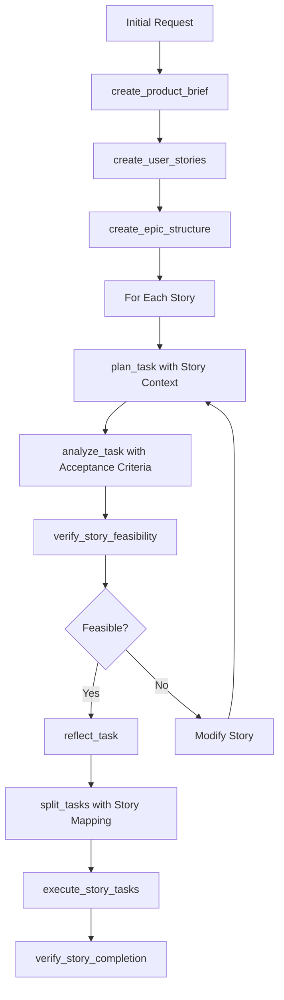

# BMAD-Shrimp Integration Strategy: Enhancing Task Planning with User Story Intelligence

## Executive Summary

This document outlines a comprehensive strategy for integrating BMAD's sophisticated user story and epic creation capabilities with Shrimp Task Manager's robust task planning and verification workflow. The goal is to create a more intelligent, story-driven task planning system that combines BMAD's product management expertise with Shrimp's technical execution precision.

## 1. Analysis of BMAD's Genius

### 1.1 BMAD's Core Strengths

#### **Product Requirements Document (PRD) Generation**
- **Interactive Elicitation**: BMAD uses advanced elicitation techniques to gather comprehensive requirements
- **Structured Templates**: Uses YAML-based templates that ensure consistency and completeness
- **Progressive Enhancement**: Starts with goals/context, moves to requirements, then UI goals, technical assumptions
- **Epic/Story Hierarchy**: Automatically creates logical epic sequences with properly sized user stories

#### **Epic and Story Creation Process**
- **Vertical Slicing**: Each story delivers complete, testable functionality
- **Sequential Logic**: Stories are ordered to build upon each other without forward dependencies
- **AI-Agent Sizing**: Stories are sized for single AI agent sessions (2-4 hours of focused work)
- **Acceptance Criteria**: Clear, testable criteria that define "done" from a functional perspective

#### **Agent Specialization**
- **PM Agent (John)**: Focuses on "Why" - uncovers root causes, maintains user focus, creates PRDs
- **Dev Agent (James)**: Executes stories sequentially, updates specific story sections, maintains minimal context
- **Clear Separation**: Each agent has specific responsibilities and communication protocols

### 1.2 BMAD's Workflow Architecture

```yaml
BMAD Workflow:
  1. Project Brief → PRD Creation
  2. PRD → Epic List Generation
  3. Epics → User Story Breakdown
  4. Stories → Acceptance Criteria
  5. Stories → Dev Agent Execution
  6. Execution → Verification & Documentation
```

## 2. Analysis of Shrimp's Current Approach

### 2.1 Shrimp's Core Strengths

#### **Task Planning Workflow**
- **Four-Stage Process**: plan_task → analyze_task → reflect_task → split_tasks
- **Codebase Analysis**: Deep integration with existing architecture and patterns
- **Verification Focus**: Built-in verification at each stage
- **Technical Precision**: Strong emphasis on implementation details and code consistency

#### **Current Limitations**
- **No User Story Concept**: Tasks are technical units without user-centric framing
- **Limited Context**: Lacks the "Why" that drives requirements
- **No Epic Structure**: Missing hierarchical organization of related work
- **Minimal Product Vision**: Focuses on technical execution over product goals

## 3. Integration Strategy

### 3.1 Enhanced Shrimp MCP Tool Architecture

```typescript
// Proposed new MCP tools for Shrimp
interface ShrimpStoryTools {
  // Phase 1: Story Creation Tools
  create_product_brief: Tool;     // Initial product vision and goals
  create_user_stories: Tool;       // Generate user stories from requirements
  create_epic_structure: Tool;     // Organize stories into epics
  
  // Phase 2: Story-Task Integration
  story_to_tasks: Tool;           // Convert user story to Shrimp tasks
  verify_story_feasibility: Tool; // Check if story can be implemented
  
  // Phase 3: Execution & Verification
  execute_story_tasks: Tool;      // Execute tasks with story context
  verify_story_completion: Tool;  // Verify story acceptance criteria
}
```

### 3.2 Modified Shrimp Workflow with Story Integration



### 3.3 Integration Points

#### **3.3.1 Enhance plan_task Template**
```markdown
## Enhanced Task Analysis with Story Context

1. **Story Understanding** (NEW)
   - User Story: As a {user}, I want {action}, so that {benefit}
   - Acceptance Criteria: {criteria_list}
   - Epic Context: {epic_goals}
   
2. **Analysis Purpose** (EXISTING)
   - Task objectives aligned with story goals
   - Technical challenges in story context
   ...
```

#### **3.3.2 New Story Verification Stage**
```typescript
// After analyze_task, before reflect_task
async function verify_story_feasibility(context: TaskContext): Promise<VerificationResult> {
  return {
    feasible: boolean,
    risks: Risk[],
    alternatives: Alternative[],
    effort_estimate: Hours,
    acceptance_criteria_coverage: Percentage
  };
}
```

#### **3.3.3 Enhanced split_tasks with Story Mapping**
```json
{
  "story_id": "STORY-001",
  "tasks": [
    {
      "id": "TASK-001",
      "name": "Implement backend API endpoint",
      "maps_to_criteria": ["AC1", "AC2"],
      "story_value_contribution": "Enables data persistence",
      ...
    }
  ]
}
```

## 4. Implementation Plan

### Phase 1: Foundation (Week 1-2)
1. Create new MCP tools for story management
2. Implement story-to-task converter
3. Add story context to existing templates

### Phase 2: Integration (Week 3-4)
1. Modify plan_task to accept story context
2. Add verify_story_feasibility tool
3. Enhance split_tasks with story mapping

### Phase 3: Verification Enhancement (Week 5-6)
1. Implement story completion verification
2. Add acceptance criteria tracking
3. Create story progress visualization

### Phase 4: Agent Integration (Week 7-8)
1. Create Shrimp PM agent based on BMAD's approach
2. Integrate story creation into workflow
3. Add epic management capabilities

## 5. Specific BMAD Features to Adopt

### 5.1 Interactive Elicitation
```yaml
elicitation_process:
  - Ask for existing documentation
  - Pre-fill with educated guesses
  - Present complete sections for review
  - Ask targeted questions for gaps
  - Iterate until complete
```

### 5.2 Story Sizing for AI Agents
```yaml
story_sizing_rules:
  - Maximum 4 hours of focused work
  - Single vertical slice of functionality
  - Clear integration boundaries
  - Testable in isolation
  - No forward dependencies
```

### 5.3 Epic Sequencing Logic
```yaml
epic_structure:
  Epic_1: Foundation & Core Infrastructure
  Epic_2: Core Business Entities
  Epic_3: User Workflows
  Epic_4: Advanced Features
```

## 6. New MCP Tool Specifications

### 6.1 create_user_stories Tool

```typescript
interface CreateUserStoriesParams {
  requirements: string;
  existing_context?: string;
  target_count?: number;
  epic_context?: string;
}

interface UserStory {
  id: string;
  title: string;
  user_story: {
    as_a: string;
    i_want: string;
    so_that: string;
  };
  acceptance_criteria: string[];
  technical_notes: string;
  estimated_hours: number;
  dependencies: string[];
}

async function create_user_stories(params: CreateUserStoriesParams): Promise<UserStory[]> {
  // 1. Analyze requirements
  // 2. Generate stories using BMAD template patterns
  // 3. Size appropriately for AI agents
  // 4. Order sequentially
  // 5. Return structured stories
}
```

### 6.2 verify_story_feasibility Tool

```typescript
interface VerifyStoryParams {
  story: UserStory;
  codebase_context: CodebaseInfo;
  technical_constraints: Constraint[];
}

interface FeasibilityReport {
  feasible: boolean;
  confidence: number; // 0-100
  risks: {
    description: string;
    severity: 'low' | 'medium' | 'high';
    mitigation: string;
  }[];
  required_changes: {
    type: 'architecture' | 'dependency' | 'pattern';
    description: string;
  }[];
  effort_breakdown: {
    development: number;
    testing: number;
    integration: number;
  };
}

async function verify_story_feasibility(params: VerifyStoryParams): Promise<FeasibilityReport> {
  // 1. Check architectural compatibility
  // 2. Verify technical feasibility
  // 3. Assess integration complexity
  // 4. Estimate effort
  // 5. Return detailed report
}
```

## 7. Benefits of Integration

### 7.1 For Product Planning
- **Clear Requirements**: User stories provide context and purpose
- **Better Prioritization**: Epic structure enables logical sequencing
- **Stakeholder Communication**: Stories are understandable by non-technical stakeholders

### 7.2 For Development
- **Focused Work**: Stories provide clear boundaries and goals
- **Verification Clarity**: Acceptance criteria define "done"
- **Reduced Ambiguity**: User stories clarify the "why" behind tasks

### 7.3 For Quality Assurance
- **Testable Criteria**: Each story has clear acceptance criteria
- **Traceability**: Tasks map to stories map to requirements
- **Progress Tracking**: Story completion provides meaningful progress metrics

## 8. Migration Strategy

### 8.1 Backward Compatibility
- Existing Shrimp workflows continue to function
- New story tools are optional enhancements
- Gradual adoption path available

### 8.2 Training & Documentation
- Create examples showing story-driven planning
- Document best practices for story creation
- Provide templates for common story patterns

## 9. Success Metrics

### 9.1 Quantitative Metrics
- **Story Completion Rate**: % of stories completed vs planned
- **Acceptance Criteria Coverage**: % of criteria verified
- **Task-Story Alignment**: % of tasks mapping to stories
- **Rework Reduction**: Decrease in task modifications post-creation

### 9.2 Qualitative Metrics
- **Developer Satisfaction**: Clarity of requirements
- **Stakeholder Visibility**: Understanding of progress
- **Code Quality**: Alignment with user needs

## 10. Conclusion

By integrating BMAD's user story expertise with Shrimp's technical precision, we can create a superior task planning system that:

1. **Maintains user focus** while ensuring technical excellence
2. **Provides clear context** for every technical decision
3. **Enables verification** at both story and task levels
4. **Scales effectively** for projects of any size
5. **Improves communication** between stakeholders and developers

This integration represents a significant evolution in AI-assisted software development, combining the best of product management and engineering practices into a unified, intelligent system.

## Appendix A: Example Story-to-Task Conversion

### Input: User Story
```yaml
story:
  id: "AUTH-001"
  title: "User Login"
  user_story:
    as_a: "registered user"
    i_want: "to log into the application"
    so_that: "I can access my personal dashboard"
  acceptance_criteria:
    - "Users can enter email and password"
    - "Invalid credentials show error message"
    - "Successful login redirects to dashboard"
    - "Session persists for 24 hours"
```

### Output: Shrimp Tasks
```json
{
  "tasks": [
    {
      "id": "AUTH-001-T1",
      "name": "Create login API endpoint",
      "description": "Implement POST /api/auth/login endpoint",
      "maps_to_criteria": ["AC1", "AC2"],
      "verification": "API accepts credentials and returns appropriate response"
    },
    {
      "id": "AUTH-001-T2",
      "name": "Implement session management",
      "description": "Create JWT token with 24-hour expiry",
      "maps_to_criteria": ["AC4"],
      "verification": "Token expires after 24 hours"
    },
    {
      "id": "AUTH-001-T3",
      "name": "Build login UI component",
      "description": "Create form with email/password fields",
      "maps_to_criteria": ["AC1"],
      "verification": "Form validates and submits data"
    },
    {
      "id": "AUTH-001-T4",
      "name": "Implement login flow integration",
      "description": "Connect UI to API with error handling",
      "maps_to_criteria": ["AC2", "AC3"],
      "verification": "Login flow works end-to-end with proper redirects"
    }
  ]
}
```

## Appendix B: Recommended Reading

- BMAD Core Documentation: `.bmad-core/user-guide.md`
- Shrimp Templates: `src/prompts/templates_en/`
- BMAD PRD Template: `.bmad-core/templates/prd-tmpl.yaml`
- Shrimp Task Workflow: `src/tools/task/`