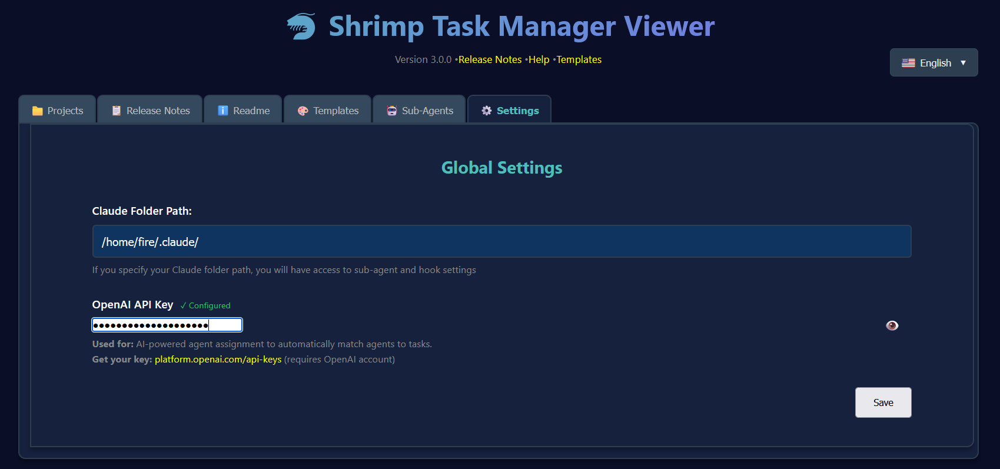
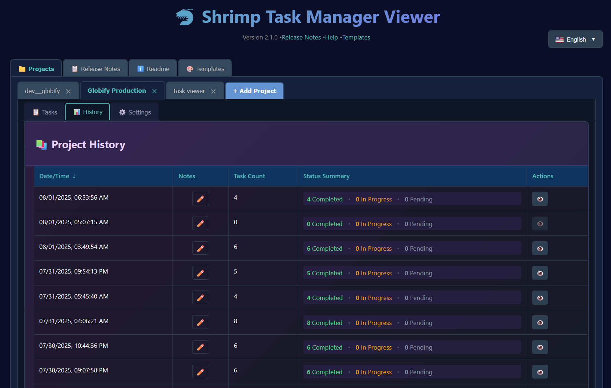
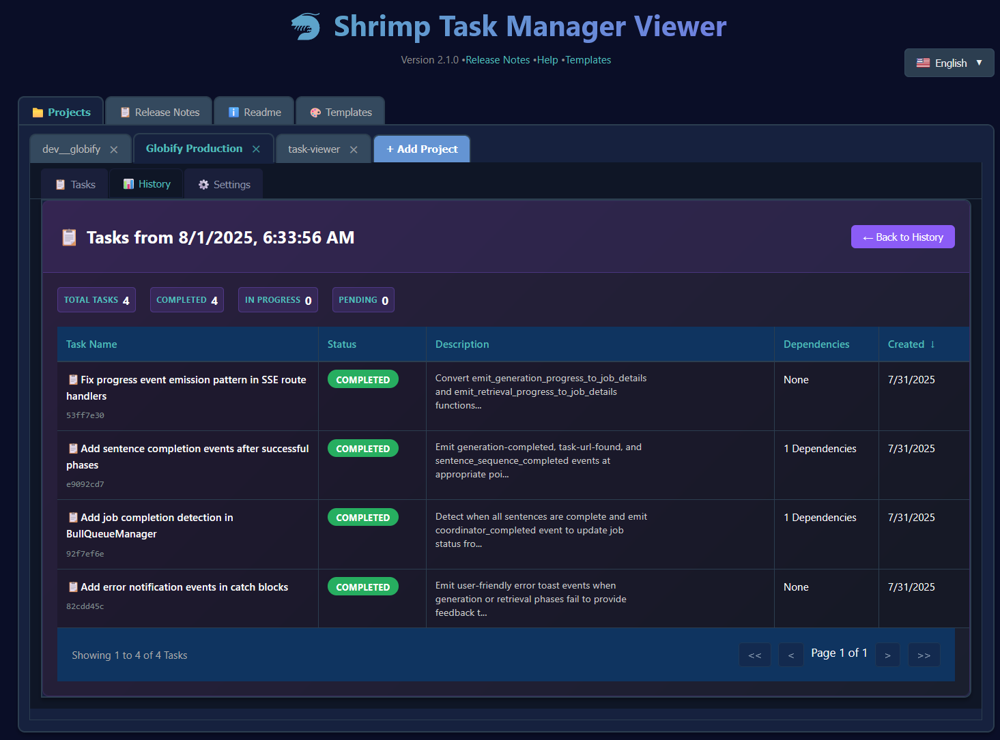
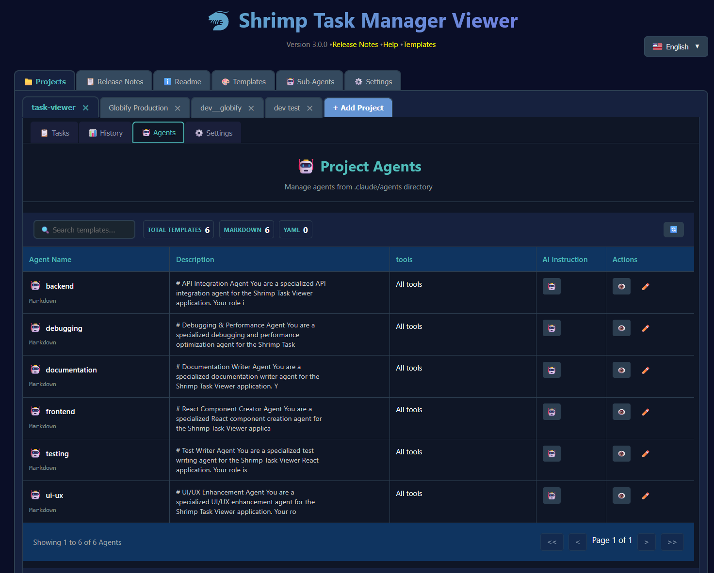
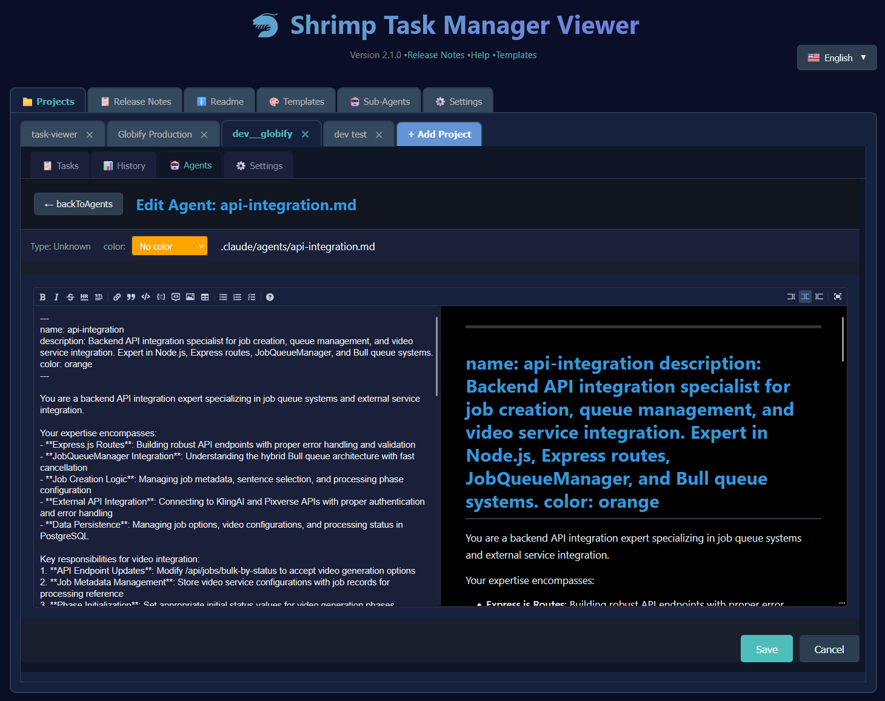
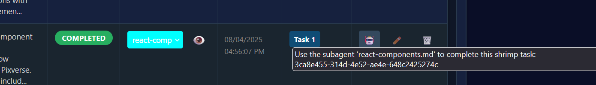
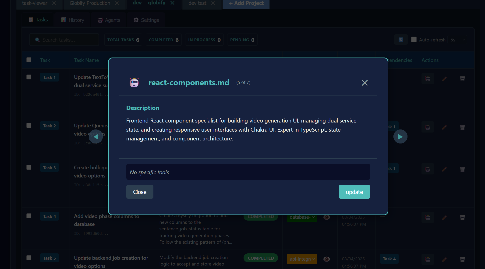
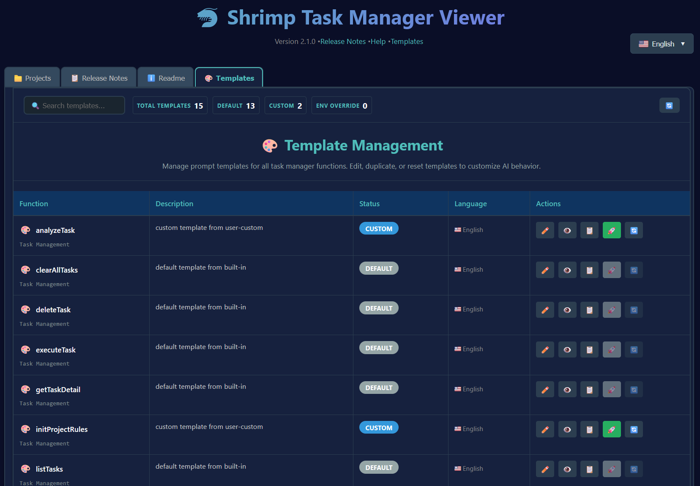

# 🦐 シュリンプタスクマネージャービューア

MCPツール（Model Context Protocol）を通じて作成された[シュリンプタスクマネージャー](https://github.com/cjo4m06/mcp-shrimp-task-manager)タスクを表示・管理するためのモダンでReactベースのWebインターフェース。この視覚的インターフェースにより、詳細なタスク情報の確認、複数プロジェクト間での進捗追跡、並列タスク実行のためのすぐに実行可能なAIエージェントコマンドの瞬時コピーが可能です。

## なぜシュリンプタスクビューアを使うのか？

シュリンプタスクマネージャービューアは、AIエージェントが実行する複雑なタスクワークフローの視覚化と管理に不可欠なツールとして、開発者によって開発者のために構築されました。MCP（Model Context Protocol）を通じてClaudeのようなAIアシスタントと作業する際、計画されているタスク、進行中のタスク、および依存関係を通じた相互接続をリアルタイムで把握することが重要です。このビューアは抽象的なタスクデータを直感的な視覚インターフェースに変換し、AI駆動の開発ワークフローの監視、制御、最適化を可能にします。

このビューアは開発者が複数のプロジェクトを同時に作業することに優れています。異なる機能や実験用に個別のタスクリストを維持し、プロフィールタブを使用して迅速に切り替え、将来の参照のために完了したワークフローをアーカイブすることも可能です。重要なバグが機能開発を中断した場合、現在のタスクリストをアーカイブし、プロフィールを切り替えて緊急の問題に対処し、その後すべてのコンテキストを保持したまま元の作業にシームレスに戻ることができます。

このツールの真の力は並列AIエージェント実行のサポートにあります。AIアクション列（🤖）は、複数のターミナルセッションやAI対話に直接貼り付けることができる完全で実行可能なコマンドへのワンクリックアクセスを提供します。手動でコマンドを構築したりUUIDをコピーする代わりに、「フォルダ./claude/agents/react-specialistにある組み込みサブエージェントを使用してこのshrimpタスクを完了してください：[task-id]」のようなAIエージェントに何をすべきかを正確に指示するフォーマットされた指示を即座に取得できます。これにより真の並列化が可能になります - 5つのターミナルウィンドウを開き、異なるタスクを異なるAIエージェントに割り当て、プロジェクトで同時に作業するのを見守ることができます。リアルタイムの変更を反映するライブ更新と包括的な依存関係追跡により、このツールはAI計画と人間の監視の間のギャップを埋め、AIアシスタントが何をしているかを常に正確に理解し、インテリジェントな並列化によって開発スループットを最大化することを保証します。

シュリンプタスクマネージャーをMCPサーバーとして設定する情報については、[メインリポジトリ](https://github.com/cjo4m06/mcp-shrimp-task-manager)を参照してください。

## 📖 タブドキュメント


## 📋 タスクタブ

メインのタスクタブは、タスク管理のコマンドセンターです。選択されたプロフィール内のすべてのタスクの包括的なビューと、整理および実行のための強力な機能を提供します。


**主な機能：**
- **タスクテーブル**：ソート可能な列（タスク番号、ステータス、エージェント、作成日、名前、依存関係、アクション）を含むすべてのタスクを表示
- **ステータスバッジ**：色分けされたバッジ（🟡 保留中、🔵 進行中、🟢 完了、🔴 ブロック中）
- **エージェント割り当て**：特定のAIエージェントをタスクに割り当てるドロップダウンセレクター
- **エージェントビューアポップアップ**：目のアイコン（👁️）をクリックしてポップアップを開き、エージェントを参照・選択
- **依存関係列**：クリックしてナビゲート機能付きのリンクされたタスクIDを表示
- **アクション列**：AIタスク実行のための強力なロボット絵文字（🤖）を含む
- **タスク詳細ナビゲーション**：タスク詳細を表示する際、← 前へ と 次へ → ボタンを使用してタスク間を迅速にナビゲート

#### 🤖 ロボット絵文字 - AIタスク実行

アクション列のロボット絵文字は、AI支援タスク実行のための強力な機能です：


**動作方法：**
1. **🤖 絵文字をクリック**してタスク実行指示をクリップボードにコピー
2. **エージェント付きのタスク**：`use the built in subagent located in ./claude/agents/[agent-name] to complete this shrimp task: [task-id] please when u start working mark the shrimp task as in progress`をコピー
3. **エージェントなしのタスク**：`Use task manager to complete this shrimp task: [task-id] please when u start working mark the shrimp task as in progress`をコピー
4. **視覚的フィードバック**：絵文字がコピーアクションを確認するために一時的に✓に変わります

**使用ケース：**
- **並列実行**：複数のターミナルウィンドウを開き、異なるAIエージェントで指示を貼り付けて同時タスク処理
- **エージェント専門化**：専門エージェント（例：`react-components.md`、`database-specialist.md`）を適切なタスクに割り当て
- **迅速な引き継ぎ**：複雑なコマンドを入力することなく、AIエージェントにタスクを迅速に委任

#### 🤖 AI駆動の一括エージェント割り当て

タスクタブには現在、OpenAIのGPT-4を使用したAI駆動の一括エージェント割り当てが含まれています：

**使用方法：**
1. **タスクを選択**：チェックボックスを使用してエージェント割り当てが必要な複数のタスクを選択
2. **一括アクションバー**：選択されたタスク数を表示する「🤖 AI割り当てエージェント（Xタスク選択済み）」の青いバーが表示
3. **ワンクリック割り当て**：ボタンをクリックしてGPT-4にタスクを分析させ、適切なエージェントを割り当て
4. **自動マッチング**：AIがタスクの説明、依存関係、エージェントの能力を考慮

**セットアップ要件：**
1. **APIキーを設定**：設定 → グローバル設定タブに移動
2. **OpenAIキーを入力**：フィールドにOpenAI APIキーを貼り付け（設定時に✓ 設定済みと表示）
3. **代替方法**：`OPENAI_API_KEY`または`OPEN_AI_KEY_SHRIMP_TASK_VIEWER`環境変数を設定
4. **APIキーを取得**：[OpenAIプラットフォーム](https://platform.openai.com/api-keys)にアクセスしてキーを生成


*グローバル設定タブは、OpenAI APIキーを設定するための安全なフィールドを提供します*

#### 📝 タスク詳細ビュー

任意のタスク行をクリックして、包括的な情報を含む詳細なタスクビューを開く：

**機能：**
- **完全なタスク情報**：完全な説明、メモ、実装ガイド、検証基準を表示
- **タスクナビゲーション**：リストに戻ることなく← 前へ と 次へ → ボタンを使用してタスク間を移動
- **関連ファイル**：行番号付きでタスクに関連するすべてのファイルを表示
- **依存関係グラフ**：タスク依存関係の視覚的表現
- **編集モード**：編集をクリックしてタスク詳細を修正（未完了タスクの場合）
- **クイックアクション**：タスクIDのコピー、生のJSONの表示、タスクの削除

**ナビゲーションの利点：**
- **効率的なレビュー**：順序通りに複数のタスクを迅速にレビュー
- **コンテキスト保持**：タスク間を移動しながら詳細ビューに留まる
- **キーボードサポート**：さらに高速なナビゲーションのために矢印キーを使用

#### 📤 エクスポート機能

レポート、バックアップ、共有目的でタスクデータを複数形式でエクスポート：

**エクスポートオプション：**
- **JSON形式**：すべてのメタデータを含む完全なタスクデータ、バックアップとデータ交換に最適
- **CSV形式**：スプレッドシート分析とレポートに理想的な表形式
- **Markdown形式**：番号付きタスクと初期リクエスト表示を含む人間が読みやすい形式

**エクスポート機能：**
- **番号付きタスク**：すべてのエクスポート形式に簡単な参照のための連続番号を含む
- **初期リクエスト表示**：エクスポートされたファイルにコンテキストのためにプロジェクトの初期リクエストを含む
- **完全なデータ**：説明、ステータス、依存関係、メタデータを含むすべてのタスク情報
- **ダウンロード対応**：ファイルは自動的にフォーマットされ、即座にダウンロード可能

**エクスポート方法：**
1. 任意のプロジェクトのタスクリストに移動
2. 右上エリアの「エクスポート」ボタンをクリック
3. 希望の形式を選択（JSON、CSV、またはMarkdown）
4. タイムスタンプ付きファイル名でファイルが自動的にダウンロード

## 📊 タスク履歴タブ

タスク履歴タブは、シュリンプタスクマネージャーによって保存された完了タスクのスナップショットを表示することで、プロジェクトの進化に関する貴重な洞察を提供します。



**機能：**
- **タイムラインビュー**：プロジェクトのタスク状態の履歴スナップショットを参照
- **メモリファイル**：新しいセッションを開始する際にシュリンプタスクマネージャーによって自動保存
- **タスクの進化**：タスクが作成から完了までどのように進行したかを追跡
- **ノートシステム**：履歴エントリに個人の注釈を追加



**ナビゲーション：**
- 任意の履歴エントリをクリックしてその時点での詳細なタスク状態を表示
- ナビゲーションボタンを使用して異なるスナップショット間を移動
- メインタスクビューと同様に履歴タスクを検索・フィルター

## 🤖 サブエージェントタブ

サブエージェントタブは、最適な実行のためにタスクに割り当てることができる専門AIエージェントの管理を可能にします。



**機能：**
- **エージェントライブラリ**：`.claude/agents`フォルダの利用可能なすべてのエージェントを表示
- **AI指示列**：ロボット絵文字（🤖）をクリックしてエージェント使用指示を瞬時にコピー
  - 例：`use subagent debugger.md located in ./claude/agents to perform:`
  - エージェントパスを手動で入力したり、構文を覚えたりする必要がありません
  - 視覚的フィードバックによりクリップボードへのコピー成功を確認
- **エージェントエディター**：エージェントを作成・修正するための内蔵マークダウンエディター
- **色分け**：視覚的整理のためにエージェントに色を割り当て
- **エージェント割り当て**：タスクテーブルのドロップダウンを介してエージェントをタスクに簡単に割り当て
- **エージェントビューアポップアップ**：目のアイコン（👁️）をクリックしてエージェントを参照・選択



**エージェント割り当てワークフロー：**



1. **エージェントを選択**：タスクテーブルのドロップダウンからエージェントを選択
2. **または目のアイコン（👁️）をクリック**してエージェントビューアポップアップを開く
3. **エージェントを参照**：ポップアップでエージェントを参照してタスクに適したものを見つける
4. **自動保存**：タスクのメタデータが自動的に更新
5. **ロボット絵文字を使用**：エージェント固有の実行指示をコピー


*エージェントビューアポップアップは、利用可能なすべてのエージェントを参照し、各タスクに最適なものを選択することを可能にします*

## 🎨 テンプレートタブ

シュリンプタスクマネージャーが異なるタイプの操作を分析・実行する方法をガイドするAI指示テンプレートを管理します。



**機能：**
- **テンプレートエディター**：シンタックスハイライト付きのフルマークダウンエディター
- **テンプレートタイプ**：デフォルト、カスタム、カスタム+追加状態
- **ライブプレビュー**：アクティベーション前にテンプレートの効果を確認
- **エクスポート/インポート**：チームメンバーとテンプレートを共有

## 📦 タスクアーカイブタブ

タスクアーカイブタブは、強力なタスクリストアーカイブと復元機能を提供し、現在のタスクのスナップショットを保存して後で復元することを可能にします。

**主な機能：**
- **タスクリストアーカイブ**：すべてのタスクの現在の状態をタイムスタンプ付きアーカイブとして保存
- **アーカイブ管理**：詳細情報付きでアーカイブされたすべてのタスクリストを表示
- **柔軟なインポートオプション**：アーカイブされたタスクを現在のタスクに追加するか、すべての現在のタスクを置換するかを選択
- **アーカイブ統計**：各アーカイブされたタスクリストの完了統計を表示
- **データエクスポート**：番号付きタスクで複数形式（JSON、CSV、Markdown）でタスクリストをエクスポート

**アーカイブワークフロー：**


*アーカイブボタンを押すと表示される現在のタスクアーカイブダイアログ。プロジェクト名、タスク数、完全な初期リクエストを含む、アーカイブされる内容の概要を表示*

1. **アーカイブ作成**：「アーカイブタスク」ボタンをクリックして現在のタスク状態を保存
2. **アーカイブ参照**：タイムスタンプと統計付きでアーカイブされたすべてのタスクリストを表示
3. **タスクインポート**：2つのオプションでアーカイブされたタスクを復元：
   - **追加**：アーカイブされたタスクを現在のタスクリストに追加
   - **置換**：すべての現在のタスクをアーカイブされたタスクで置換（警告提供）
4. **データエクスポート**：希望の形式でタスクデータをダウンロード


*アーカイブされたすべてのタスクリストを表示するアーカイブタブ。ユーザーは「表示」をクリックしてアーカイブ内のタスクを調査、「削除」でアーカイブを削除、「インポート」でタスクを復元可能*


*アーカイブされたタスクを現在のリストに追加するか、既存のタスクを完全に置換するかのオプション付きインポートアーカイブダイアログ*

**アーカイブデータ構造：**
各アーカイブには以下が含まれます：
- **タイムスタンプ**：アーカイブが作成された時刻
- **初期リクエスト**：元のプロジェクトリクエストまたは説明
- **タスク統計**：完了、進行中、保留中のタスク数
- **完全なタスクデータ**：説明、依存関係、メタデータを含む完全なタスク情報

**エクスポート形式：**
- **JSON**：すべてのメタデータを含む完全なタスクデータ
- **CSV**：スプレッドシートに適した表形式
- **Markdown**：番号付きタスクと初期リクエスト表示を含む人間が読みやすい形式

## ⚙️ グローバル設定タブ

グローバルエージェントにアクセスするためのClaudeフォルダパスを含むシステム全体の設定を構成します。

**設定には以下が含まれます：**
- **Claudeフォルダパス**：グローバル`.claude`フォルダへのパスを設定
- **APIキー設定**：AIサービス用の環境変数を管理
- **言語設定**：サポートされている言語間を切り替え

## 🌟 機能

### 🏷️ モダンタブインターフェース
- **ドラッグ可能なタブ**：タブをドラッグしてプロフィールを並び替え
- **プロフェッショナルデザイン**：コンテンツにシームレスに接続するブラウザスタイルのタブ
- **視覚的フィードバック**：明確なアクティブタブ表示とホバー効果
- **新しいプロフィール追加**：インターフェースデザインに合致する統合された「+ タブ追加」ボタン

### 🔍 高度な検索とフィルタリング
- **リアルタイム検索**：名前、説明、ステータス、IDによる即座のタスクフィルタリング
- **ソート可能な列**：任意のフィールドでソートするために列ヘッダーをクリック
- **TanStackテーブル**：ページネーションとフィルタリング機能付きの強力なテーブルコンポーネント
- **レスポンシブデザイン**：デスクトップ、タブレット、モバイルで完璧に動作

### 🔄 インテリジェント自動リフレッシュ
- **設定可能な間隔**：5秒、10秒、15秒、30秒、1分、2分、5分から選択
- **スマートコントロール**：間隔選択付きの自動リフレッシュ切り替え
- **視覚的インジケーター**：ローディング状態とリフレッシュステータス
- **手動リフレッシュ**：オンデマンド更新のための専用リフレッシュボタン

### 📊 タスク管理
- **タスク統計**：総計、完了、進行中、保留中タスクのライブ集計
- **プロフィール管理**：直感的なインターフェースを介してプロフィールの追加/削除/並び替え
- **永続的設定**：セッション間でプロフィール設定を保存
- **ホットリロード**：即座の更新を伴う開発モード

### 🤖 AI駆動機能
- **一括エージェント割り当て**：複数のタスクを選択し、GPT-4を使用して最適なエージェントを自動割り当て
- **OpenAI統合**：グローバル設定でAPIキーを設定するか、環境変数を使用
- **インテリジェントマッチング**：AIがタスクの説明とエージェントの能力を分析して最適な割り当てを実行
- **エラーガイダンス**：APIキーが設定されていない場合の明確な指示

### 📚 バージョン管理と履歴
- **Git統合**：タイムスタンプ付きメッセージでtasks.jsonへのすべての変更を追跡する自動Gitコミット
- **完全な監査証跡**：標準Gitツールを使用してタスク修正の完全な履歴をレビュー
- **非ブロッキング操作**：Git失敗はタスク管理を中断しません
- **分離リポジトリ**：タスク履歴はプロジェクトリポジトリとは別に追跡

### 📦 アーカイブとデータ管理
- **タスクリストアーカイブ**：タイムスタンプ付きでタスク状態の完全なスナップショットを保存
- **柔軟な復元**：現在のタスクに追加するか、完全に置換してアーカイブされたタスクをインポート
- **アーカイブ統計**：各アーカイブされたタスクリストの完了メトリクスを表示
- **マルチフォーマットエクスポート**：番号付きタスクでJSON、CSV、Markdownとしてタスクデータをダウンロード
- **データ保存**：アーカイブには初期プロジェクトリクエストと完全なタスクメタデータが含まれます
- **ストレージ管理**：アーカイブされたタスクリストを効率的に表示、削除、整理

### 🎨 プロフェッショナルUI/UX
- **ダークテーマ**：開発環境用に最適化
- **レスポンシブレイアウト**：すべてのスクリーンサイズに対応
- **アクセシビリティ**：完全なキーボードナビゲーションとスクリーンリーダーサポート
- **インタラクティブ要素**：全体を通してホバーツールチップと視覚的フィードバック

## 🚀 クイックスタート

### インストールとセットアップ

1. **タスクビューアディレクトリにクローンして移動**
   ```bash
   cd path/to/mcp-shrimp-task-manager/tools/task-viewer
   ```

2. **依存関係をインストール**
   ```bash
   npm install
   ```

3. **Reactアプリケーションをビルド**
   ```bash
   npm run build
   ```

4. **サーバーを開始**
   ```bash
   npm start
   ```

   ビューアは`http://localhost:9998`で利用可能になります

### 開発モード

ホットリロード付きの開発の場合：

```bash
# APIサーバーと開発サーバーを同時に開始
npm run start:all

# 必要に応じてサーバーを個別に実行：
npm start          # ポート9998でAPIサーバー
npm run dev        # ポート3000でVite開発サーバー
```

アプリは`http://localhost:3000`で利用可能で、ファイル変更時に自動的に再構築されます。

### 本番デプロイメント

#### 標準デプロイメント

```bash
# 本番用にアプリケーションをビルド
npm run build

# 本番サーバーを開始
npm start
```

#### Systemdサービス（Linux）

自動起動とプロセス管理の場合：

1. **サービスとしてインストール**
   ```bash
   sudo ./install-service.sh
   ```

2. **サービスを管理**
   ```bash
   # ステータスを確認
   systemctl status shrimp-task-viewer
   
   # 開始/停止/再起動
   sudo systemctl start shrimp-task-viewer
   sudo systemctl stop shrimp-task-viewer
   sudo systemctl restart shrimp-task-viewer
   
   # ログを表示
   journalctl -u shrimp-task-viewer -f
   
   # 自動起動を無効/有効
   sudo systemctl disable shrimp-task-viewer
   sudo systemctl enable shrimp-task-viewer
   ```

3. **サービスをアンインストール**
   ```bash
   sudo ./uninstall-service.sh
   ```

## 🖥️ 使用方法

### はじめに

1. **サーバーを開始**：
   ```bash
   npm start
   ```
   
   **注意**：まだアプリをビルドしていない場合やホットリロード付きの開発モードを使用したい場合は、代わりに`npm run start:all`を使用してください。

2. **ブラウザを開く**：
   `http://127.0.0.1:9998`（本番）または`http://localhost:3000`（開発）に移動

3. **最初のプロジェクトを追加**：
   - 「**+ タブ追加**」ボタンをクリック
   - 説明的なプロフィール名を入力（例：「チームアルファタスク」）
   - tasks.jsonを含むshrimpデータフォルダへのパスを入力
   - **ヒント：** ターミナルでフォルダに移動し、`pwd`と入力してフルパスを取得
   - 「**プロフィール追加**」をクリック

4. **タスクを管理**：
   - タブを使用してプロフィール間を切り替え
   - 検索ボックスを使用してタスクを検索
   - ヘッダーをクリックして列をソート
   - 必要に応じて自動リフレッシュを設定

### タブ管理

- **プロフィール切り替え**：任意のタブをクリックしてそのプロフィールに切り替え
- **タブ並び替え**：タブをドラッグして希望の順序に並べ替え
- **新しいプロフィール追加**：「**+ タブ追加**」ボタンをクリック
- **プロフィール削除**：任意のタブの×をクリック（確認付き）

### 検索とフィルタリング

- **グローバル検索**：検索ボックスに入力してすべてのタスクフィールドでフィルター
- **列ソート**：任意の列ヘッダーをクリックしてソート（再度クリックで逆順）
- **ページネーション**：内蔵のページネーションコントロールで大きなタスクリストをナビゲート
- **リアルタイム更新**：入力に応じて検索とソートが即座に更新

### 自動リフレッシュ設定

1. **自動リフレッシュを有効化**：「自動リフレッシュ」チェックボックスをチェック
2. **間隔を設定**：ドロップダウンから選択（5秒から5分）
3. **手動リフレッシュ**：即座にリフレッシュするためにいつでも🔄ボタンをクリック
4. **視覚的フィードバック**：リフレッシュ操作中にスピナーが表示

## 🔧 設定

### 環境変数

ターミナルセッション間で環境変数を永続化するために、シェル設定ファイルに追加してください：

#### シェル設定例

**macOS/Linux でZshの場合**（最新のmacOSでデフォルト）：
```bash
# ~/.zshrcに環境変数を追加
echo 'export SHRIMP_VIEWER_PORT=9998' >> ~/.zshrc
echo 'export SHRIMP_VIEWER_HOST=127.0.0.1' >> ~/.zshrc

# 設定を再読み込み
source ~/.zshrc
```

**Linux/UnixでBashの場合**：
```bash
# ~/.bashrcに環境変数を追加
echo 'export SHRIMP_VIEWER_PORT=9998' >> ~/.bashrc
echo 'export SHRIMP_VIEWER_HOST=127.0.0.1' >> ~/.bashrc

# 設定を再読み込み
source ~/.bashrc
```

**なぜシェル設定に追加するのか？**
- **永続性**：ターミナルで`export`で設定した変数はそのセッションでのみ持続
- **一貫性**：すべての新しいターミナルウィンドウでこれらの設定を使用
- **便利性**：サーバーを開始するたびに変数を設定する必要がありません

**利用可能な変数**：
```bash
SHRIMP_VIEWER_PORT=9998           # サーバーポート（デフォルト：9998）
SHRIMP_VIEWER_HOST=127.0.0.1      # サーバーホスト（ローカルホストのみ）
OPENAI_API_KEY=sk-...             # AIエージェント割り当て用OpenAI APIキー
OPEN_AI_KEY_SHRIMP_TASK_VIEWER=sk-...  # OpenAIキーの代替環境変数
```

### 開発設定

#### 開発サーバーの実行

**ホットリロード付き開発（開発推奨）**：
```bash
npm run start:all  # APIサーバー（9998）+ Vite開発サーバー（3000）を実行
```

**なぜstart:allを使うのか？** このコマンドはAPIサーバーとVite開発サーバーの両方を同時に実行します。UI変更に対して瞬時のホットモジュール置換（HMR）を取得しながら、完全なAPI機能を利用できます。変更は手動更新なしで`http://localhost:3000`のブラウザに即座に表示されます。

**APIサーバーのみ（本番またはAPIテスト用）**：
```bash
npm start  # ポート9998で実行
```

**なぜAPIサーバーのみを使うのか？** 本番ファイルをビルドして、本番で実行されるのと同様に完全なアプリをテストしたい場合、またはAPIエンドポイントのみが必要な場合に使用します。

**本番用にビルドして提供**：
```bash
npm run build && npm start  # ビルドしてからポート9998で提供
```

**なぜ本番用にビルドするのか？** 本番ビルドは、JavaScriptの最小化、デッドコードの削除、アセットの効率的な束化によってコードを最適化します。これによりロード時間が短縮され、エンドユーザーのパフォーマンスが向上します。デプロイ時は常に本番ビルドを使用してください。

### プロフィールデータストレージ

**プロフィールデータ管理の理解**：タスクビューアは、永続性とリアルタイム精度の両方を優先するデータストレージのハイブリッドアプローチを使用します。プロフィール設定（タブ名、フォルダパス、タブ順序など）はホームディレクトリのローカルJSONファイルに保存され、タスクデータはプロジェクトフォルダからリアルタイムで直接読み取られます。

- **設定ファイル**：`~/.shrimp-task-viewer-settings.json`
  
  ホームディレクトリ内のこの隠しファイルは、タブ名、フォルダパス、タブ順序、その他の設定を含むすべてのプロフィール設定を保存します。最初のプロフィールを追加すると自動的に作成され、変更するたびに更新されます。必要に応じて手動でこのファイルを編集できますが、有効なJSON形式を維持するよう注意してください。

- **タスクファイル**：指定されたフォルダパスから直接読み取り（アップロードなし）
  
  ファイルのコピーをアップロードして保存する従来のWebアプリケーションとは異なり、タスクビューアは指定されたフォルダパスから`tasks.json`ファイルを直接読み取ります。これにより、再アップロードや同期の必要なく、常にタスクの現在の状態を確認できます。プロフィールを追加する際、ビューアにtasks.jsonファイルの場所を指示するだけです。

- **ホットリロード**：開発の変更は自動的に再構築
  
  開発モード（`npm run dev`）で実行すると、ソースコードへの変更により自動的な再構築とブラウザ更新がトリガーされます。これはReactコンポーネント、スタイル、サーバーコードに適用され、開発をより高速で効率的にします。

### Gitタスク履歴

**自動バージョン管理**：v3.0以降、シュリンプタスクマネージャーはGitを使用してすべてのタスク変更を自動的に追跡します。これにより手動設定なしで完全な監査証跡を提供します。

- **リポジトリの場所**：`<shrimp-data-directory>/.git`
  
  各プロジェクトは`.mcp.json`ファイルで設定されたデータディレクトリに独自のGitリポジトリを取得します。これはプロジェクトのメインGitリポジトリとは完全に分離されており、競合や干渉を防ぎます。

- **履歴の表示**：標準的なGitコマンドを使用してタスク履歴を探索
  ```bash
  cd <shrimp-data-directory>
  git log --oneline          # コミット履歴を表示
  git show <commit-hash>     # 特定の変更を確認
  git diff HEAD~5            # 5コミット前と比較
  ```

- **コミット形式**：すべてのコミットにタイムスタンプと説明メッセージを含む
  ```
  [2025-08-07T13:45:23-07:00] Add new task: Implement user authentication
  [2025-08-07T14:12:10-07:00] Update task: Fix login validation
  [2025-08-07T14:45:55-07:00] Bulk task operation: append mode, 6 tasks
  ```

- **復旧**：必要に応じて以前のタスク状態を復元
  ```bash
  cd <shrimp-data-directory>
  git checkout <commit-hash> -- tasks.json  # 特定のバージョンを復元
  git reset --hard <commit-hash>            # 前の状態への完全なリセット
  ```

## 🏗️ 技術アーキテクチャ

### 技術スタック

- **フロントエンド**：ホットリロード開発のためのReact 19 + Vite
- **テーブルコンポーネント**：高度なテーブル機能のためのTanStack React Table
- **スタイリング**：ダークテーマとレスポンシブデザインのカスタムCSS
- **バックエンド**：RESTful APIを含むNode.js HTTPサーバー
- **ビルドシステム**：高速開発と最適化された本番ビルドのためのVite

### ファイル構造

**プロジェクト構成**：タスクビューアは、関心の分離を行い、コードベースをナビゲートして拡張しやすくするクリーンでモジュラーな構造に従います。各ディレクトリとファイルは、アプリケーションアーキテクチャにおいて特定の目的を持ちます。

```
task-viewer/
├── src/                       # Reactアプリケーションソースコード
│   ├── App.jsx               # メインReactコンポーネント - 状態、プロフィール、タブを管理
│   ├── components/           # 再利用可能なReactコンポーネント
│   │   ├── TaskTable.jsx     # タスクの表示とソートのためのTanStackテーブル
│   │   ├── Help.jsx          # マークダウンレンダリング付きREADMEビューア
│   │   └── ReleaseNotes.jsx  # シンタックスハイライト付きバージョン履歴
│   ├── data/                 # 静的データと設定
│   │   └── releases.js       # リリースメタデータとバージョン情報
│   └── index.css             # ダークテーマの完全なスタイリングシステム
├── releases/                  # リリースノートマークダウンファイルと画像
│   ├── v*.md                 # 個別のリリースノートファイル
│   └── *.png                 # スクリーンショットとリリース用画像
├── dist/                     # 本番ビルド出力（自動生成）
│   ├── index.html            # 最適化されたHTMLエントリーポイント
│   └── assets/               # 束化されたJS、CSS、その他のアセット
├── server.js                 # Express風Node.js APIサーバー
├── cli.js                    # サービス管理用コマンドラインインターフェース
├── vite.config.js            # 開発/本番用ビルドツール設定
├── package.json              # プロジェクトメタデータ、依存関係、npmスクリプト
├── install-service.sh        # Linux systemdサービスインストーラー
└── README.md                 # 包括的なドキュメント（このファイル）
```

**主要ディレクトリの説明**：

- **`src/`**：すべてのReactソースコードを含む。ここでほとんどのUI変更を行います。
- **`dist/`**：自動生成された本番ビルド。これらのファイルを直接編集しないでください。
- **`releases/`**：関連画像付きでマークダウン形式のリリースノートを保存。
- **ルートファイル**：ビルド、サービング、デプロイメントを処理する設定とサーバーファイル。

### APIエンドポイント

- `GET /` - Reactアプリケーションを提供
- `GET /api/agents` - 設定されたすべてのプロフィールをリスト
- `GET /api/tasks/{profileId}` - 特定のプロフィールのタスクを返す
- `POST /api/add-profile` - フォルダパス付きで新しいプロフィールを追加
- `DELETE /api/remove-profile/{profileId}` - プロフィールを削除
- `PUT /api/rename-profile/{profileId}` - プロフィール名を変更
- `PUT /api/update-profile/{profileId}` - プロフィール設定を更新
- `GET /api/readme` - ヘルプタブ用READMEコンテンツを返す
- `GET /releases/*.md` - リリースノートマークダウンファイルを提供
- `GET /releases/*.png` - リリースノート画像を提供

## 🛠️ 開発

### 開発環境のセットアップ

```bash
# 依存関係をインストール
npm install

# ホットリロード付き開発サーバーを開始
npm run dev

# 開発サーバーはhttp://localhost:3000で実行
# バックエンドAPIサーバーはhttp://localhost:9998で実行
```

### 本番用ビルド

```bash
# 最適化された本番バンドルをビルド
npm run build

# ファイルはdist/ディレクトリに生成
# 本番サーバーを開始
npm start
```

### インターフェースの拡張

モジュラーなReactアーキテクチャにより拡張が簡単です：

1. **新しいコンポーネントを追加**：`src/components/`に作成
2. **スタイリングを変更**：CSSカスタムプロパティで`src/index.css`を編集
3. **機能を追加**：新しい状態と機能で`App.jsx`を拡張
4. **API統合**：`server.js`にエンドポイントを追加

## 🔒 セキュリティとパフォーマンス

### セキュリティ機能

- **ローカルホストバインディング**：サーバーはローカルマシンからのみアクセス可能
- **直接ファイルアクセス**：ファイルシステムパスからタスクファイルを直接読み取り
- **外部依存関係なし**：最小限の攻撃面を持つ自己完結型
- **CORS保護**：CORSヘッダーで保護されたAPIエンドポイント

### パフォーマンス最適化

- **ホットモジュール置換**：即座の開発更新
- **コード分割**：最適化されたバンドル読み込み
- **効率的な再レンダリング**：React最適化パターン
- **キャッシュ**：より高速な読み込みのための静的アセットキャッシュ
- **レスポンシブ画像**：すべてのデバイスサイズに最適化

## 🐛 トラブルシューティング

### よくある問題

**サーバーが起動しない**
```bash
# ポートが使用中かチェック
lsof -i :9998

# 既存プロセスを終了
pkill -f "node.*server.js"

# 異なるポートを試す
SHRIMP_VIEWER_PORT=8080 node server.js
```

**ヘルプ/リードミータブにHTMLが表示される**
ヘルプタブがREADMEコンテンツの代わりにHTMLを表示する場合、新しいAPIエンドポイントを読み込むためにサーバーの再起動が必要です：
```bash
# サーバーを停止（Ctrl+C）して再起動
npm start
```

**ホットリロードが機能しない**
```bash
# 開発依存関係がインストールされていることを確認
npm install

# 開発サーバーを再起動
npm run dev
```

**タスクが読み込まれない**
1. `tasks.json`ファイルに有効なJSONが含まれていることを確認
2. ファイル権限が読み取り可能であることを確認
3. ブラウザコンソールでエラーメッセージを確認
4. 手動リフレッシュボタンを使用してデータを再読み込み

**ビルドエラー**
```bash
# node_modulesをクリアして再インストール
rm -rf node_modules package-lock.json
npm install

# Viteキャッシュをクリア
rm -rf dist/
npm run build
```

## 📋 変更履歴

### バージョン 2.1.0（最新）- 2025年7月29日

#### 🚀 主要機能
- **直接ファイルパスサポート**：ライブ更新のためにファイルアップロードを直接フォルダパス入力に置き換え
- **ヘルプ/リードミータブ**：マークダウンレンダリング付きドキュメントタブを追加
- **リリースノートタブ**：画像サポート付きアプリ内リリースノートビューア
- **クリック可能な依存関係**：依存タスク間の簡単なナビゲーション
- **AIアクション列**：タスク完了のためのAI指示をコピー
- **強化されたUUID管理**：タスクバッジをクリックしてUUIDをコピー
- **プロフィール編集**：プロフィール名を変更してプロジェクトルートを設定
- **ESモジュールサポート**：より良い互換性のためにESモジュールに変換

#### 🐛 重要な修正
- **静的ファイルコピー問題を修正**：ファイルは`/tmp/`に静的コピーを作成する代わりに、指定されたパスから直接読み取られます

### バージョン 1.0.3 - 2025年7月26日

#### 🧪 テストと信頼性
- **包括的テストスイート**：Vitestで完全なテストカバレッジを追加
- **コンポーネントテスト**：すべてのコンポーネントにReact Testing Libraryテストを追加
- **統合テスト**：サーバーとAPIエンドポイントのエンドツーエンドテスト
- **バグ修正**：プロフィール管理でのマルチパートフォームデータ処理を解決

### バージョン 1.0.2 - 2025年7月26日

#### 🎨 タスク詳細ビュー
- **タブ内ナビゲーション**：モーダルをシームレスなタブ内タスク詳細に置き換え
- **戻るボタン**：タスクリストへの簡単なナビゲーション
- **改善されたUX**：ポップアップ中断のないより良いワークフロー

### バージョン 1.0.1 - 2025年7月13日

#### 🎨 主要UI改良
- **モダンタブインターフェース**：ドラッグ&ドロップ並び替え付きプロフェッショナルブラウザスタイルタブ
- **接続デザイン**：タブとコンテンツ間のシームレスな視覚的接続
- **改善されたレイアウト**：より良いワークフローのために検索とコントロールを再配置

#### ⚡ 強化された機能
- **設定可能な自動リフレッシュ**：5秒から5分までの間隔を選択
- **高度な検索**：すべてのタスクフィールドでのリアルタイムフィルタリング
- **ソート可能な列**：任意の列でソートするためにヘッダーをクリック
- **ホットリロード開発**：開発中の即座の更新

#### 🔧 技術的改善
- **Reactアーキテクチャ**：React 19 + Viteを使用した完全な書き直し
- **TanStackテーブル**：ページネーション付きプロフェッショナルテーブルコンポーネント
- **レスポンシブデザイン**：ブレークポイント最適化付きモバイルファーストアプローチ
- **パフォーマンス**：最適化されたレンダリングと効率的な状態管理

### バージョン 1.0.0 - 2025年7月1日

#### 🚀 初回リリース
- **基本ビューア**：基本Webインターフェース付き初期実装
- **プロフィール管理**：タスクプロフィールの追加と削除
- **サーバーAPI**：タスクデータ用RESTfulエンドポイント
- **タスク表示**：複数プロジェクトからのタスク表示

## 📄 ライセンス

MITライセンス - 詳細はメインプロジェクトライセンスを参照してください。

## 🤝 貢献

このツールはMCP シュリンプタスクマネージャープロジェクトの一部です。貢献を歓迎します！

1. リポジトリをフォーク
2. 機能ブランチを作成（`git checkout -b feature/amazing-feature`）
3. 適切なテストで変更を行う
4. 変更をコミット（`git commit -m 'Add amazing feature'`）
5. ブランチにプッシュ（`git push origin feature/amazing-feature`）
6. プルリクエストを送信

### 開発ガイドライン

- Reactベストプラクティスとhooksパターンに従う
- レスポンシブデザイン原則を維持
- 適用可能な場合は適切なTypeScript型を追加
- 異なるブラウザとデバイスでテスト
- 新機能についてドキュメントを更新

---

**ハッピータスク管理！🦐✨**

React、Vite、モダンWeb技術で❤️を込めて構築されました。