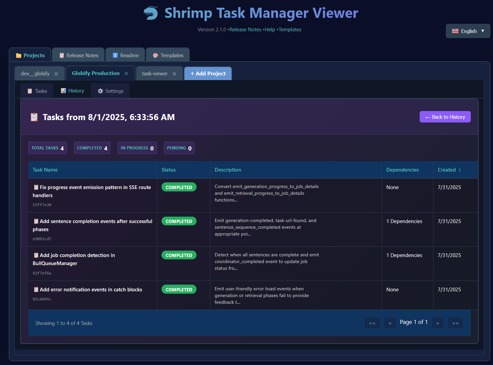
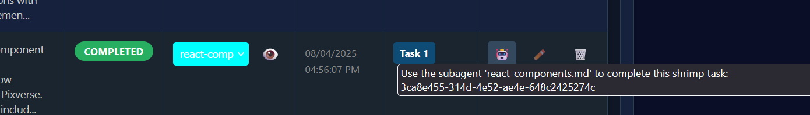

# 🦐 虾米任务管理器查看器

一个现代化的、基于React的Web界面，用于查看和管理通过MCP（模型上下文协议）工具创建的[虾米任务管理器](https://github.com/cjo4m06/mcp-shrimp-task-manager)任务。这个可视化界面让您能够查看详细的任务信息、跟踪多个项目的进度，并快速复制可直接执行的AI代理命令，实现并行任务执行。

## 为什么使用虾米任务查看器？

虾米任务管理器查看器是由开发者为开发者构建的，作为可视化和管理AI代理执行的复杂任务工作流的必备工具。当您通过MCP（模型上下文协议）与Claude等AI助手协作时，实时了解正在规划的任务、进行中的任务以及它们通过依赖关系的相互连接至关重要。这个查看器将抽象的任务数据转换为直观的可视化界面，让您能够监控、控制和优化AI驱动的开发工作流程。

该查看器在支持开发者同时处理多个项目方面表现出色。您可以为不同的功能或实验维护单独的任务列表，使用配置文件标签页快速在它们之间切换，甚至可以将完成的工作流程归档以供日后参考。当紧急错误中断您的功能开发时，只需归档当前任务列表，切换配置文件处理紧急问题，然后无缝返回到原始工作，所有上下文都会得到保留。

这个工具的真正威力在于它对并行AI代理执行的支持。AI操作列（🤖）提供一键访问完整的、可直接执行的命令，您可以直接粘贴到多个终端会话或AI对话中。无需手动构建命令或复制UUID，您可以立即获得格式化的指令，如`"use the built in subagent located in ./claude/agents/react-specialist to complete this shrimp task: [task-id]"`，告诉AI代理具体要做什么。这实现了真正的并行化——启动五个终端窗口，将不同的任务分配给不同的AI代理，并观看它们同时在您的项目上工作。通过实时更新反映实时变化和全面的依赖跟踪，这个工具弥合了AI规划和人工监督之间的差距，确保您始终准确了解AI助手在做什么，并通过智能并行化最大化您的开发吞吐量。

有关设置虾米任务管理器作为MCP服务器的信息，请参阅[主仓库](https://github.com/cjo4m06/mcp-shrimp-task-manager)。

## 📖 标签页文档


## 📋 任务标签页

主任务标签页是您任务管理的指挥中心。它提供所选配置文件中所有任务的全面视图，具有强大的组织和执行功能。


**主要功能：**
- **任务表格**：显示所有任务，具有可排序的列，包括任务编号、状态、代理、创建日期、名称、依赖项和操作
- **状态徽章**：彩色编码徽章（🟡 待处理、🔵 进行中、🟢 已完成、🔴 被阻止）
- **代理分配**：下拉选择器，用于将特定AI代理分配给任务
- **代理查看器弹窗**：点击眼睛图标（👁️）打开弹窗，您可以浏览和选择代理
- **依赖项列**：显示链接的任务ID，具有点击导航功能
- **操作列**：包含用于AI任务执行的强大机器人表情符号（🤖）
- **任务详情导航**：在查看任务详情时，使用←上一个和下一个→按钮在任务之间快速导航

#### 🤖 机器人表情符号 - AI任务执行

操作列中的机器人表情符号是AI辅助任务执行的强大功能：


**工作原理：**
1. **点击🤖表情符号**将任务执行指令复制到剪贴板
2. **对于有代理的任务**：复制`use the built in subagent located in ./claude/agents/[agent-name] to complete this shrimp task: [task-id] please when u start working mark the shrimp task as in progress`
3. **对于没有代理的任务**：复制`Use task manager to complete this shrimp task: [task-id] please when u start working mark the shrimp task as in progress`
4. **视觉反馈**：表情符号短暂变为✓以确认复制操作

**使用场景：**
- **并行执行**：打开多个终端窗口，使用不同的AI代理并粘贴指令进行并发任务处理
- **代理专业化**：将专业化代理（如`react-components.md`、`database-specialist.md`）分配给适当的任务
- **快速交接**：快速将任务委托给AI代理，无需输入复杂命令

#### 🤖 AI驱动的批量代理分配

任务标签页现在包含使用OpenAI的GPT-4的AI驱动批量代理分配：

**使用方法：**
1. **选择任务**：使用复选框选择需要代理分配的多个任务
2. **批量操作栏**：出现蓝色栏显示"🤖 AI分配代理（已选择X个任务）"
3. **一键分配**：点击按钮让GPT-4分析任务并分配适当的代理
4. **自动匹配**：AI考虑任务描述、依赖项和代理能力

**设置要求：**
1. **配置API密钥**：导航到设置→全局设置标签页
2. **输入OpenAI密钥**：在字段中粘贴您的OpenAI API密钥（设置后显示为✓已配置）
3. **替代方法**：设置`OPENAI_API_KEY`或`OPEN_AI_KEY_SHRIMP_TASK_VIEWER`环境变量
4. **获取API密钥**：访问[OpenAI平台](https://platform.openai.com/api-keys)生成密钥


*全局设置标签页提供了安全字段来配置您的OpenAI API密钥*

#### 📝 任务详情视图

点击任何任务行打开详细任务视图，包含全面信息：

**功能：**
- **完整任务信息**：查看完整描述、备注、实施指南和验证标准
- **任务导航**：使用←上一个和下一个→按钮在任务之间移动，无需返回列表
- **相关文件**：查看与任务关联的所有文件，包含行号
- **依赖关系图**：任务依赖关系的可视化表示
- **编辑模式**：点击编辑以修改任务详情（针对未完成的任务）
- **快速操作**：复制任务ID、查看原始JSON或删除任务

**导航优势：**
- **高效审查**：按顺序快速审查多个任务
- **上下文保持**：在任务之间移动时保持在详情视图中
- **键盘支持**：使用箭头键进行更快的导航

#### 📤 导出功能

以多种格式导出任务数据，用于报告、备份或共享目的：

**导出选项：**
- **JSON格式**：包含所有元数据的完整任务数据，适合备份和数据交换
- **CSV格式**：适合电子表格分析和报告的表格格式
- **Markdown格式**：人类可读格式，带有编号任务和初始请求显示

**导出功能：**
- **编号任务**：所有导出格式都包含序号任务编号，便于参考
- **初始请求显示**：导出文件包含项目的初始请求以提供上下文
- **完整数据**：所有任务信息，包括描述、状态、依赖项和元数据
- **下载就绪**：文件自动格式化并准备立即下载

**如何导出：**
1. 导航到任何项目的任务列表
2. 点击右上区域的"导出"按钮
3. 选择您首选的格式（JSON、CSV或Markdown）
4. 文件自动下载，文件名包含时间戳

## 📊 任务历史标签页

任务历史标签页通过显示虾米任务管理器保存的已完成任务快照，为您的项目演进提供有价值的洞察。


**功能：**
- **时间轴视图**：浏览项目任务状态的历史快照
- **记忆文件**：在启动新会话时由虾米任务管理器自动保存
- **任务演进**：跟踪任务从创建到完成的进展
- **笔记系统**：为历史条目添加个人注释



**导航：**
- 点击任何历史条目查看该时间点的详细任务状态
- 使用导航按钮在不同快照之间移动
- 像在主任务视图中一样搜索和过滤历史任务

## 🤖 子代理标签页

子代理标签页允许您管理可以分配给任务以实现最佳执行的专业化AI代理。


**功能：**
- **代理库**：查看`.claude/agents`文件夹中的所有可用代理
- **AI指令列**：点击机器人表情符号（🤖）即时复制代理使用指令
  - 示例：`use subagent debugger.md located in ./claude/agents to perform:`
  - 无需手动输入代理路径或记住语法
  - 视觉反馈确认成功复制到剪贴板
- **代理编辑器**：用于创建和修改代理的内置markdown编辑器
- **颜色编码**：为代理分配颜色以进行视觉组织
- **代理分配**：通过任务表格中的下拉菜单轻松将代理分配给任务
- **代理查看器弹窗**：点击眼睛图标（👁️）浏览和选择代理


**代理分配工作流程：**



1. **从任务表格的下拉菜单中选择代理**
2. **或点击眼睛图标（👁️）**打开代理查看器弹窗
3. **在弹窗中浏览代理**找到适合您任务的代理
4. **自动保存**更新任务的元数据
5. **使用机器人表情符号**复制特定代理的执行指令


*代理查看器弹窗允许您浏览所有可用代理并为每个任务选择最佳代理*

## 🎨 模板标签页

管理指导虾米任务管理器如何分析和执行不同类型操作的AI指令模板。


**功能：**
- **模板编辑器**：带有语法高亮的完整markdown编辑器
- **模板类型**：默认、自定义和自定义+追加状态
- **实时预览**：在激活前查看模板效果
- **导出/导入**：与团队成员共享模板

## 📦 任务归档标签页

任务归档标签页提供强大的任务列表归档和恢复功能，允许您保存当前任务的快照并稍后恢复它们。

**主要功能：**
- **任务列表归档**：将所有任务的当前状态保存为带时间戳的归档
- **归档管理**：查看所有已归档的任务列表及详细信息
- **灵活导入选项**：选择将已归档任务追加到当前任务或替换所有当前任务
- **归档统计**：查看每个已归档任务列表的完成统计
- **数据导出**：以多种格式（JSON、CSV、Markdown）导出任务列表，带有编号任务

**归档工作流程：**


*按下归档按钮时出现的归档当前任务对话框，显示将要归档的内容摘要，包括项目名称、任务计数和完整的初始请求*

1. **创建归档**：点击"归档任务"按钮保存当前任务状态
2. **浏览归档**：查看所有已归档的任务列表，包含时间戳和统计
3. **导入任务**：使用两个选项恢复已归档任务：
   - **追加**：将已归档任务添加到当前任务列表
   - **替换**：用已归档任务替换所有当前任务（提供警告）
4. **导出数据**：以您首选格式下载任务数据


*归档标签页显示所有已归档的任务列表。用户可以点击"查看"检查归档内的任务，"删除"移除归档，或"导入"恢复任务*


*导入归档对话框，提供将已归档任务追加到当前列表或完全替换现有任务的选项*

**归档数据结构：**
每个归档包含：
- **时间戳**：创建归档的时间
- **初始请求**：原始项目请求或描述
- **任务统计**：已完成、进行中和待处理任务计数
- **完整任务数据**：包括描述、依赖项和元数据的完整任务信息

**导出格式：**
- **JSON**：包含所有元数据的完整任务数据
- **CSV**：适合电子表格的表格格式
- **Markdown**：人类可读格式，带有编号任务和初始请求显示

## ⚙️ 全局设置标签页

配置系统范围设置，包括用于访问全局代理的Claude文件夹路径。

**设置包括：**
- **Claude文件夹路径**：设置全局`.claude`文件夹的路径
- **API密钥配置**：管理AI服务的环境变量
- **语言首选项**：在支持的语言之间切换

## 🌟 功能

### 🏷️ 现代化标签页界面
- **可拖动标签页**：通过拖动标签页重新排序配置文件
- **专业设计**：浏览器风格的标签页与内容无缝连接
- **视觉反馈**：清晰的活动标签页指示和悬停效果
- **添加新配置文件**：集成的"+ 添加标签页"按钮匹配界面设计

### 🔍 高级搜索和过滤
- **实时搜索**：按名称、描述、状态或ID即时过滤任务
- **可排序列**：点击列标题按任何字段排序
- **TanStack表格**：具有分页和过滤功能的强大表格组件
- **响应式设计**：在桌面、平板和手机上完美工作

### 🔄 智能自动刷新
- **可配置间隔**：从5秒、10秒、15秒、30秒、1分钟、2分钟或5分钟中选择
- **智能控制**：自动刷新切换与间隔选择
- **视觉指示器**：加载状态和刷新状态
- **手动刷新**：专用刷新按钮，可按需更新

### 📊 任务管理
- **任务统计**：总计、已完成、进行中和待处理任务的实时计数
- **配置文件管理**：通过直观界面添加/删除/重新排序配置文件
- **持久设置**：跨会话保存配置文件配置
- **热重载**：开发模式，即时更新

### 🤖 AI驱动功能
- **批量代理分配**：选择多个任务并使用GPT-4自动分配最合适的代理
- **OpenAI集成**：在全局设置中配置您的API密钥或通过环境变量
- **智能匹配**：AI分析任务描述和代理能力以实现最佳分配
- **错误指导**：如果未配置API密钥，提供清晰指示

### 📚 版本控制和历史
- **Git集成**：自动Git提交跟踪tasks.json的每次更改，带有时间戳消息
- **完整审计跟踪**：使用标准Git工具审查任务修改的完整历史
- **非阻塞操作**：Git故障不会中断任务管理
- **隔离仓库**：任务历史与您的项目仓库分开跟踪

### 📦 归档和数据管理
- **任务列表归档**：保存带时间戳的任务状态完整快照
- **灵活恢复**：通过追加到当前任务或完全替换导入已归档任务
- **归档统计**：查看每个已归档任务列表的完成指标
- **多格式导出**：将任务数据下载为JSON、CSV或Markdown，带有编号任务
- **数据保护**：归档包括初始项目请求和完整任务元数据
- **存储管理**：高效查看、删除和组织已归档任务列表

### 🎨 专业UI/UX
- **深色主题**：为开发环境优化
- **响应式布局**：适应所有屏幕尺寸
- **无障碍性**：完整键盘导航和屏幕阅读器支持
- **交互元素**：悬停提示和整体视觉反馈

## 🚀 快速开始

### 安装和设置

1. **克隆并导航到任务查看器目录**
   ```bash
   cd path/to/mcp-shrimp-task-manager/tools/task-viewer
   ```

2. **安装依赖项**
   ```bash
   npm install
   ```

3. **构建React应用程序**
   ```bash
   npm run build
   ```

4. **启动服务器**
   ```bash
   npm start
   ```

   查看器将在`http://localhost:9998`可用

### 开发模式

用于开发的热重载：

```bash
# 同时启动API服务器和开发服务器
npm run start:all

# 如果需要，可以单独运行服务器：
npm start          # 端口9998上的API服务器
npm run dev        # 端口3000上的Vite开发服务器
```

应用程序将在`http://localhost:3000`可用，文件更改时自动重建。

### 生产部署

#### 标准部署

```bash
# 为生产构建应用程序
npm run build

# 启动生产服务器
npm start
```

#### Systemd服务（Linux）

用于自动启动和进程管理：

1. **安装为服务**
   ```bash
   sudo ./install-service.sh
   ```

2. **管理服务**
   ```bash
   # 检查状态
   systemctl status shrimp-task-viewer
   
   # 启动/停止/重启
   sudo systemctl start shrimp-task-viewer
   sudo systemctl stop shrimp-task-viewer
   sudo systemctl restart shrimp-task-viewer
   
   # 查看日志
   journalctl -u shrimp-task-viewer -f
   
   # 禁用/启用自动启动
   sudo systemctl disable shrimp-task-viewer
   sudo systemctl enable shrimp-task-viewer
   ```

3. **卸载服务**
   ```bash
   sudo ./uninstall-service.sh
   ```

## 🖥️ 使用方法

### 入门

1. **启动服务器**：
   ```bash
   npm start
   ```
   
   **注意**：如果您尚未构建应用程序或想要使用带热重载的开发模式，请使用`npm run start:all`。

2. **打开浏览器**：
   导航到`http://127.0.0.1:9998`（生产）或`http://localhost:3000`（开发）

3. **添加第一个项目**：
   - 点击"**+ 添加标签页**"按钮
   - 输入描述性配置文件名称（例如，"Team Alpha Tasks"）
   - 输入包含tasks.json的虾米数据文件夹路径
   - **提示：** 在终端中导航到您的文件夹并输入`pwd`获取完整路径
   - 点击"**添加配置文件**"

4. **管理任务**：
   - 使用标签页在配置文件之间切换
   - 使用搜索框搜索任务
   - 点击标题对列进行排序
   - 根据需要配置自动刷新

### 标签页管理

- **切换配置文件**：点击任何标签页切换到该配置文件
- **重新排序标签页**：拖动标签页以您首选的顺序重新排列
- **添加新配置文件**：点击"**+ 添加标签页**"按钮
- **删除配置文件**：点击任何标签页上的×（需要确认）

### 搜索和过滤

- **全局搜索**：在搜索框中输入以过滤所有任务字段
- **列排序**：点击任何列标题进行排序（再次点击反转）
- **分页**：使用内置分页控件导航大型任务列表
- **实时更新**：搜索和排序在您输入时即时更新

### 自动刷新配置

1. **启用自动刷新**：选中"自动刷新"复选框
2. **设置间隔**：从下拉菜单中选择（5秒到5分钟）
3. **手动刷新**：随时点击🔄按钮立即刷新
4. **视觉反馈**：刷新操作期间显示旋转器

## 🔧 配置

### 环境变量

为了使环境变量在终端会话间保持持久，将它们添加到您的shell配置文件中：

#### Shell配置示例

**对于macOS/Linux和Zsh**（现代macOS的默认）：
```bash
# 将环境变量添加到 ~/.zshrc
echo 'export SHRIMP_VIEWER_PORT=9998' >> ~/.zshrc
echo 'export SHRIMP_VIEWER_HOST=127.0.0.1' >> ~/.zshrc

# 重新加载配置
source ~/.zshrc
```

**对于Linux/Unix和Bash**：
```bash
# 将环境变量添加到 ~/.bashrc
echo 'export SHRIMP_VIEWER_PORT=9998' >> ~/.bashrc
echo 'export SHRIMP_VIEWER_HOST=127.0.0.1' >> ~/.bashrc

# 重新加载配置
source ~/.bashrc
```

**为什么添加到shell配置？**
- **持久性**：在终端中使用`export`设置的变量只对该会话有效
- **一致性**：所有新终端窗口都将具有这些设置
- **便利性**：每次启动服务器时无需设置变量

**可用变量**：
```bash
SHRIMP_VIEWER_PORT=9998           # 服务器端口（默认：9998）
SHRIMP_VIEWER_HOST=127.0.0.1      # 服务器主机（仅localhost）
OPENAI_API_KEY=sk-...             # OpenAI API密钥，用于AI代理分配
OPEN_AI_KEY_SHRIMP_TASK_VIEWER=sk-...  # OpenAI密钥的替代环境变量
```

### 开发配置

#### 运行开发服务器

**带热重载的开发（推荐用于开发）**：
```bash
npm run start:all  # 运行API服务器（9998）+ Vite开发服务器（3000）
```

**为什么使用start:all？** 此命令同时运行API服务器和Vite开发服务器。您可以获得UI更改的即时热模块替换（HMR），同时具有完整的API功能。您的更改会立即在`http://localhost:3000`的浏览器中出现，无需手动刷新。

**仅API服务器（用于生产或API测试）**：
```bash
npm start  # 在端口9998上运行
```

**为什么仅使用API服务器？** 当您已构建生产文件并想要测试完整应用程序在生产中的运行方式，或者只需要API端点时使用此选项。

**构建并为生产提供服务**：
```bash
npm run build && npm start  # 构建然后在端口9998上提供服务
```

**为什么为生产构建？** 生产构建通过缩小JavaScript、删除死代码和高效捆绑资产来优化您的代码。这为最终用户带来更快的加载时间和更好的性能。部署时始终使用生产构建。

### 配置文件数据存储

**了解配置文件数据管理**：任务查看器使用混合数据存储方法，既优先考虑持久性，又注重实时准确性。配置文件配置（如标签页名称、文件夹路径和标签页顺序）存储在您主目录的本地JSON设置文件中，而任务数据直接从您的项目文件夹实时读取。

- **设置文件**：`~/.shrimp-task-viewer-settings.json`
  
  您主目录中的这个隐藏文件存储所有配置文件配置，包括标签页名称、文件夹路径、标签页排序和其他首选项。它在您添加第一个配置文件时自动创建，并在您进行更改时更新。如有需要，您可以手动编辑此文件，但要小心保持有效的JSON格式。

- **任务文件**：直接从指定的文件夹路径读取（无上传）
  
  与上传和存储文件副本的传统Web应用程序不同，任务查看器直接从您指定的文件夹路径读取`tasks.json`文件。这确保您始终看到任务的当前状态，无需重新上传或同步。添加配置文件时，您只是告诉查看器在哪里查找tasks.json文件。

- **热重载**：开发更改自动重建
  
  在开发模式下运行（`npm run dev`）时，对源代码的任何更改都会触发自动重建和浏览器刷新。这适用于React组件、样式和服务器代码，使开发更快更高效。

### Git任务历史

**自动版本控制**：从v3.0开始，虾米任务管理器使用Git自动跟踪所有任务更改。这提供了完整的审计跟踪，无需任何手动配置。

- **仓库位置**：`<shrimp-data-directory>/.git`
  
  每个项目在`.mcp.json`文件中配置的数据目录中获得自己的Git仓库。这与您项目的主Git仓库完全分离，防止任何冲突或干扰。

- **查看历史**：使用标准Git命令探索任务历史
  ```bash
  cd <shrimp-data-directory>
  git log --oneline          # 查看提交历史
  git show <commit-hash>     # 查看具体更改
  git diff HEAD~5            # 与5个提交前比较
  ```

- **提交格式**：所有提交都包含时间戳和描述性消息
  ```
  [2025-08-07T13:45:23-07:00] Add new task: Implement user authentication
  [2025-08-07T14:12:10-07:00] Update task: Fix login validation
  [2025-08-07T14:45:55-07:00] Bulk task operation: append mode, 6 tasks
  ```

- **恢复**：如需恢复以前的任务状态
  ```bash
  cd <shrimp-data-directory>
  git checkout <commit-hash> -- tasks.json  # 恢复特定版本
  git reset --hard <commit-hash>            # 完全重置到以前状态
  ```

## 🏗️ 技术架构

### 技术栈

- **前端**：React 19 + Vite用于热重载开发
- **表格组件**：TanStack React Table用于高级表格功能
- **样式**：带深色主题和响应式设计的自定义CSS
- **后端**：带RESTful API的Node.js HTTP服务器
- **构建系统**：Vite用于快速开发和优化的生产构建

### 文件结构

**项目组织**：任务查看器遵循清洁、模块化的结构，分离关注点，使代码库易于导航和扩展。每个目录和文件在应用程序架构中都有特定用途。

```
task-viewer/
├── src/                       # React应用程序源代码
│   ├── App.jsx               # 主React组件 - 管理状态、配置文件和标签页
│   ├── components/           # 可重用React组件
│   │   ├── TaskTable.jsx     # 用于显示和排序任务的TanStack表格
│   │   ├── Help.jsx          # 带markdown渲染的README查看器
│   │   └── ReleaseNotes.jsx  # 带语法高亮的版本历史
│   ├── data/                 # 静态数据和配置
│   │   └── releases.js       # 发布元数据和版本信息
│   └── index.css             # 带深色主题的完整样式系统
├── releases/                  # 发布说明markdown文件和图像
│   ├── v*.md                 # 单独的发布说明文件
│   └── *.png                 # 发布的屏幕截图和图像
├── dist/                     # 生产构建输出（自动生成）
│   ├── index.html            # 优化的HTML入口点
│   └── assets/               # 捆绑的JS、CSS和其他资产
├── server.js                 # 类Express的Node.js API服务器
├── cli.js                    # 服务管理的命令行界面
├── vite.config.js            # 开发/生产的构建工具配置
├── package.json              # 项目元数据、依赖项和npm脚本
├── install-service.sh        # Linux systemd服务安装程序
└── README.md                 # 综合文档（此文件）
```

**重要目录说明**：

- **`src/`**：包含所有React源代码。这是您进行大部分UI更改的地方。
- **`dist/`**：自动生成的生产构建。永远不要直接编辑这些文件。
- **`releases/`**：以markdown格式存储发布说明及相关图像。
- **根文件**：处理构建、服务和部署的配置和服务器文件。

### API端点

- `GET /` - 提供React应用程序
- `GET /api/agents` - 列出所有配置的配置文件
- `GET /api/tasks/{profileId}` - 返回特定配置文件的任务
- `POST /api/add-profile` - 添加带文件夹路径的新配置文件
- `DELETE /api/remove-profile/{profileId}` - 删除配置文件
- `PUT /api/rename-profile/{profileId}` - 重命名配置文件
- `PUT /api/update-profile/{profileId}` - 更新配置文件设置
- `GET /api/readme` - 返回帮助标签页的README内容
- `GET /releases/*.md` - 提供发布说明markdown文件
- `GET /releases/*.png` - 提供发布说明图像

## 🛠️ 开发

### 设置开发环境

```bash
# 安装依赖项
npm install

# 启动带热重载的开发服务器
npm run dev

# 开发服务器在 http://localhost:3000 运行
# 后端API服务器在 http://localhost:9998 运行
```

### 为生产构建

```bash
# 构建优化的生产捆绑包
npm run build

# 文件在 dist/ 目录中生成
# 启动生产服务器
npm start
```

### 扩展界面

模块化React架构使扩展变得容易：

1. **添加新组件**：在`src/components/`中创建
2. **修改样式**：使用CSS自定义属性编辑`src/index.css`
3. **添加功能**：使用新状态和功能扩展`App.jsx`
4. **API集成**：在`server.js`中添加端点

## 🔒 安全性和性能

### 安全功能

- **本地主机绑定**：服务器仅可从本地机器访问
- **直接文件访问**：直接从文件系统路径读取任务文件
- **无外部依赖**：自包含，最小攻击面
- **CORS保护**：API端点受CORS标头保护

### 性能优化

- **热模块替换**：即时开发更新
- **代码分割**：优化捆绑包加载
- **高效重新渲染**：React优化模式
- **缓存**：静态资产缓存以实现更快加载
- **响应式图像**：为所有设备尺寸优化

## 🐛 故障排除

### 常见问题

**服务器无法启动**
```bash
# 检查端口是否正在使用
lsof -i :9998

# 终止现有进程
pkill -f "node.*server.js"

# 尝试不同端口
SHRIMP_VIEWER_PORT=8080 node server.js
```

**帮助/Readme标签页显示HTML**
如果帮助标签页显示HTML而不是README内容，需要重启服务器以加载新的API端点：
```bash
# 停止服务器（Ctrl+C）并重启
npm start
```

**热重载不工作**
```bash
# 确保安装了开发依赖项
npm install

# 重启开发服务器
npm run dev
```

**任务无法加载**
1. 检查`tasks.json`文件包含有效JSON
2. 验证文件权限可读
3. 检查浏览器控制台的错误消息
4. 使用手动刷新按钮重新加载数据

**构建错误**
```bash
# 清除 node_modules 并重新安装
rm -rf node_modules package-lock.json
npm install

# 清除 Vite 缓存
rm -rf dist/
npm run build
```

## 📋 更新日志

### 版本 2.1.0（最新）- 2025-07-29

#### 🚀 主要功能
- **直接文件路径支持**：用直接文件夹路径输入替换文件上传以进行实时更新
- **帮助/Readme标签页**：添加了带markdown渲染的文档标签页
- **发布说明标签页**：应用内发布说明查看器，支持图像
- **可点击依赖项**：轻松在依赖任务之间导航
- **AI操作列**：复制AI指令以完成任务
- **增强的UUID管理**：点击任务徽章复制UUID
- **配置文件编辑**：重命名配置文件并配置项目根目录
- **ES模块支持**：转换为ES模块以获得更好的兼容性

#### 🐛 关键修复
- **修复了静态文件复制问题**：文件现在直接从指定路径读取，而不是在`/tmp/`中创建静态副本

### 版本 1.0.3 - 2025-07-26

#### 🧪 测试和可靠性
- **全面测试套件**：使用Vitest添加了全面测试覆盖
- **组件测试**：所有组件的React测试库测试
- **集成测试**：服务器和API端点的端到端测试
- **错误修复**：解决了配置文件管理中的多部分表单数据处理

### 版本 1.0.2 - 2025-07-26

#### 🎨 任务详情视图
- **标签页内导航**：用无缝的标签页内任务详情替换模态
- **返回按钮**：轻松导航回任务列表
- **改进的UX**：更好的工作流程，无弹窗中断

### 版本 1.0.1 - 2025-07-13

#### 🎨 主要UI改造
- **现代化标签页界面**：专业的浏览器风格标签页，支持拖放重新排序
- **连接设计**：标签页和内容之间的无缝视觉连接
- **改进的布局**：重新定位搜索和控件以实现更好的工作流程

#### ⚡ 增强功能
- **可配置自动刷新**：从5秒到5分钟选择间隔
- **高级搜索**：跨所有任务字段的实时过滤
- **可排序列**：点击标题按任何列排序
- **热重载开发**：开发期间即时更新

#### 🔧 技术改进
- **React架构**：使用React 19 + Vite完全重写
- **TanStack表格**：带分页的专业表格组件
- **响应式设计**：移动优先方法，具有断点优化
- **性能**：优化渲染和高效状态管理

### 版本 1.0.0 - 2025-07-01

#### 🚀 初始发布
- **基本查看器**：带基本Web界面的初始实现
- **配置文件管理**：添加和删除任务配置文件
- **服务器API**：用于任务数据的RESTful端点
- **任务显示**：查看多个项目的任务

## 📄 许可证

MIT许可证 - 有关详细信息，请参阅主项目许可证。

## 🤝 贡献

此工具是MCP虾米任务管理器项目的一部分。欢迎贡献！

1. Fork仓库
2. 创建功能分支（`git checkout -b feature/amazing-feature`）
3. 进行适当测试的更改
4. 提交更改（`git commit -m 'Add amazing feature'`）
5. 推送到分支（`git push origin feature/amazing-feature`）
6. 提交拉取请求

### 开发指南

- 遵循React最佳实践和hooks模式
- 保持响应式设计原则
- 在适当的地方添加适当的TypeScript类型
- 在不同浏览器和设备上测试
- 为新功能更新文档

---

**快乐的任务管理！🦐✨**

使用React、Vite和现代Web技术构建，满怀❤️。