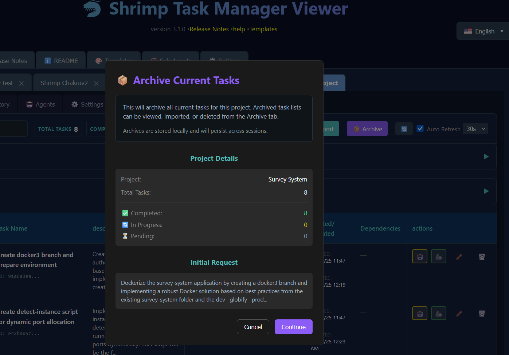
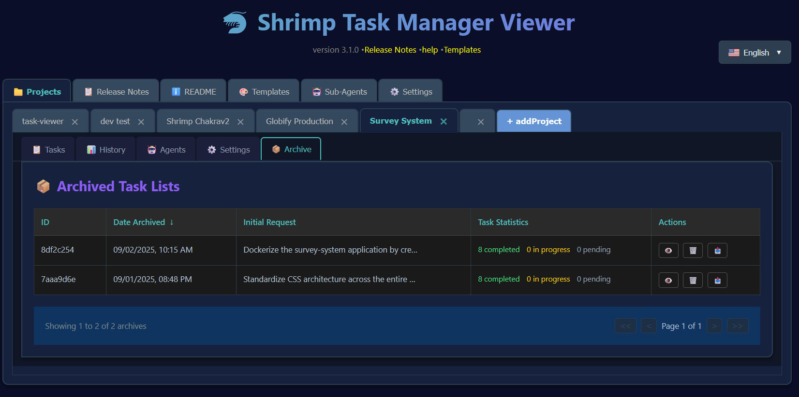
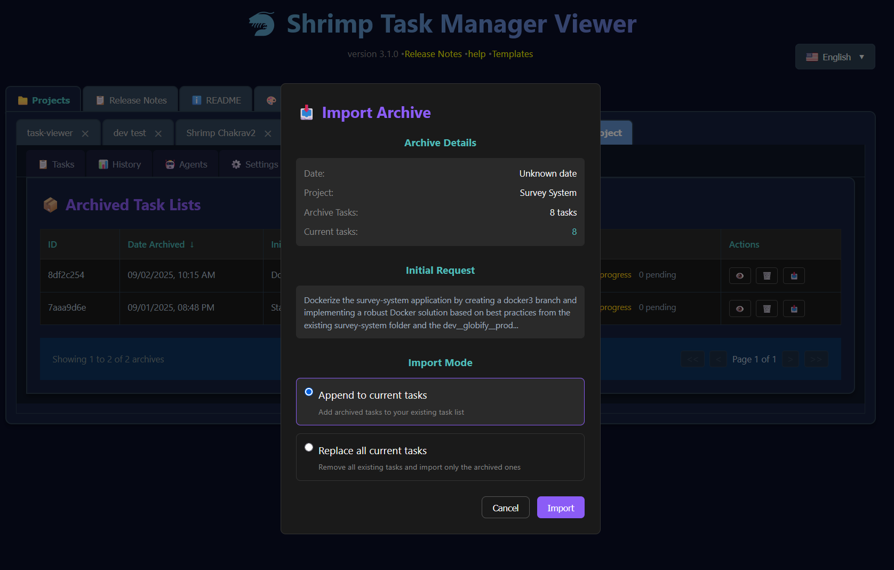
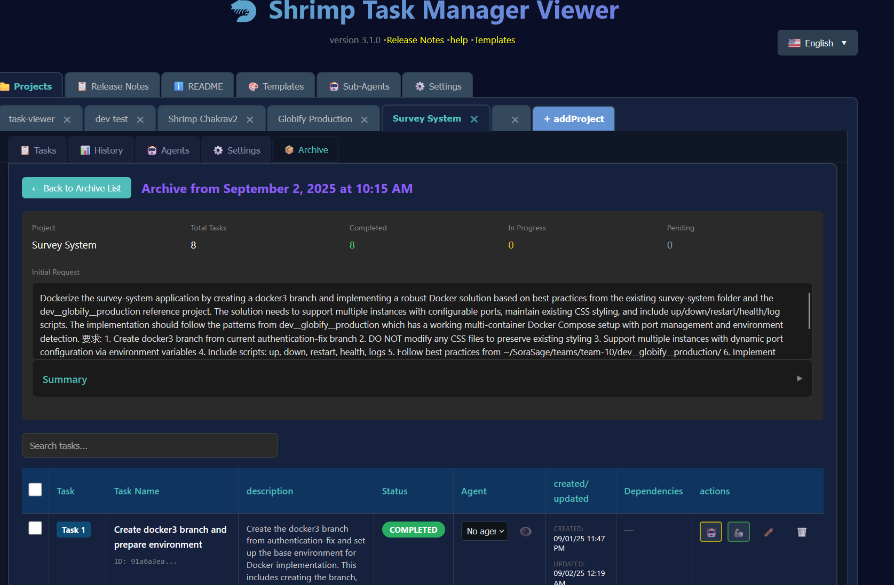

# 🦐 Shrimp Task Manager v4.0.0 रिलीज़ नोट्स

*रिलीज़ दिनांक: 3 सितंबर 2025*

## 📋 विषय सूची

- [प्रमुख नई सुविधाएं](#प्रमुख-नई-सुविधाएं)
  - [प्रारंभिक अनुरोध प्रदर्शन एवं सारांश जेनरेशन](#प्रारंभिक-अनुरोध-प्रदर्शन-एवं-सारांश-जेनरेशन)
  - [उन्नत रिलीज़ नोट्स अनुभव](#उन्नत-रिलीज़-नोट्स-अनुभव)
  - [आर्काइव प्रबंधन सिस्टम](#आर्काइव-प्रबंधन-सिस्टम)
  - [उन्नत एजेंट प्रबंधन](#उन्नत-एजेंट-प्रबंधन)
  - [पुनर्डिज़ाइन इतिहास दृश्य](#पुनर्डिज़ाइन-इतिहास-दृश्य)
- [तकनीकी सुधार](#तकनीकी-सुधार)
  - [प्रदर्शन एवं अवसंरचना](#प्रदर्शन-एवं-अवसंरचना)
  - [परीक्षण कवरेज](#परीक्षण-कवरेज)
- [महत्वपूर्ण बग फिक्स](#महत्वपूर्ण-बग-फिक्स)
  - [स्क्रॉलिंग समस्याएं हल की गईं](#स्क्रॉलिंग-समस्याएं-हल-की-गईं)
  - [UI/UX फिक्स](#uiux-फिक्स)
- [अपग्रेड करने का तरीका](#अपग्रेड-करने-का-तरीका)
- [आगे क्या है](#आगे-क्या-है)

## 🎉 प्रमुख नई सुविधाएं

### 💡 प्रारंभिक अनुरोध प्रदर्शन एवं सारांश जेनरेशन

आपकी कार्य सूची के पीछे के संदर्भ को देखने और समझने की क्षमता अब उपलब्ध है। प्रारंभिक अनुरोध प्रदर्शन कार्य योजना शुरू करने वाले मूल उपयोगकर्ता अनुरोध को कैप्चर करता है और स्थायी रूप से संग्रहीत करता है। इसका मतलब है कि हफ्तों या महीनों बाद, आप तुरंत अपनी स्मृति को तरोताजा कर सकते हैं कि ये कार्य क्यों मौजूद हैं और वे किस समस्या को हल करने के लिए बने थे।

इसके अतिरिक्त, अब एक बुद्धिमान सारांश सुविधा है जो OpenAI का लाभ उठाकर संक्षिप्त अवलोकन प्रदान करती है कि क्या पूरा किया गया है। बस सारांश बटन पर क्लिक करें, और अपनी OpenAI API key का उपयोग करके, सिस्टम सभी पूर्ण कार्यों का विश्लेषण करेगा और आपकी प्रगति का स्पष्ट सिनॉप्सिस प्रदान करेगा। यह परियोजना स्थिति अपडेट, टीम संचार, या बस यह समझने के लिए अमूल्य है कि आप जटिल कार्यान्वयन के साथ कहां खड़े हैं।

### 📖 उन्नत रिलीज़ नोट्स अनुभव

रिलीज़ नोट्स सिस्टम को जमीन से ऊपर तक पूरी तरह से फिर से कल्पना की गई है। स्थिर टेक्स्ट के बजाय, अब आपके पास साइडबार में collapsible विषय सूची के साथ एक interactive, नेविगेट करने योग्य अनुभव है। प्रत्येक संस्करण को इसकी सेक्शन रूपरेखा दिखाने के लिए विस्तृत किया जा सकता है, जिससे आप आवश्यक जानकारी पर जल्दी पहुंच सकते हैं।

कार्यान्वयन में रंग-कोडित हेडिंग के साथ परिष्कृत स्टाइलिंग शामिल है - मुख्य अनुभागों के लिए गुलाबी, "नई सुविधाओं" के लिए सफेद, "बग फिक्स" के लिए नारंगी, और अवलोकन अनुभागों के लिए हल्का नीला। बेहतर पठनीयता के लिए टेक्स्ट 25% बड़ा है, और h2 से h5 तक सभी markdown तत्व उचित रूप से रेंडर किए गए हैं।

साइडबार और कंटेंट क्षेत्र स्वतंत्र रूप से स्क्रॉल करते हैं, यह सुनिश्चित करते हुए कि आप व्यापक दस्तावेज़ीकरण के माध्यम से नेविगेट करते समय कभी अपना स्थान नहीं खोते। कस्टम टील-थीम्ड स्क्रॉलबार एप्लिकेशन की डिज़ाइन भाषा के साथ दृश्य स्थिरता प्रदान करते हैं।

### 📚 आर्काइव प्रबंधन सिस्टम

आर्काइव सुविधा आपके कार्य सूचियों के प्रबंधन में क्रांति लाती है। क्या आपने कभी विस्तृत प्रारंभिक अनुरोध से कार्यों का जटिल सेट बनाया है, केवल यह महसूस करने के लिए कि आपको पहले किसी और चीज़ पर काम करने की आवश्यकता है? आर्काइव सिस्टम इस समस्या को पूरी तरह से हल करता है।

जब आप कार्य सूची को आर्काइव करते हैं, तो कार्यों का पूरा संग्रह - उन्हें स्पॉन करने वाले प्रारंभिक अनुरोध सहित - बाद में उपयोग के लिए सुरक्षित रूप से संग्रहीत हो जाता है। यह आपको अपने पिछले योजना कार्य को खोए बिना नई कार्य सूची के साथ तरोताजा शुरुआत करने की अनुमति देता है। जब आप उन आर्काइव कार्यों पर वापस लौटने के लिए तैयार हों, तो बस उन्हें अपने वर्तमान वर्कफ़्लो में वापस आयात करें। यह उन डेवलपर्स के लिए विशेष रूप से उपयोगी है जो एक साथ कई सुविधाओं पर काम करते हैं या अक्सर संदर्भ बदलने की आवश्यकता होती है।

आर्काइव इंटरफ़ेस इतिहास पृष्ठ के समान परिष्कृत डिज़ाइन साझा करता है, एप्लिकेशन में एक सुसंगत और सहज उपयोगकर्ता अनुभव प्रदान करता है। आप अपनी सभी आर्काइव कार्य सूचियों को देख सकते हैं, देख सकते हैं कि वे कब बनाई गई थीं, और आवश्यकता पड़ने पर जल्दी से किसी भी आर्काइव को पुनर्स्थापित कर सकते हैं।

*वर्तमान कार्य आर्काइव करें डायलॉग जो तब दिखाई देता है जब आप कार्य टैब में आर्काइव बटन दबाते हैं। यह दिखाता है कि क्या आर्काइव किया जाएगा, परियोजना नाम, कार्य गिनती, स्थिति विवरण, और पूर्ण प्रारंभिक अनुरोध जिसने ये कार्य बनाए थे*

आर्काइव सूची दृश्य आपकी सभी आर्काइव कार्य सूचियों को उनके प्रारंभिक अनुरोधों और कार्य आंकड़ों के साथ प्रदर्शित करता है:

*आर्काइव टैब जो आर्काइव कार्य सूचियों की सूची दिखाता है। ध्यान दें कि उपयोगकर्ता आर्काइव कार्य सूची के भीतर सभी कार्यों की जांच करने के लिए "देखें" पर क्लिक कर सकते हैं, आर्काइव को स्थायी रूप से हटाने के लिए "डिलीट" पर क्लिक कर सकते हैं, या अपने वर्तमान वर्कफ़्लो में कार्यों को पुनर्स्थापित करने के लिए "आयात" बटन दबा सकते हैं*

जब आप आर्काइव को पुनर्स्थापित करने के लिए तैयार हों, तो आयात डायलॉग आपको अपनी वर्तमान सूची में कार्यों को जोड़ने या उन्हें पूरी तरह से बदलने के विकल्प देता है:

*आयात आर्काइव डायलॉग जो आयात दबाने पर दिखाई देता है। यह आर्काइव कार्यों को पुनर्स्थापित करने के लिए लचीले विकल्प प्रदान करता है - या तो उन्हें वर्तमान कार्य सूची में जोड़ें या मौजूदा कार्यों को आर्काइव वाले के साथ पूरी तरह से बदलें*

एक बार आयात करने पर, आप प्रारंभिक अनुरोध और कार्य विवरण सहित आर्काइव कार्यों का सभी विवरण देख सकते हैं:

*आर्काइव विवरण पृष्ठ जो प्रारंभिक अनुरोध और सारांश के साथ पूर्ण कार्य सूची दिखाता है*

### नए MCP उपकरण जोड़े गए

चूंकि अब हमारे पास Task Viewer में आर्काइविंग और इतिहास है, हमने सोचा कि बेहतर होगा कि MCP tool को भी अपडेट किया जाए ताकि आपका Claude agent आर्काइव और इतिहास को पूरी तरह से नियंत्रित कर सके।

आर्काइव और इतिहास कार्यक्षमता तक प्रोग्रामेटिक पहुंच प्रदान करने के लिए MCP (Model Context Protocol) उपकरणों का व्यापक सेट लागू किया गया है। ये उपकरण AI एजेंट और बाहरी सिस्टम को संरचित APIs के माध्यम से कार्य प्रबंधन वर्कफ़्लो के साथ इंटरैक्ट करने में सक्षम बनाते हैं।

**सात नए MCP उपकरण:**

- **create_archive**: वैकल्पिक विवरण के साथ वर्तमान कार्य सूचियों का बैकअप बनाएं
- **list_archives**: निर्माण तिथि और कार्य गिनती सहित मेटाडेटा के साथ सभी आर्काइव कार्य सूचियों को ब्राउज़ करें  
- **restore_from_archive**: merge या replace विकल्पों के साथ आर्काइव कार्यों को वर्तमान वर्कफ़्लो में वापस आयात करें
- **get_task_history**: सभी कार्य परिवर्तनों, अपडेट और स्थिति संक्रमणों के व्यापक ऑडिट ट्रेल प्राप्त करें
- **get_deleted_tasks**: रिकवरी या ऑडिट उद्देश्यों के लिए हटाए गए कार्यों के बारे में जानकारी एक्सेस करें
- **recover_task**: अपने अद्वितीय पहचानकर्ताओं द्वारा पहले हटाए गए कार्यों को पुनर्स्थापित करें
- **sync_task_state**: विभिन्न भंडारण स्थानों में कार्य डेटा स्थिरता को सिंक्रोनाइज़ करें और संघर्षों को हल करें

प्रत्येक उपकरण में मजबूत Zod schema validation, व्यापक error handling, और द्विभाषी template समर्थन (अंग्रेजी/चीनी) शामिल है। कार्यान्वयन में मौजूदा कार्य मॉडल के साथ उचित TypeScript एकीकरण की सुविधा है और वेब इंटरफ़ेस के साथ पूर्ण संगतता बनाए रखता है।

### 🤖 उन्नत एजेंट प्रबंधन

इस रिलीज़ में एजेंट क्षमताओं को महत्वपूर्ण रूप से विस्तारित किया गया है। नई bulk agent assignment सुविधा आपको intuitive dropdown इंटरफ़ेस के माध्यम से एक साथ कई कार्यों को AI एजेंट को असाइन करने की अनुमति देती है। व्यक्तिगत कार्य असाइनमेंट अब page refresh के बिना होते हैं, जिससे वर्कफ़्लो अधिक smooth और कुशल हो जाता है।

एजेंट जानकारी मोडल को स्पष्ट विवरण प्रदान करने और एजेंट क्षमताओं में बेहतर दृश्यता के लिए पूरी तरह से ओवरहॉल किया गया है। महत्वपूर्ण समस्याएं जहां एजेंट विवरण रिक्त दिखाई देते थे, उन्हें ठीक किया गया है, उन 500 त्रुटियों के साथ जो production कार्य सूचियों के साथ काम करते समय होती थीं।

### 📊 पुनर्डिज़ाइन इतिहास दृश्य

इतिहास दृश्य को आर्काइव सिस्टम के परिष्कृत इंटरफ़ेस से मेल खाने के लिए बदल दिया गया है। सबसे महत्वपूर्ण बात यह है कि यह अब मुख्य दृश्य में नोट्स के बजाय प्रारंभिक अनुरोध प्रदर्शित करता है, जिससे आपको प्रत्येक ऐतिहासिक कार्य सूची के बारे में तत्काल संदर्भ मिलता है। लेआउट को बेहतर कॉलम स्पेसिंग और अधिक कुशल फ़िल्टरिंग क्षमताओं के साथ अनुकूलित किया गया है।

## 🔧 तकनीकी सुधार

### प्रदर्शन एवं अवसंरचना

एप्लिकेशन के प्रदर्शन और विकास अनुभव में महत्वपूर्ण सुधार किए गए हैं। नई बिल्ड सिस्टम में एक सरलीकृत `npm run build` कमांड शामिल है जो स्वचालित रूप से server को बिल्ड और शुरू करता है। end-to-end परीक्षण के लिए Playwright को एकीकृत किया गया है, जो अपडेट में UI विश्वसनीयता सुनिश्चित करता है।

server को बेहतर error handling और validation के साथ नए आर्काइव endpoints के साथ बढ़ाया गया है। बेहतर डेटा fetching रणनीतियों के माध्यम से response times को अनुकूलित किया गया है।

**MCP सर्वर आर्किटेक्चर:**

MCP server कार्यान्वयन विश्वसनीय संचार के लिए Claude के साथ StdioServerTransport के साथ low-level Server class का उपयोग करता है। आर्किटेक्चर में शामिल है:

- `ListToolsRequestSchema` और `CallToolRequestSchema` के लिए `setRequestHandler` के माध्यम से उचित tool registration
- व्यापक tool परिभाषाओं के साथ server capabilities घोषणा
- विस्तृत लॉगिंग और user-friendly error messages के साथ मजबूत error handling
- JSON persistence और automatic backups के साथ memory-based कार्य भंडारण
- dynamic सामग्री जेनरेशन के साथ द्विभाषी template समर्थन

### परीक्षण कवरेज

इस रिलीज़ में सभी नई सुविधाओं के लिए व्यापक परीक्षण कवरेज शामिल है:
- आर्काइव कार्यक्षमता परीक्षण
- रिलीज़ नोट्स स्क्रॉलिंग परीक्षण
- इतिहास दृश्य एकीकरण परीक्षण
- एजेंट असाइनमेंट परीक्षण
- सारांश जेनरेशन परीक्षण
- **MCP उपकरण validation परीक्षण**: वास्तविक कार्य निर्माण, आर्काइविंग, और restoration scenarios के साथ पूर्ण आर्काइव/restore वर्कफ़्लो परीक्षण
- **Template processing परीक्षण**: Handlebars template rendering और variable substitution का सत्यापन
- **Error handling परीक्षण**: सभी MCP उपकरणों में edge cases और failure scenarios का व्यापक परीक्षण

## 🐛 महत्वपूर्ण बग फिक्स

### स्क्रॉलिंग समस्याएं हल की गईं

रिलीज़ नोट्स और अन्य टैब को प्रभावित करने वाली महत्वपूर्ण स्क्रॉलबार दृश्यता समस्याएं ठीक कर दी गई हैं। एप्लिकेशन अब custom styling के साथ उचित रूप से स्क्रॉलबार प्रदर्शित करता है, यह सुनिश्चित करते हुए कि सामग्री हमेशा accessible है। साइडबार और सामग्री क्षेत्रों के बीच स्वतंत्र स्क्रॉलिंग निर्दोष रूप से काम करती है।

### UI/UX फिक्स

- collapsible sections में Arrow positioning को सही किया गया है
- पूरे इंटरफ़ेस में color contrast में सुधार किया गया है
- Loading states अब अधिक जानकारीपूर्ण हैं
- Error messages स्पष्ट मार्गदर्शन प्रदान करते हैं

### पोस्ट-रिलीज़ फिक्स (सितंबर 2025)

प्रारंभिक रिलीज़ के बाद कई महत्वपूर्ण समस्याओं की पहचान और समाधान किया गया:

#### Scroll Spy और विषय सूची फिक्स

- **Fixed scroll spy duplicate highlighting**: समान नामों वाले sections (जैसे "How to Use") कई TOC entries को एक साथ highlight करने का कारण बन रहे थे। केवल सही section के highlight होने को सुनिश्चित करने के लिए parent context का उपयोग करके unique ID generation लागू की गई।
- **Fixed broken scroll spy highlighting**: unique IDs लागू करने के बाद scroll spy कार्यक्षमता पूरी तरह से काम करना बंद हो गई थी। table of contents parsing और content rendering के बीच consistency सुनिश्चित करने के लिए centralized ID generation functions जोड़े गए।
- **Fixed Collapse All button on Release Notes**: incorrect version scope handling के कारण button काम नहीं कर रहा था। expand/collapse functions को version parameters स्वीकार करने और सही release version pass करने के लिए अपडेट किया गया।

#### पारिभाषिकता और दिनांक सुधार

- **Updated modal terminology**: पूरे इंटरफ़ेस में "project" पारिभाषिकता का consistently उपयोग करने के लिए "Add New Profile" modal बदला गया। "Profile Name" के बजाय "Project Name" दिखाने के लिए अंग्रेजी अनुवाद अपडेट किए गए।
- **Corrected v4.0.0 release date**: रिलीज़ दिनांक को 2025-01-02 से 2025-09-03 की वास्तविक रिलीज़ दिनांक में ठीक किया गया।

#### MCP सर्वर और Template Processing फिक्स

- **Fixed function naming conflicts**: MCP उपकरण और मॉडल functions के बीच duplicate function names के कारण होने वाली server crashes को हल किया गया। उचित import aliasing के साथ `getDeletedTasksTool` → `getDeletedTasks` और `recoverTaskTool` → `recoverTask` अपडेट किया गया।
- **Fixed template processing issues**: गुम template files (`empty.md`, `noResults.md`, `success.md`) बनाकर और generators और templates के बीच variable name mappings को सही करके tool responses में raw Handlebars syntax दिखाई देने की समस्या हल की गई।
- **Fixed MCP tool registration**: सभी 7 नए उपकरण MCP इंटरफ़ेस के माध्यम से उचित रूप से accessible हों यह सुनिश्चित करने के लिए tool export naming और registration को सही किया गया।
- **Fixed TypeScript compilation errors**: filter functions में async/await issues हल किए गए और optional parameters के लिए उचित type assertions जोड़े गए।

ये फिक्स उचित navigation, consistent terminology, सटीक रिलीज़ जानकारी, और पूरी तरह कार्यात्मक MCP tool एकीकरण के साथ smooth उपयोगकर्ता अनुभव सुनिश्चित करते हैं।

## 📝 अपग्रेड करने का तरीका

v4.0.0 में अपग्रेड करना सीधा है:

1. repository से latest changes pull करें
2. dependencies अपडेट करने के लिए `npm install` चलाएं
3. एप्लिकेशन को बिल्ड और शुरू करने के लिए `npm run build` execute करें
4. सभी नई styles load हों यह सुनिश्चित करने के लिए अपना browser cache clear करें

बस इतना ही! कोई database migration की आवश्यकता नहीं - बस बिल्ड करें और चलाएं।

## 🚀 आगे क्या है

संस्करण 4.0.0 Shrimp Task Manager के लिए एक नया मानक स्थापित करता है। आर्काइव प्रबंधन, प्रारंभिक अनुरोध ट्रैकिंग, सारांश जेनरेशन, उन्नत रिलीज़ नोट्स सिस्टम, और व्यापक MCP API एकीकरण का संयोजन जटिल विकास वर्कफ़्लो प्रबंधन के लिए एक शक्तिशाली toolkit बनाता है।

नया MCP आर्काइव और इतिहास उपकरण सिस्टम इसके लिए संभावनाएं खोलता है:
- बाहरी विकास उपकरण और CI/CD pipelines के साथ एकीकरण
- AI एजेंट द्वारा संचालित automated कार्य प्रबंधन वर्कफ़्लो
- कार्य डेटा तक प्रोग्रामेटिक पहुंच के माध्यम से enhanced सहयोग
- विकास प्रगति पर advanced analytics और reporting
- repetitive कार्य प्रबंधन operations के लिए custom automation scripts

यह foundation Shrimp Task Manager को केवल एक standalone उपकरण के रूप में नहीं, बल्कि बड़े विकास ecosystems के मुख्य घटक के रूप में स्थापित करता है।