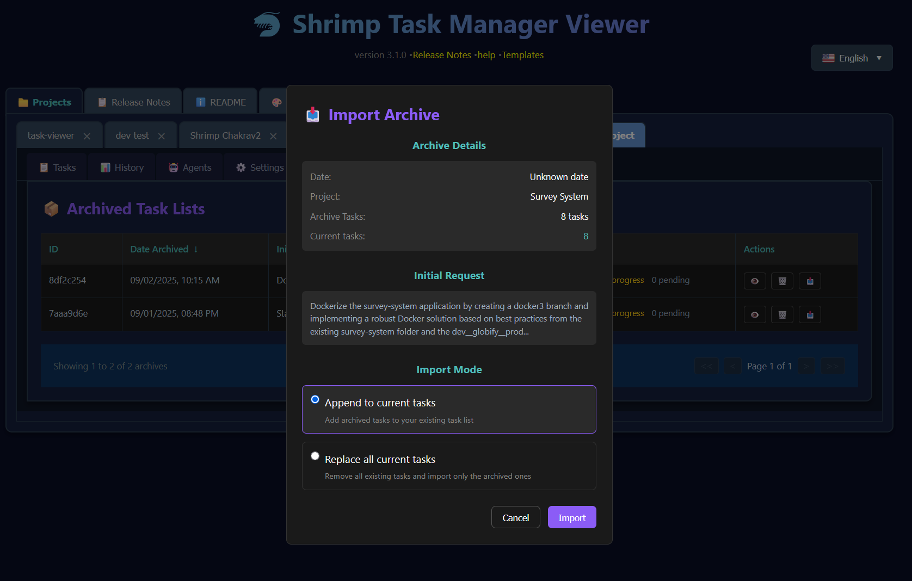

# 🦐 Shrimp Task Manager v4.0.0 Versienotities

*Uitgebracht: 3 september 2025*

## 📋 Inhoudsopgave

- [Belangrijkste Nieuwe Functies](#belangrijkste-nieuwe-functies)
  - [Oorspronkelijke Aanvraagweergave & Samenvattingsgeneratie](#oorspronkelijke-aanvraagweergave--samenvattingsgeneratie)
  - [Verbeterde Versienotities-ervaring](#verbeterde-versienotities-ervaring)
  - [Archiefsysteem](#archiefsysteem)
  - [Verbeterd Agent Beheer](#verbeterd-agent-beheer)
  - [Herontworpen Geschiedenis Weergave](#herontworpen-geschiedenis-weergave)
- [Technische Verbeteringen](#technische-verbeteringen)
  - [Prestaties & Infrastructuur](#prestaties--infrastructuur)
  - [Test Dekking](#test-dekking)
- [Kritieke Bugfixes](#kritieke-bugfixes)
  - [Scroll Problemen Opgelost](#scroll-problemen-opgelost)
  - [UI/UX Fixes](#uiux-fixes)
- [Hoe Upgraden](#hoe-upgraden)
- [Wat Volgt](#wat-volgt)

## 🎉 Belangrijkste Nieuwe Functies

### 💡 Oorspronkelijke Aanvraagweergave & Samenvattingsgeneratie

De mogelijkheid om de context achter uw taaklijsten te zien en begrijpen is nu beschikbaar. De Oorspronkelijke Aanvraagweergave legt de oorspronkelijke gebruikersaanvraag die de taakplanning heeft geïnitieerd permanent vast en slaat deze op. Dit betekent dat u weken of maanden later direct uw geheugen kunt opfrissen over waarom deze taken bestaan en welk probleem ze bedoeld waren op te lossen.

Daarnaast is er nu een intelligente Samenvattingsfunctie die OpenAI gebruikt om beknopte overzichten te genereren van wat er is bereikt. Klik gewoon op de Samenvatting knop, en met behulp van uw OpenAI API sleutel zal het systeem alle voltooide taken analyseren en u een duidelijke samenvatting geven van uw voortgang. Dit is onschatbaar voor projectstatusupdates, teamcommunicatie, of gewoon om te begrijpen waar u staat met complexe implementaties.

### 📖 Verbeterde Versienotities-ervaring

Het Versienotities systeem is volledig opnieuw bedacht vanaf de grond. In plaats van statische tekst heeft u nu een interactieve, navigeerbare ervaring met een inklapbare Inhoudsopgave in de zijbalk. Elke versie kan worden uitgevouwen om de sectie-indeling te tonen, waardoor u snel naar de informatie kunt springen die u nodig heeft.

De implementatie bevat geavanceerde styling met kleurgecodeerde kopjes - roze voor hoofdsecties, wit voor "Nieuwe Functies", oranje voor "Bug Fixes", en lichtblauw voor overzichtssecties. De tekst is 25% groter voor betere leesbaarheid, en alle markdown elementen van h2 tot h5 worden correct weergegeven.

De zijbalk en inhoud gebieden scrollen onafhankelijk, wat ervoor zorgt dat u nooit uw plek verliest tijdens het navigeren door uitgebreide documentatie. Aangepaste blauwgroene scrollbalken bieden visuele consistentie met de ontwerptaal van de applicatie.

### 📚 Archiefsysteem

De Archief functie revolutioneert hoe u uw taaklijsten beheert. Heeft u ooit een complexe set taken gemaakt vanuit een gedetailleerde oorspronkelijke aanvraag, om er vervolgens achter te komen dat u eerst aan iets anders moet werken? Het Archief systeem lost dit probleem perfect op.

Wanneer u een taaklijst archiveert, wordt de volledige collectie taken - inclusief de oorspronkelijke aanvraag die ze heeft voortgebracht - veilig opgeslagen voor later gebruik. Dit stelt u in staat om opnieuw te beginnen met een nieuwe taaklijst zonder uw vorige planningswerk te verliezen. Wanneer u klaar bent om terug te keren naar die gearchiveerde taken, importeert u ze gewoon terug in uw huidige werkstroom. Dit is bijzonder nuttig voor ontwikkelaars die aan meerdere functies tegelijkertijd werken of frequent van context moeten wisselen.

De Archief interface deelt hetzelfde gepolijste ontwerp als de Geschiedenis pagina, wat een consistente en intuïtieve gebruikerservaring biedt door de hele applicatie. U kunt al uw gearchiveerde taaklijsten bekijken, zien wanneer ze zijn gemaakt, en snel elk archief herstellen wanneer nodig.

*Het Archiveer Huidige Taken dialoog dat verschijnt wanneer u op de Archief knop drukt in het Taken tabblad. Het toont een samenvatting van wat er wordt gearchiveerd, inclusief de projectnaam, taaktelling, status verdeling, en de volledige oorspronkelijke aanvraag die deze taken heeft gemaakt*

De Archief Lijst weergave toont al uw gearchiveerde taaklijsten met hun oorspronkelijke aanvragen en taakstatistieken:

*Het Archief tabblad toont een lijst van gearchiveerde taaklijsten. Merk op dat gebruikers kunnen klikken op "Bekijken" om alle taken binnen de gearchiveerde taaklijst te onderzoeken, "Verwijderen" om een archief permanent te verwijderen, of op de "Importeren" knop drukken om taken terug te zetten naar hun huidige werkstroom*

Wanneer u klaar bent om een archief te herstellen, geeft de Importeer dialoog u opties om taken toe te voegen aan uw huidige lijst of deze volledig te vervangen:

*Het Importeer Archief dialoog dat verschijnt wanneer u op Importeren drukt. Het biedt flexibele opties voor het herstellen van gearchiveerde taken - voeg ze toe aan de huidige takenlijst of vervang bestaande taken volledig met de gearchiveerde*

Eenmaal geïmporteerd, kunt u alle details van de gearchiveerde taken bekijken, inclusief de volledige oorspronkelijke aanvraag en taak verdeling:

*Archief Details pagina toont de volledige takenlijst met oorspronkelijke aanvraag en samenvatting*

### Nieuwe MCP Tools Toegevoegd

Omdat we nu Archivering en Geschiedenis hebben in de Task Viewer, dachten we dat we er beter voor konden zorgen dat de MCP tool ook is bijgewerkt, zodat uw Claude agent volledige controle heeft over archieven en geschiedenis.

Een uitgebreide set MCP (Model Context Protocol) tools is geïmplementeerd om programmatische toegang te bieden tot de archief en geschiedenis functionaliteit. Deze tools stellen AI agents en externe systemen in staat om te interacteren met taakbeheer werkstromen door gestructureerde API's.

**Zeven Nieuwe MCP Tools:**

- **create_archive**: Maak back-ups van huidige taaklijsten met optionele beschrijvingen voor organisatie
- **list_archives**: Blader door alle gearchiveerde taaklijsten met metadata inclusief aanmaakdatums en taaktellingen
- **restore_from_archive**: Importeer gearchiveerde taken terug in de huidige werkstroom met samenvoeg of vervang opties
- **get_task_history**: Haal uitgebreide audittrails op van alle taakwijzigingen, updates en statusovergangen
- **get_deleted_tasks**: Krijg toegang tot informatie over verwijderde taken voor herstel of auditdoeleinden
- **recover_task**: Herstel eerder verwijderde taken aan de hand van hun unieke identificaties
- **sync_task_state**: Synchroniseer taakdata consistentie over verschillende opslaglocaties en los conflicten op

Elke tool bevat robuuste Zod schema validatie, uitgebreide foutafhandeling, en tweetalige template ondersteuning (Engels/Chinees). De implementatie heeft juiste TypeScript integratie met het bestaande taakmodel en houdt volledige compatibiliteit met de web interface aan.

### 🤖 Verbeterd Agent Beheer

De agent mogelijkheden zijn aanzienlijk uitgebreid in deze release. De nieuwe bulk agent toewijzing functie stelt u in staat om meerdere taken tegelijkertijd aan AI agents toe te wijzen door een intuïtieve dropdown interface. Individuele taak toewijzingen gebeuren nu zonder pagina herladingen, wat de werkstroom soepeler en efficiënter maakt.

Het agent informatie modal is volledig vernieuwd om duidelijkere beschrijvingen en betere zichtbaarheid in agent mogelijkheden te bieden. Kritieke problemen waarbij agent beschrijvingen leeg zouden verschijnen zijn opgelost, samen met de 500 fouten die optraden bij het werken met productie taaklijsten.

### 📊 Herontworpen Geschiedenis Weergave

De Geschiedenis Weergave is getransformeerd om overeen te komen met de gepolijste interface van het Archief systeem. Wat het belangrijkst is, het toont nu de Oorspronkelijke Aanvraag in plaats van notities in de hoofdweergave, wat u onmiddellijke context geeft over elke historische taaklijst. De lay-out is geoptimaliseerd met betere kolomafstand en efficiëntere filter mogelijkheden.

## 🔧 Technische Verbeteringen

### Prestaties & Infrastructuur

Significante verbeteringen zijn gemaakt aan de prestaties van de applicatie en ontwikkelervaring. Het nieuwe bouwsysteem bevat een vereenvoudigde `npm run build` commando dat automatisch bouwt en de server start. Playwright is geïntegreerd voor end-to-end testen, wat UI betrouwbaarheid verzekert door updates.

De server is verbeterd met nieuwe archief eindpunten met verbeterde foutafhandeling en validatie. Responstijden zijn geoptimaliseerd door betere data ophaal strategieën.

**MCP Server Architectuur:**

De MCP server implementatie gebruikt een low-level Server klasse met StdioServerTransport voor betrouwbare communicatie met Claude. De architectuur bevat:

- Juiste tool registratie via `setRequestHandler` voor `ListToolsRequestSchema` en `CallToolRequestSchema`
- Server mogelijkheden declaratie met uitgebreide tool definities
- Robuuste foutafhandeling met gedetailleerde logging en gebruikersvriendelijke foutberichten
- Geheugen-gebaseerde taak opslag met JSON persistentie en automatische back-ups
- Tweetalige template ondersteuning met dynamische inhoud generatie

### Test Dekking

Deze release bevat uitgebreide test dekking voor alle nieuwe functies:
- Archief functionaliteit tests
- Versienotities scroll tests
- Geschiedenis Weergave integratie tests
- Agent toewijzing tests
- Samenvatting generatie tests
- **MCP tools validatie tests**: Volledige archief/herstel werkstroom testen met echte taak aanmaak, archivering, en herstel scenario's
- **Template verwerkings tests**: Verificatie van Handlebars template rendering en variabele substitutie
- **Foutafhandeling tests**: Uitgebreide testen van edge cases en faal scenario's door alle MCP tools

## 🐛 Kritieke Bugfixes

### Scroll Problemen Opgelost

De kritieke scrollbalk zichtbaarheidsproblemen die de Versienotities en andere tabbladen beïnvloedden zijn opgelost. De applicatie toont nu correct scrollbalken met aangepaste styling, wat ervoor zorgt dat inhoud altijd toegankelijk is. Onafhankelijk scrollen tussen zijbalk en inhoud gebieden werkt feilloos.

### UI/UX Fixes

- Pijl positionering in inklapbare secties is gecorrigeerd
- Kleurcontrast is verbeterd door de hele interface
- Laad toestanden zijn nu informatiever
- Foutberichten bieden duidelijkere begeleiding

### Post-Release Fixes (September 2025)

Verschillende kritieke problemen werden geïdentificeerd en opgelost na de initiële release:

#### Scroll Spy en Inhoudsopgave Fixes

- **Scroll spy dubbele highlighting opgelost**: Secties met identieke namen (zoals "Hoe te Gebruiken") veroorzaakten dat meerdere TOC vermeldingen tegelijkertijd werden gemarkeerd. Unieke ID generatie geïmplementeerd met ouder context om ervoor te zorgen dat alleen de juiste sectie wordt gemarkeerd tijdens het scrollen.
- **Gebroken scroll spy highlighting opgelost**: De scroll spy functionaliteit stopte volledig met werken na het implementeren van unieke ID's. Gecentraliseerde ID generatie functies toegevoegd om consistentie te verzekeren tussen inhoudsopgave parsing en inhoud rendering.
- **Inklap Alles knop op Versienotities opgelost**: De knop werkte niet door incorrecte versie scope afhandeling. De uitvouw/inklap functies bijgewerkt om versie parameters te accepteren en de juiste release versie door te geven.

#### Terminologie en Datum Correcties

- **Modal terminologie bijgewerkt**: "Voeg Nieuw Profiel Toe" modal aangepast om "project" terminologie consistent te gebruiken door de hele interface. Engelse vertalingen bijgewerkt om "Project Naam" te tonen in plaats van "Profiel Naam".
- **v4.0.0 release datum gecorrigeerd**: De release datum gecorrigeerd van 2025-01-02 naar de werkelijke release datum van 2025-09-03.

#### MCP Server en Template Verwerkings Fixes

- **Functie naamgevings conflicten opgelost**: Server crashes opgelost veroorzaakt door dubbele functie namen tussen MCP tools en model functies. `getDeletedTasksTool` → `getDeletedTasks` en `recoverTaskTool` → `recoverTask` bijgewerkt met juiste import aliasing.
- **Template verwerkings problemen opgelost**: Ruwe Handlebars syntax die verscheen in tool reacties opgelost door ontbrekende template bestanden (`empty.md`, `noResults.md`, `success.md`) aan te maken en variabele naam mappings tussen generators en templates te corrigeren.
- **MCP tool registratie opgelost**: Tool export naming en registratie gecorrigeerd om ervoor te zorgen dat alle 7 nieuwe tools correct toegankelijk zijn door de MCP interface.
- **TypeScript compilatie fouten opgelost**: Async/await problemen in filter functies opgelost en juiste type assertions toegevoegd voor optionele parameters.

Deze fixes zorgen voor een soepele gebruikerservaring met juiste navigatie, consistente terminologie, nauwkeurige release informatie, en volledig functionele MCP tool integratie.

## 📝 Hoe Upgraden

Upgraden naar v4.0.0 is eenvoudig:

1. Pull de laatste wijzigingen uit de repository
2. Voer `npm install` uit om dependencies bij te werken
3. Voer `npm run build` uit om de applicatie te bouwen en te starten
4. Wis uw browser cache om ervoor te zorgen dat alle nieuwe stijlen worden geladen

Dat is alles! Geen database migraties nodig - gewoon bouwen en uitvoeren.

## 🚀 Wat Volgt

Versie 4.0.0 zet een nieuwe standaard voor de Shrimp Task Manager. De combinatie van Archief beheer, Oorspronkelijke Aanvraag tracking, Samenvatting generatie, verbeterd Versienotities systeem, en uitgebreide MCP API integratie creëert een krachtige toolkit voor het beheren van complexe ontwikkel werkstromen.

Het nieuwe MCP Archief en Geschiedenis Tools systeem opent mogelijkheden voor:
- Integratie met externe ontwikkeltools en CI/CD pipelines
- Geautomatiseerde taakbeheer werkstromen aangedreven door AI agents
- Verbeterde samenwerking door programmatische toegang tot taakdata
- Geavanceerde analytics en rapportage over ontwikkelvoortgang
- Aangepaste automatisering scripts voor repetitieve taakbeheer operaties

Deze basis positioneert de Shrimp Task Manager niet alleen als een standalone tool, maar als een kerncomponent van grotere ontwikkel ecosystemen.