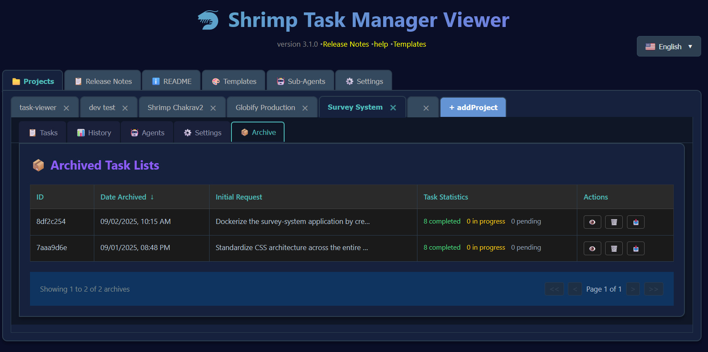

# 🦐 Ghi chú phát hành Shrimp Task Manager v4.0.0

*Ngày phát hành: 3 tháng 9, 2025*

## 📋 Mục lục

- [Tính năng mới chính](#tính-năng-mới-chính)
  - [Hiển thị Yêu cầu Ban đầu & Tạo Tóm tắt](#hiển-thị-yêu-cầu-ban-đầu--tạo-tóm-tắt)
  - [Trải nghiệm Ghi chú Phát hành Nâng cao](#trải-nghiệm-ghi-chú-phát-hành-nâng-cao)
  - [Hệ thống Quản lý Lưu trữ](#hệ-thống-quản-lý-lưu-trữ)
  - [Quản lý Agent Nâng cao](#quản-lý-agent-nâng-cao)
  - [Giao diện Lịch sử Được thiết kế lại](#giao-diện-lịch-sử-được-thiết-kế-lại)
- [Cải tiến Kỹ thuật](#cải-tiến-kỹ-thuật)
  - [Hiệu suất & Cơ sở hạ tầng](#hiệu-suất--cơ-sở-hạ-tầng)
  - [Phạm vi Testing](#phạm-vi-testing)
- [Sửa lỗi Quan trọng](#sửa-lỗi-quan-trọng)
  - [Giải quyết Vấn đề Cuộn](#giải-quyết-vấn-đề-cuộn)
  - [Sửa lỗi UI/UX](#sửa-lỗi-uiux)
- [Cách Nâng cấp](#cách-nâng-cấp)
- [Tiếp theo](#tiếp-theo)

## 🎉 Tính năng mới chính

### 💡 Hiển thị Yêu cầu Ban đầu & Tạo Tóm tắt

Khả năng xem và hiểu ngữ cảnh đằng sau danh sách tác vụ của bạn hiện đã có sẵn. Hiển thị Yêu cầu Ban đầu ghi nhận và lưu trữ vĩnh viễn yêu cầu gốc của người dùng khởi tạo việc lập kế hoạch tác vụ. Điều này có nghĩa là hàng tuần hoặc hàng tháng sau đó, bạn có thể làm mới trí nhớ của mình ngay lập tức về lý do tại sao các tác vụ này tồn tại và vấn đề gì chúng được dự định giải quyết.

Ngoài ra, hiện có tính năng Tóm tắt thông minh tận dụng OpenAI để tạo ra tổng quan ngắn gọn về những gì đã được hoàn thành. Chỉ cần nhấp vào nút Tóm tắt, và sử dụng khóa API OpenAI của bạn, hệ thống sẽ phân tích tất cả các tác vụ đã hoàn thành và cung cấp cho bạn một bản tóm tắt rõ ràng về tiến trình của bạn. Điều này vô cùng có giá trị cho cập nhật trạng thái dự án, giao tiếp nhóm, hoặc đơn giản là hiểu vị trí của bạn với các triển khai phức tạp.

### 📖 Trải nghiệm Ghi chú Phát hành Nâng cao

Hệ thống Ghi chú Phát hành đã được tái tưởng tượng hoàn toàn từ đầu. Thay vì văn bản tĩnh, bạn hiện có một trải nghiệm tương tác, có thể điều hướng với Mục lục có thể thu gọn trong thanh bên. Mỗi phiên bản có thể được mở rộng để hiển thị phác thảo phần của nó, cho phép bạn nhanh chóng chuyển đến thông tin bạn cần.

Việc triển khai bao gồm kiểu dáng tinh vi với tiêu đề được mã hóa màu - hồng cho các phần chính, trắng cho "Tính năng Mới", cam cho "Sửa lỗi", và xanh dương nhạt cho các phần tổng quan. Văn bản được phóng to 25% để đọc tốt hơn, và tất cả các phần tử markdown từ h2 đến h5 được hiển thị đúng cách.

Thanh bên và vùng nội dung cuộn độc lập, đảm bảo bạn không bao giờ mất vị trí khi điều hướng qua tài liệu mở rộng. Thanh cuộn chủ đề teal tùy chỉnh cung cấp tính nhất quán trực quan với ngôn ngữ thiết kế của ứng dụng.

### 📚 Hệ thống Quản lý Lưu trữ

Tính năng Lưu trữ cách mạng hóa cách bạn quản lý danh sách tác vụ của mình. Bạn đã bao giờ tạo một bộ tác vụ phức tạp từ một yêu cầu ban đầu chi tiết, chỉ để nhận ra bạn cần làm việc gì khác trước không? Hệ thống Lưu trữ giải quyết vấn đề này một cách hoàn hảo.

Khi bạn lưu trữ một danh sách tác vụ, toàn bộ bộ sưu tập tác vụ - bao gồm yêu cầu ban đầu đã sinh ra chúng - được lưu trữ an toàn để sử dụng sau này. Điều này cho phép bạn bắt đầu mới với một danh sách tác vụ mới mà không mất bất kỳ công việc lập kế hoạch trước đó nào. Khi bạn sẵn sàng quay lại những tác vụ được lưu trữ đó, chỉ cần nhập chúng trở lại quy trình làm việc hiện tại của bạn. Điều này đặc biệt hữu ích cho các nhà phát triển làm việc trên nhiều tính năng đồng thời hoặc cần chuyển đổi ngữ cảnh thường xuyên.

Giao diện Lưu trữ chia sẻ cùng thiết kế được đánh bóng với trang Lịch sử, cung cấp trải nghiệm người dùng nhất quán và trực quan trên toàn ứng dụng. Bạn có thể xem tất cả danh sách tác vụ được lưu trữ của mình, xem khi chúng được tạo, và nhanh chóng khôi phục bất kỳ lưu trữ nào khi cần thiết.

*Hộp thoại Lưu trữ Tác vụ Hiện tại xuất hiện khi bạn nhấn nút Lưu trữ trong tab Tác vụ. Nó hiển thị tóm tắt những gì sẽ được lưu trữ, bao gồm tên dự án, số lượng tác vụ, phân tích trạng thái, và yêu cầu ban đầu hoàn chỉnh đã tạo ra những tác vụ này*

Giao diện Danh sách Lưu trữ hiển thị tất cả danh sách tác vụ được lưu trữ của bạn với yêu cầu ban đầu và thống kê tác vụ:

*Tab Lưu trữ hiển thị danh sách các danh sách tác vụ được lưu trữ. Lưu ý rằng người dùng có thể nhấp "Xem" để kiểm tra tất cả tác vụ trong danh sách tác vụ được lưu trữ, "Xóa" để xóa vĩnh viễn một lưu trữ, hoặc nhấn nút "Nhập" để khôi phục tác vụ vào quy trình làm việc hiện tại của họ*

Khi bạn sẵn sàng khôi phục một lưu trữ, hộp thoại Nhập cung cấp cho bạn các tùy chọn để thêm tác vụ vào danh sách hiện tại của bạn hoặc thay thế chúng hoàn toàn:

*Hộp thoại Nhập Lưu trữ xuất hiện khi bạn nhấn Nhập. Nó cung cấp các tùy chọn linh hoạt để khôi phục tác vụ được lưu trữ - hoặc thêm chúng vào danh sách tác vụ hiện tại hoặc thay thế hoàn toàn các tác vụ hiện có bằng những tác vụ được lưu trữ*

Sau khi được nhập, bạn có thể xem tất cả chi tiết của các tác vụ được lưu trữ, bao gồm yêu cầu ban đầu hoàn chỉnh và phân tích tác vụ:

*Trang Chi tiết Lưu trữ hiển thị danh sách tác vụ hoàn chỉnh với yêu cầu ban đầu và tóm tắt*

### Công cụ MCP Mới được Thêm

Vì chúng ta hiện có Lưu trữ và Lịch sử trong Trình xem Tác vụ, chúng ta nghĩ rằng tốt hơn hết là đảm bảo rằng công cụ MCP cũng được cập nhật để agent Claude của bạn có thể kiểm soát hoàn toàn lưu trữ và lịch sử.

Một bộ công cụ MCP (Model Context Protocol) toàn diện đã được triển khai để cung cấp truy cập theo chương trình vào chức năng lưu trữ và lịch sử. Các công cụ này cho phép các agent AI và hệ thống bên ngoài tương tác với quy trình quản lý tác vụ thông qua API có cấu trúc.

**Bảy Công cụ MCP Mới:**

- **create_archive**: Tạo bản sao lưu của danh sách tác vụ hiện tại với mô tả tùy chọn để tổ chức
- **list_archives**: Duyệt tất cả danh sách tác vụ được lưu trữ với metadata bao gồm ngày tạo và số lượng tác vụ  
- **restore_from_archive**: Nhập tác vụ được lưu trữ trở lại quy trình làm việc hiện tại với tùy chọn hợp nhất hoặc thay thế
- **get_task_history**: Truy xuất bản theo dõi kiểm toán toàn diện của tất cả thay đổi tác vụ, cập nhật và chuyển đổi trạng thái
- **get_deleted_tasks**: Truy cập thông tin về các tác vụ đã xóa để khôi phục hoặc mục đích kiểm toán
- **recover_task**: Khôi phục các tác vụ đã xóa trước đó bằng định danh duy nhất của chúng
- **sync_task_state**: Đồng bộ tính nhất quán dữ liệu tác vụ trên các vị trí lưu trữ khác nhau và giải quyết xung đột

Mỗi công cụ bao gồm xác thực schema Zod mạnh mẽ, xử lý lỗi toàn diện, và hỗ trợ template song ngữ (Tiếng Anh/Tiếng Trung). Việc triển khai có tính năng tích hợp TypeScript phù hợp với mô hình tác vụ hiện có và duy trì khả năng tương thích hoàn toàn với giao diện web.

### 🤖 Quản lý Agent Nâng cao

Khả năng agent đã được mở rộng đáng kể trong bản phát hành này. Tính năng gán agent hàng loạt mới cho phép bạn gán nhiều tác vụ cho các agent AI đồng thời thông qua giao diện dropdown trực quan. Gán tác vụ riêng lẻ hiện xảy ra mà không cần làm mới trang, làm cho quy trình làm việc mượt mà và hiệu quả hơn.

Modal thông tin agent đã được đại tu hoàn toàn để cung cấp mô tả rõ ràng hơn và khả năng hiển thị tốt hơn vào khả năng agent. Các vấn đề quan trọng khi mô tả agent xuất hiện trống đã được sửa, cùng với lỗi 500 xảy ra khi làm việc với danh sách tác vụ sản xuất.

### 📊 Giao diện Lịch sử Được thiết kế lại

Giao diện Lịch sử đã được biến đổi để phù hợp với giao diện được đánh bóng của hệ thống Lưu trữ. Quan trọng nhất, giờ đây nó hiển thị Yêu cầu Ban đầu thay vì ghi chú trong giao diện chính, cung cấp cho bạn ngữ cảnh ngay lập tức về mỗi danh sách tác vụ lịch sử. Bố cục đã được tối ưu hóa với khoảng cách cột tốt hơn và khả năng lọc hiệu quả hơn.

## 🔧 Cải tiến Kỹ thuật

### Hiệu suất & Cơ sở hạ tầng

Các cải tiến đáng kể đã được thực hiện đối với hiệu suất của ứng dụng và trải nghiệm phát triển. Hệ thống build mới bao gồm lệnh `npm run build` đơn giản tự động xây dựng và khởi động server. Playwright đã được tích hợp cho kiểm thử end-to-end, đảm bảo độ tin cậy UI qua các cập nhật.

Server đã được nâng cao với các endpoint lưu trữ mới có xử lý lỗi và xác thực được cải thiện. Thời gian phản hồi đã được tối ưu hóa thông qua các chiến lược lấy dữ liệu tốt hơn.

**Kiến trúc MCP Server:**

Việc triển khai MCP server sử dụng lớp Server cấp thấp với StdioServerTransport để giao tiếp đáng tin cậy với Claude. Kiến trúc bao gồm:

- Đăng ký công cụ phù hợp qua `setRequestHandler` cho `ListToolsRequestSchema` và `CallToolRequestSchema`
- Khai báo khả năng server với định nghĩa công cụ toàn diện
- Xử lý lỗi mạnh mẽ với ghi log chi tiết và thông báo lỗi thân thiện với người dùng
- Lưu trữ tác vụ dựa trên bộ nhớ với tính bền vững JSON và sao lưu tự động
- Hỗ trợ template song ngữ với tạo nội dung động

### Phạm vi Testing

Bản phát hành này bao gồm phạm vi test toàn diện cho tất cả tính năng mới:
- Test chức năng lưu trữ
- Test cuộn Ghi chú Phát hành
- Test tích hợp Giao diện Lịch sử
- Test gán agent
- Test tạo tóm tắt
- **Test xác thực công cụ MCP**: Test quy trình lưu trữ/khôi phục hoàn chỉnh với tạo tác vụ thực, lưu trữ và kịch bản khôi phục
- **Test xử lý template**: Xác thực rendering template Handlebars và thay thế biến
- **Test xử lý lỗi**: Test toàn diện các trường hợp đặc biệt và kịch bản thất bại qua tất cả công cụ MCP

## 🐛 Sửa lỗi Quan trọng

### Giải quyết Vấn đề Cuộn

Các vấn đề quan trọng về khả năng hiển thị thanh cuộn ảnh hưởng đến Ghi chú Phát hành và các tab khác đã được sửa. Ứng dụng hiện hiển thị đúng thanh cuộn với kiểu dáng tùy chỉnh, đảm bảo nội dung luôn có thể truy cập. Cuộn độc lập giữa thanh bên và vùng nội dung hoạt động hoàn hảo.

### Sửa lỗi UI/UX

- Vị trí mũi tên trong các phần có thể thu gọn đã được sửa
- Độ tương phản màu đã được cải thiện trong toàn giao diện
- Trạng thái tải hiện thông tin hơn
- Thông báo lỗi cung cấp hướng dẫn rõ ràng hơn

### Sửa lỗi Sau Phát hành (Tháng 9 2025)

Một số vấn đề quan trọng đã được xác định và giải quyết sau lần phát hành ban đầu:

#### Sửa lỗi Scroll Spy và Mục lục

- **Sửa lỗi đánh dấu trùng lặp scroll spy**: Các phần có tên giống nhau (như "Cách Sử dụng") gây ra nhiều mục TOC được đánh dấu đồng thời. Triển khai tạo ID duy nhất sử dụng ngữ cảnh cha để đảm bảo chỉ phần chính xác được đánh dấu khi bạn cuộn.
- **Sửa lỗi đánh dấu scroll spy bị hỏng**: Chức năng scroll spy ngừng hoạt động hoàn toàn sau khi triển khai ID duy nhất. Thêm các hàm tạo ID tập trung để đảm bảo tính nhất quán giữa phân tích mục lục và rendering nội dung.
- **Sửa lỗi nút Thu gọn Tất cả trên Ghi chú Phát hành**: Nút không hoạt động do xử lý phạm vi phiên bản không chính xác. Cập nhật các hàm mở rộng/thu gọn để chấp nhận tham số phiên bản và truyền phiên bản phát hành chính xác.

#### Sửa lỗi Thuật ngữ và Ngày tháng

- **Cập nhật thuật ngữ modal**: Thay đổi modal "Thêm Hồ sơ Mới" để sử dụng thuật ngữ "dự án" nhất quán trong toàn giao diện. Cập nhật bản dịch tiếng Anh để hiển thị "Tên Dự án" thay vì "Tên Hồ sơ".
- **Sửa ngày phát hành v4.0.0**: Sửa ngày phát hành từ 2025-01-02 thành ngày phát hành thực tế là 2025-09-03.

#### Sửa lỗi MCP Server và Xử lý Template

- **Sửa xung đột tên hàm**: Giải quyết sự cố server do tên hàm trùng lặp giữa công cụ MCP và hàm mô hình. Cập nhật `getDeletedTasksTool` → `getDeletedTasks` và `recoverTaskTool` → `recoverTask` với aliasing import phù hợp.
- **Sửa vấn đề xử lý template**: Giải quyết cú pháp Handlebars thô xuất hiện trong phản hồi công cụ bằng cách tạo các file template bị thiếu (`empty.md`, `noResults.md`, `success.md`) và sửa ánh xạ tên biến giữa generator và template.
- **Sửa đăng ký công cụ MCP**: Sửa tên export và đăng ký công cụ để đảm bảo tất cả 7 công cụ mới đều có thể truy cập được thông qua giao diện MCP.
- **Sửa lỗi biên dịch TypeScript**: Giải quyết vấn đề async/await trong hàm filter và thêm xác nhận kiểu phù hợp cho tham số tùy chọn.

Những sửa lỗi này đảm bảo trải nghiệm người dùng mượt mà với điều hướng phù hợp, thuật ngữ nhất quán, thông tin phát hành chính xác và tích hợp công cụ MCP hoạt động đầy đủ.

## 📝 Cách Nâng cấp

Nâng cấp lên v4.0.0 rất đơn giản:

1. Kéo các thay đổi mới nhất từ kho lưu trữ
2. Chạy `npm install` để cập nhật dependencies
3. Thực thi `npm run build` để xây dựng và khởi động ứng dụng
4. Xóa cache trình duyệt để đảm bảo tất cả kiểu dáng mới được tải

Thế thôi! Không cần migration cơ sở dữ liệu - chỉ cần xây dựng và chạy.

## 🚀 Tiếp theo

Phiên bản 4.0.0 đặt ra tiêu chuẩn mới cho Shrimp Task Manager. Sự kết hợp của quản lý Lưu trữ, theo dõi Yêu cầu Ban đầu, tạo Tóm tắt, hệ thống Ghi chú Phát hành nâng cao và tích hợp API MCP toàn diện tạo ra một bộ công cụ mạnh mẽ để quản lý quy trình phát triển phức tạp.

Hệ thống Công cụ MCP Lưu trữ và Lịch sử mới mở ra khả năng cho:
- Tích hợp với các công cụ phát triển bên ngoài và pipeline CI/CD
- Quy trình quản lý tác vụ tự động được điều khiển bởi agent AI
- Hợp tác nâng cao thông qua truy cập theo chương trình vào dữ liệu tác vụ
- Phân tích và báo cáo nâng cao về tiến trình phát triển
- Script tự động hóa tùy chỉnh cho các hoạt động quản lý tác vụ lặp lại

Nền tảng này định vị Shrimp Task Manager không chỉ là một công cụ độc lập, mà là một thành phần cốt lõi của các hệ sinh thái phát triển lớn hơn.