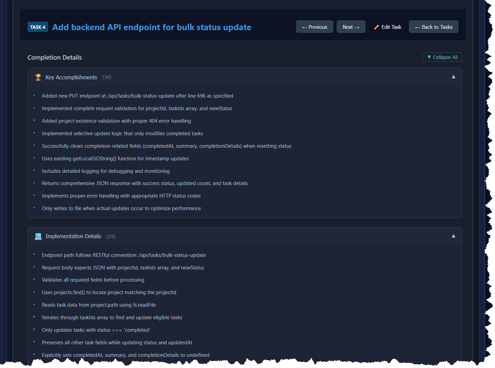

# संस्करण 4.1.0 रिलीज़ नोट्स

**रिलीज़ दिनांक:** 6 सितंबर 2025

## 🎯 अवलोकन

**सरल शब्दों में नया क्या है:**
संस्करण 4.1.0 आपके कार्य प्रबंधक को बेहतर पूर्णता ट्रैकिंग और उन्नत कार्य ब्राउज़िंग के साथ बढ़ाता है! 🎯✨ सिस्टम में अब एक नया सारांश पूर्वावलोकन कॉलम है जो आपको प्रत्येक कार्य को खोले बिना तुरंत कार्य विवरण स्कैन करने देता है, साथ ही उन्नत संरचित कार्य पूर्णता विवरण भी। नए डेटा मॉडल और पार्सिंग क्षमताओं के साथ, आप मुख्य उपलब्धियों, कार्यान्वयन विवरण और चुनौतियों को अधिक संगठित तरीके से ट्रैक कर सकते हैं।

**तकनीकी अवलोकन:**
संस्करण 4.1.0 में संरचित डेटा मॉडल और बुद्धिमान पार्सिंग क्षमताओं के साथ उन्नत **कार्य पूर्णता विवरण** पेश किया गया है, साथ ही सारांश पूर्वावलोकन कार्यक्षमता के साथ महत्वपूर्ण **TaskTable UI सुधार** भी। यह सिस्टम कार्य पूर्णता जानकारी के बेहतर संगठन और बेहतर कार्य ब्राउज़िंग अनुभव प्रदान करता है, जिससे यह भविष्य के एनालिटिक्स के लिए अधिक खोजने योग्य और उपयोगी हो जाता है।

## ✨ नई सुविधाएं

### 📊 कार्य पूर्णता विवरण डेटा मॉडल

व्यापक कार्य पूर्णता जानकारी संग्रहीत करने के लिए एक नया संरचित डेटा मॉडल लागू किया गया है।

- **नया `TaskCompletionDetails` इंटरफ़ेस** संरचित फ़ील्ड्स के साथ:
  - `keyAccomplishments`: मुख्य उपलब्धियों की सरणी
  - `implementationDetails`: तकनीकी कार्यान्वयन विवरण की सरणी
  - `technicalChallenges`: सामना की गई और हल की गई चुनौतियों की सरणी
  - `completedAt`: कार्य पूर्णता का टाइमस्टैम्प
  - `verificationScore`: कार्य सत्यापन के लिए संख्यात्मक स्कोर (0-100)
- **पूर्ण पश्चगामी संगतता** - मौजूदा `summary` फ़ील्ड अपरिवर्तित रहती है
- **वैकल्पिक एकीकरण** - Task इंटरफ़ेस में `completionDetails` को वैकल्पिक फ़ील्ड के रूप में जोड़ा गया
- **स्थान**: `src/utils/completionTemplates.ts`

### 🔍 बुद्धिमान सारांश पार्सर

पूर्णता सारांश से संरचित डेटा निकालने वाला उन्नत मार्कडाउन पार्सर।

- **लचीली पार्सिंग क्षमताएं**:
  - कई मार्कडाउन हेडिंग प्रारूपों का समर्थन (`#` और `##`)
  - विभिन्न सूची शैलियों को संभालता है (`-`, `*`, `+`, संख्यांकित सूचियां)
  - कई प्रारूपों से सत्यापन स्कोर निकालता है
  - पूर्णता तिथियां पार्स करता है (ISO प्रारूप और सामान्य प्रारूप)
- **दो पार्सिंग मोड**:
  - `parseCompletionSummary()`: अच्छी तरह से प्रारूपित सारांश के लिए मानक पार्सिंग
  - `parseFlexibleSummary()`: विभिन्न AI प्रतिक्रिया प्रारूपों के लिए अनुकूली पार्सिंग
- **मजबूत त्रुटि हैंडलिंग** - खराब सामग्री को सुंदरता से संभालता है
- **100% टेस्ट कवरेज** 17 व्यापक यूनिट टेस्ट के साथ
- **स्थान**: `src/utils/completionSummaryParser.ts`


*बुद्धिमान सारांश पार्सर स्वचालित रूप से कार्य पूर्णता सारांश से संरचित डेटा निकालता है, विभिन्न मार्कडाउन प्रारूपों का समर्थन करता है और विभिन्न AI प्रतिक्रिया प्रारूपों के लिए मजबूत पार्सिंग क्षमताएं प्रदान करता है।*

### 📋 TaskTable सारांश पूर्वावलोकन कॉलम

कार्य तालिका में त्वरित कार्य अवलोकन के लिए नया सारांश पूर्वावलोकन कॉलम।

- **सारांश पूर्वावलोकन कॉलम** कार्य सारांश के पहले 100 अक्षर प्रदर्शित करता है
- **विस्तार/संक्षेप कार्यक्षमता** "और दिखाएं"/"कम दिखाएं" टॉगल बटन के साथ
- **रेस्पॉन्सिव डिज़ाइन** मोबाइल अनुकूलन के साथ
- **मेमोराइज़्ड SummaryCell घटक** बेहतर प्रदर्शन के लिए
- **बेहतर एजेंट ड्रॉपडाउन लेआउट** ऊर्ध्वाधर स्टैकिंग और बढ़ी हुई जगह के साथ
- **एजेंट जानकारी बटन पुनर्स्थापन** बेहतर स्थान उपयोग के लिए ड्रॉपडाउन के नीचे स्थानांतरित
- **अनुकूलित कॉलम चौड़ाई** - अधिक स्थान प्रदान करने के लिए dependencies और actions कॉलम कम किए गए
- **स्थान**: `src/components/TaskTable.jsx`

### 🎨 उन्नत पूर्णता प्रदर्शन

कार्य पूर्णता जानकारी की बेहतर दृश्य संगठन और प्रस्तुति।

- **संरचित पूर्णता विवरण** संगठित अनुभागों में प्रदर्शित
- **CompletionDetailsView घटक** समृद्ध दृश्य प्रस्तुति के लिए
- **विस्तार योग्य अनुभाग** बेहतर जानकारी संगठन के लिए
- **सत्यापन स्कोर संकेतक** दृश्य प्रगति बार के साथ
- **मार्कडाउन रेंडरिंग समर्थन** समृद्ध पाठ पूर्णता विवरण के लिए
- **स्थान**: `src/components/CompletionDetailsView.jsx`


*मुख्य उपलब्धियां, कार्यान्वयन विवरण और तकनीकी चुनौतियों के लिए संरचित अनुभाग दिखाने वाला उन्नत कार्य पूर्णता प्रदर्शन। इंटरफ़ेस में विस्तार योग्य अनुभाग, सत्यापन स्कोर, और व्यापक कार्य प्रलेखन के लिए समृद्ध मार्कडाउन रेंडरिंग की सुविधा है। "कार्य पूर्णता डेटा अब बाद में देखने के लिए सहेजा गया है" की पुष्टि करने वाले अधिसूचना बैनर पर ध्यान दें।*

## 🛠️ तकनीकी सुधार

### TypeScript समर्थन
- सभी नए इंटरफ़ेस और फ़ंक्शन के लिए पूर्ण TypeScript परिभाषाएं
- एप्लिकेशन में उपयोग के लिए उचित टाइप एक्सपोर्ट्स
- सख्त टाइप चेकिंग सक्षम

### परीक्षण ढांचा
- **पार्सर परीक्षण**: 100% कवरेज के साथ 17 यूनिट परीक्षण
- **माइग्रेशन परीक्षण**: सभी परिस्थितियों को कवर करने वाले 9 व्यापक परीक्षण
- **परीक्षण ढांचे**: मॉकिंग समर्थन के साथ Vitest
- **कवरेज रिपोर्टिंग**: @vitest/coverage-v8 के साथ एकीकृत

### कोड गुणवत्ता
- चिंताओं का स्वच्छ पृथक्करण
- मॉड्यूलर, पुन: उपयोग योग्य उपयोगिताएं
- व्यापक त्रुटि हैंडलिंग
- JSDoc टिप्पणियों के साथ अच्छी तरह से प्रलेखित कोड

## 📈 लाभ

### उपयोगकर्ताओं के लिए
- **त्वरित कार्य अवलोकन** - सारांश पूर्वावलोकन कॉलम सभी कार्यों के लिए तत्काल संदर्भ प्रदान करता है
- **बेहतर कार्य स्कैनिंग** - विस्तार योग्य सारांश विवरण खोले बिना कुशल ब्राउज़िंग की अनुमति देते हैं
- **बेहतर मोबाइल अनुभव** - रेस्पॉन्सिव डिज़ाइन सभी स्क्रीन आकारों पर देखने का अनुकूलन करता है
- **बेहतर कार्य इतिहास** - पूर्ण कार्यों के बारे में विस्तृत, संरचित जानकारी
- **बेहतर खोज क्षमता** - संरचित डेटा बेहतर फ़िल्टरिंग और खोज सक्षम करता है
- **सत्यापन ट्रैकिंग** - संख्यात्मक स्कोर मात्रात्मक कार्य मूल्यांकन प्रदान करते हैं
- **समय ट्रैकिंग** - सभी कार्यों के लिए सटीक पूर्णता टाइमस्टैम्प

### डेवलपर्स के लिए
- **एनालिटिक्स के लिए आधार** - संरचित डेटा भविष्य की रिपोर्टिंग सुविधाओं को सक्षम बनाता है
- **API-तैयार डेटा मॉडल** - बाहरी एकीकरण के लिए सुसंगत संरचना
- **विस्तार योग्य डिज़ाइन** - नए फ़ील्ड या पार्सिंग नियम जोड़ना आसान
- **व्यापक परीक्षण** - सिस्टम विश्वसनीयता में उच्च विश्वास

## 📁 फ़ाइल संरचना

```
src/
├── utils/
│   ├── completionTemplates.ts       # डेटा मॉडल और इंटरफ़ेस
│   ├── completionSummaryParser.ts   # पार्सर उपयोगिता
│   └── completionSummaryParser.test.ts # पार्सर परीक्षण
└── components/
    └── CompletionDetailsView.jsx    # उन्नत पूर्णता प्रदर्शन घटक
```

## 🔧 उपयोग गाइड

### नए कार्यों के लिए

सिस्टम आपके मौजूदा वर्कफ़्लो के साथ निर्बाध रूप से काम करने के लिए डिज़ाइन किया गया है:

1. **सामान्य रूप से कार्य पूरे करें** - अपनी मानक पूर्णता प्रक्रिया का उपयोग जारी रखें
2. **संरचित सारांश** - वैकल्पिक रूप से मार्कडाउन हेडर के साथ पूर्णता सारांश को प्रारूपित करें:
   - `## मुख्य उपलब्धियां`
   - `## कार्यान्वयन विवरण`
   - `## तकनीकी चुनौतियां`
3. **स्वचालित पार्सिंग** - उपलब्ध होने पर सिस्टम स्वचालित रूप से संरचित डेटा निकालेगा
4. **पश्चगामी संगतता** - सादा पाठ सारांश पूर्ण रूप से काम करना जारी रखते हैं

### उन्नत कार्य विवरण

पूर्ण कार्यों को देखते समय, आपको संगठित अनुभागों और बेहतर दृश्य स्वरूपण के साथ पूर्णता जानकारी की उन्नत प्रस्तुति दिखाई देगी।

## 📊 उदाहरण डेटा संरचना

### सादा पाठ सारांश (काम करता रहता है)
```json
{
  "id": "task-001",
  "name": "प्रमाणीकरण लागू करें",
  "status": "completed",
  "summary": "OAuth2 एकीकरण के साथ JWT प्रमाणीकरण सफलतापूर्वक लागू किया।"
}
```

### संरचित सारांश (स्वचालित रूप से पार्स किया जाता है)
```json
{
  "id": "task-002",
  "name": "डेटाबेस अनुकूलन",
  "status": "completed",
  "summary": "## मुख्य उपलब्धियां\n- क्वेरी अनुकूलित\n- इंडेक्सिंग जोड़ा\n\n## तकनीकी चुनौतियां\n- मेमोरी बाधाएं\n\nसत्यापन स्कोर: 92",
  "completionDetails": {
    "keyAccomplishments": ["क्वेरी अनुकूलित", "इंडेक्सिंग जोड़ा"],
    "implementationDetails": [],
    "technicalChallenges": ["मेमोरी बाधाएं"],
    "completedAt": "2025-09-06T10:30:00.000Z",
    "verificationScore": 92
  }
}
```

## 🚀 आगे आने वाला

यह रिलीज़ भविष्य की संवर्धन के लिए आधार तैयार करती है:
- कार्य पूर्णता एनालिटिक्स डैशबोर्ड
- पूर्णता विवरण द्वारा उन्नत फ़िल्टरिंग
- पूर्णता सारांश टेम्प्लेट्स
- पूर्णता रिपोर्ट के लिए एक्सपोर्ट कार्यक्षमता
- पूर्णता डेटा का उन्नत दृश्य प्रस्तुति

## 🙏 स्वीकृतियां

सभी योगदानकर्ताओं और उपयोगकर्ताओं को धन्यवाद जिन्होंने इस रिलीज़ के लिए फीडबैक प्रदान किया। कार्य पूर्णता सारांश सिस्टम कार्य प्रबंधन को अधिक अंतर्दृष्टिपूर्ण और डेटा-संचालित बनाने की दिशा में एक महत्वपूर्ण कदम का प्रतिनिधित्व करता है।

---

प्रश्न या समस्याओं के लिए, कृपया हमारे [GitHub रिपॉजिटरी](https://github.com/your-repo/shrimp-task-viewer) पर जाएं।