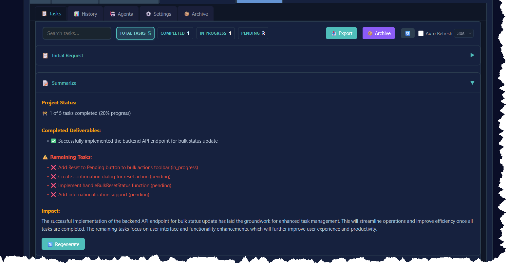

# Ghi chú phát hành Phiên bản 4.1.0

**Ngày phát hành:** 6 tháng 9, 2025

## 🎯 Tổng quan

**Những gì mới theo thuật ngữ đơn giản:**
Phiên bản 4.1.0 nâng cao trình quản lý tác vụ của bạn với khả năng theo dõi hoàn thành tốt hơn và cải thiện duyệt tác vụ! 🎯✨ Hệ thống hiện có tính năng cột xem trước tóm tắt mới cho phép bạn nhanh chóng quét chi tiết tác vụ mà không cần mở từng cái một, cộng với chi tiết hoàn thành tác vụ có cấu trúc nâng cao. Với mô hình dữ liệu mới và khả năng phân tích cú pháp, bạn có thể theo dõi thành tựu chính, chi tiết triển khai và thử thách theo cách có tổ chức hơn.

**Tổng quan kỹ thuật:**
Phiên bản 4.1.0 giới thiệu **Chi tiết Hoàn thành Tác vụ** nâng cao với mô hình dữ liệu có cấu trúc và khả năng phân tích cú pháp thông minh, cộng với **cải tiến UI TaskTable** đáng kể với chức năng xem trước tóm tắt. Hệ thống này cung cấp tổ chức tốt hơn thông tin hoàn thành tác vụ và trải nghiệm duyệt tác vụ được cải thiện, làm cho nó có thể tìm kiếm hơn và hữu ích hơn cho phân tích tương lai.

## ✨ Tính năng mới

### 📊 Mô hình Dữ liệu Chi tiết Hoàn thành Tác vụ

Một mô hình dữ liệu có cấu trúc mới để lưu trữ thông tin hoàn thành tác vụ toàn diện đã được triển khai.

- **Interface `TaskCompletionDetails` mới** với các trường có cấu trúc:
  - `keyAccomplishments`: Mảng các thành tựu chính
  - `implementationDetails`: Mảng chi tiết triển khai kỹ thuật
  - `technicalChallenges`: Mảng các thử thách gặp phải và được giải quyết
  - `completedAt`: Dấu thời gian hoàn thành tác vụ
  - `verificationScore`: Điểm số (0-100) để xác minh tác vụ
- **Tương thích ngược đầy đủ** - trường `summary` hiện có không thay đổi
- **Tích hợp tùy chọn** - `completionDetails` được thêm như trường tùy chọn vào interface Task
- **Vị trí**: `src/utils/completionTemplates.ts`

### 🔍 Bộ Phân tích Tóm tắt Thông minh

Bộ phân tích Markdown nâng cao trích xuất dữ liệu có cấu trúc từ tóm tắt hoàn thành.

- **Khả năng phân tích linh hoạt**:
  - Hỗ trợ nhiều định dạng tiêu đề Markdown (`#` và `##`)
  - Xử lý các kiểu danh sách khác nhau (`-`, `*`, `+`, danh sách đánh số)
  - Trích xuất điểm xác minh từ nhiều định dạng
  - Phân tích ngày hoàn thành (định dạng ISO và định dạng phổ biến)
- **Hai chế độ phân tích**:
  - `parseCompletionSummary()`: Phân tích tiêu chuẩn cho tóm tắt định dạng tốt
  - `parseFlexibleSummary()`: Phân tích thích ứng cho các định dạng phản hồi AI khác nhau
- **Xử lý lỗi mạnh mẽ** - xử lý nội dung có dạng sai một cách nhẹ nhàng
- **100% test coverage** với 17 unit test toàn diện
- **Vị trí**: `src/utils/completionSummaryParser.ts`


*Bộ phân tích tóm tắt thông minh tự động trích xuất dữ liệu có cấu trúc từ tóm tắt hoàn thành tác vụ, hỗ trợ các định dạng Markdown khác nhau và cung cấp khả năng phân tích mạnh mẽ cho các định dạng phản hồi AI khác nhau.*

### 📋 Cột Xem trước Tóm tắt TaskTable

Cột xem trước tóm tắt mới trong bảng tác vụ để tổng quan tác vụ nhanh chóng.

- **Cột xem trước tóm tắt** hiển thị 100 ký tự đầu tiên của tóm tắt tác vụ
- **Chức năng mở rộng/thu gọn** với nút chuyển đổi "Hiển thị thêm"/"Hiển thị ít hơn"
- **Thiết kế responsive** với tối ưu hóa di động
- **Component SummaryCell được ghi nhớ** để hiệu suất tối ưu
- **Cải thiện bố cục dropdown agent** với xếp chồng dọc và tăng khoảng cách
- **Định vị lại nút thông tin agent** di chuyển xuống dưới dropdown để sử dụng không gian tốt hơn
- **Tối ưu hóa độ rộng cột** - giảm cột dependencies và actions để cung cấp thêm không gian
- **Vị trí**: `src/components/TaskTable.jsx`

### 🎨 Hiển thị Hoàn thành Nâng cao

Cải thiện tổ chức trực quan và trình bày thông tin hoàn thành tác vụ.

- **Chi tiết hoàn thành có cấu trúc** được hiển thị trong các phần có tổ chức
- **Component CompletionDetailsView** để trình bày trực quan phong phú
- **Các phần có thể mở rộng** để tổ chức thông tin tốt hơn
- **Chỉ báo điểm xác minh** với thanh tiến trình trực quan
- **Hỗ trợ render Markdown** cho chi tiết hoàn thành văn bản phong phú
- **Vị trí**: `src/components/CompletionDetailsView.jsx`


*Hiển thị hoàn thành tác vụ nâng cao hiển thị các phần có cấu trúc cho Thành tựu Chính, Chi tiết Triển khai và Thử thách Kỹ thuật. Giao diện có các phần có thể mở rộng, điểm xác minh và render Markdown phong phú để tài liệu tác vụ toàn diện. Lưu ý banner thông báo xác nhận "Dữ liệu hoàn thành tác vụ hiện được lưu để xem sau".*

## 🛠️ Cải tiến Kỹ thuật

### Hỗ trợ TypeScript
- Định nghĩa TypeScript đầy đủ cho tất cả interface và function mới
- Xuất kiểu phù hợp để sử dụng trong toàn ứng dụng
- Bật kiểm tra kiểu nghiêm ngặt

### Cơ sở hạ tầng Testing
- **Test Parser**: 17 unit test với 100% coverage
- **Test Migration**: 9 test toàn diện bao gồm tất cả các kịch bản
- **Test frameworks**: Vitest với hỗ trợ mocking
- **Báo cáo Coverage**: Tích hợp với @vitest/coverage-v8

### Chất lượng Code
- Phân tách mối quan tâm rõ ràng
- Tiện ích modular, có thể tái sử dụng
- Xử lý lỗi toàn diện
- Code được tài liệu hóa tốt với comment JSDoc

## 📈 Lợi ích

### Cho Người dùng
- **Tổng quan tác vụ nhanh** - Cột xem trước tóm tắt cung cấp ngữ cảnh ngay lập tức cho tất cả tác vụ
- **Quét tác vụ tốt hơn** - Tóm tắt có thể mở rộng cho phép duyệt hiệu quả mà không cần mở chi tiết
- **Trải nghiệm di động cải thiện** - Thiết kế responsive tối ưu hóa xem trên tất cả kích thước màn hình
- **Lịch sử tác vụ tốt hơn** - Thông tin chi tiết, có cấu trúc về các tác vụ đã hoàn thành
- **Khả năng tìm kiếm cải thiện** - Dữ liệu có cấu trúc cho phép lọc và tìm kiếm tốt hơn
- **Theo dõi xác minh** - Điểm số cung cấp đánh giá định lượng tác vụ
- **Theo dõi thời gian** - Dấu thời gian hoàn thành chính xác cho tất cả tác vụ

### Cho Nhà phát triển
- **Nền tảng cho phân tích** - Dữ liệu có cấu trúc cho phép tính năng báo cáo tương lai
- **Mô hình dữ liệu sẵn sàng API** - Cấu trúc nhất quán cho tích hợp bên ngoài
- **Thiết kế có thể mở rộng** - Dễ dàng thêm trường mới hoặc quy tắc phân tích
- **Testing toàn diện** - Tin tưởng cao vào độ tin cậy hệ thống

## 📁 Cấu trúc File

```
src/
├── utils/
│   ├── completionTemplates.ts       # Mô hình dữ liệu và interface
│   ├── completionSummaryParser.ts   # Tiện ích Parser
│   └── completionSummaryParser.test.ts # Test Parser
└── components/
    └── CompletionDetailsView.jsx    # Component hiển thị hoàn thành nâng cao
```

## 🔧 Hướng dẫn Sử dụng

### Cho Tác vụ Mới

Hệ thống được thiết kế để hoạt động liền mạch với quy trình làm việc hiện có của bạn:

1. **Hoàn thành tác vụ như bình thường** - tiếp tục sử dụng quy trình hoàn thành tiêu chuẩn của bạn
2. **Tóm tắt có cấu trúc** - tùy chọn định dạng tóm tắt hoàn thành với tiêu đề Markdown:
   - `## Key Accomplishments`
   - `## Implementation Details` 
   - `## Technical Challenges`
3. **Phân tích tự động** - hệ thống sẽ tự động trích xuất dữ liệu có cấu trúc khi có sẵn
4. **Tương thích ngược** - tóm tắt văn bản thuần túy tiếp tục hoạt động hoàn hảo

### Chi tiết Tác vụ Nâng cao

Khi xem các tác vụ đã hoàn thành, bạn sẽ thấy trình bày nâng cao của thông tin hoàn thành với các phần có tổ chức và định dạng trực quan tốt hơn.

## 📊 Ví dụ Cấu trúc Dữ liệu

### Tóm tắt Văn bản Thuần túy (tiếp tục hoạt động)
```json
{
  "id": "task-001",
  "name": "Triển khai xác thực",
  "status": "completed",
  "summary": "Triển khai thành công xác thực JWT với tích hợp OAuth2."
}
```

### Tóm tắt Có cấu trúc (được phân tích tự động)
```json
{
  "id": "task-002",
  "name": "Tối ưu hóa cơ sở dữ liệu",
  "status": "completed",
  "summary": "## Key Accomplishments\n- Tối ưu hóa truy vấn\n- Thêm đánh chỉ mục\n\n## Technical Challenges\n- Ràng buộc bộ nhớ\n\nVerification Score: 92",
  "completionDetails": {
    "keyAccomplishments": ["Tối ưu hóa truy vấn", "Thêm đánh chỉ mục"],
    "implementationDetails": [],
    "technicalChallenges": ["Ràng buộc bộ nhớ"],
    "completedAt": "2025-09-06T10:30:00.000Z",
    "verificationScore": 92
  }
}
```

## 🚀 Sắp tới

Bản phát hành này đặt nền móng cho các cải tiến tương lai:
- Dashboard phân tích hoàn thành tác vụ
- Lọc nâng cao theo chi tiết hoàn thành
- Template tóm tắt hoàn thành
- Chức năng xuất cho báo cáo hoàn thành
- Trình bày trực quan nâng cao của dữ liệu hoàn thành

## 🙏 Lời cảm ơn

Cảm ơn tất cả các đóng góp viên và người dùng đã cung cấp phản hồi cho bản phát hành này. Hệ thống tóm tắt hoàn thành tác vụ đại diện cho một bước tiến đáng kể trong việc làm cho quản lý tác vụ có nhiều thông tin hơn và dựa trên dữ liệu hơn.

---

Đối với các câu hỏi hoặc vấn đề, vui lòng truy cập [GitHub repository](https://github.com/your-repo/shrimp-task-viewer) của chúng tôi.