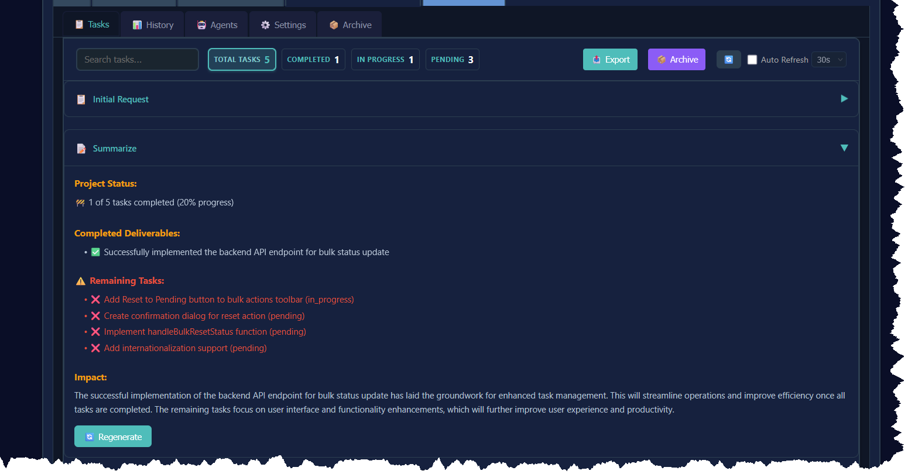
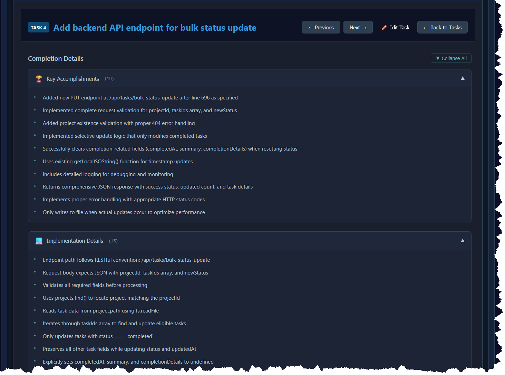

# Version 4.1.0 Release Notes

**Release Date:** September 6, 2025

## 🎯 Overview

**What's New in Simple Terms:**
Version 4.1.0 enhances your task manager with better completion tracking and improved task browsing! 🎯✨ The system now features a new summary preview column that lets you quickly scan task details without opening each one, plus enhanced structured task completion details. With new data models and parsing capabilities, you can track key achievements, implementation details, and challenges in a more organized way.

**Technical Overview:**
Version 4.1.0 introduces enhanced **Task Completion Details** with structured data models and intelligent parsing capabilities, plus significant **TaskTable UI improvements** with summary preview functionality. This system provides better organization of task completion information and improved task browsing experience, making it more searchable and useful for future analytics.

## ✨ New Features

### 📊 Task Completion Details Data Model

A new structured data model for storing comprehensive task completion information has been implemented.

- **New `TaskCompletionDetails` interface** with structured fields:
  - `keyAccomplishments`: Array of main achievements
  - `implementationDetails`: Array of technical implementation details
  - `technicalChallenges`: Array of challenges encountered and resolved
  - `completedAt`: Timestamp of task completion
  - `verificationScore`: Numeric score (0-100) for task verification
- **Full backward compatibility** - existing `summary` field remains unchanged
- **Optional integration** - `completionDetails` added as optional field to Task interface
- **Location**: `src/utils/completionTemplates.ts`

### 🔍 Intelligent Summary Parser

Advanced Markdown parser that extracts structured data from completion summaries.

- **Flexible parsing capabilities**:
  - Supports multiple Markdown heading formats (`#` and `##`)
  - Handles various list styles (`-`, `*`, `+`, numbered lists)
  - Extracts verification scores from multiple formats
  - Parses completion dates (ISO format and common formats)
- **Two parsing modes**:
  - `parseCompletionSummary()`: Standard parsing for well-formatted summaries
  - `parseFlexibleSummary()`: Adaptive parsing for various AI response formats
- **Robust error handling** - gracefully handles malformed content
- **100% test coverage** with 17 comprehensive unit tests
- **Location**: `src/utils/completionSummaryParser.ts`


*The intelligent summary parser automatically extracts structured data from task completion summaries, supporting various Markdown formats and providing robust parsing capabilities for different AI response formats.*

### 📋 TaskTable Summary Preview Column

New summary preview column in the task table for quick task overview.

- **Summary preview column** displays first 100 characters of task summaries
- **Expand/collapse functionality** with "Show more"/"Show less" toggle buttons
- **Responsive design** with mobile optimizations
- **Memoized SummaryCell component** for optimal performance
- **Improved agent dropdown layout** with vertical stacking and increased space
- **Agent info button repositioning** moved below dropdown for better space utilization
- **Optimized column widths** - reduced dependencies and actions columns to provide more space
- **Location**: `src/components/TaskTable.jsx`

### 🎨 Enhanced Completion Display

Improved visual organization and presentation of task completion information.

- **Structured completion details** displayed in organized sections
- **CompletionDetailsView component** for rich visual presentation
- **Expandable sections** for better information organization
- **Verification score indicators** with visual progress bars
- **Markdown rendering support** for rich text completion details
- **Location**: `src/components/CompletionDetailsView.jsx`


*Enhanced task completion display showing structured sections for Key Accomplishments, Implementation Details, and Technical Challenges. The interface features expandable sections, verification scores, and rich Markdown rendering for comprehensive task documentation. Note the notification banner confirming "Tasks completion data is now saved for later viewing".*

## 🛠️ Technical Improvements

### TypeScript Support
- Full TypeScript definitions for all new interfaces and functions
- Proper type exports for use across the application
- Strict type checking enabled

### Testing Infrastructure
- **Parser tests**: 17 unit tests with 100% coverage
- **Migration tests**: 9 comprehensive tests covering all scenarios
- **Test frameworks**: Vitest with mocking support
- **Coverage reporting**: Integrated with @vitest/coverage-v8

### Code Quality
- Clean separation of concerns
- Modular, reusable utilities
- Comprehensive error handling
- Well-documented code with JSDoc comments

## 📈 Benefits

### For Users
- **Quick task overview** - Summary preview column provides immediate context for all tasks
- **Better task scanning** - Expandable summaries allow efficient browsing without opening details
- **Improved mobile experience** - Responsive design optimizes viewing on all screen sizes
- **Better task history** - Detailed, structured information about completed tasks
- **Improved searchability** - Structured data enables better filtering and search
- **Verification tracking** - Numerical scores provide quantitative task assessment
- **Time tracking** - Accurate completion timestamps for all tasks

### For Developers
- **Foundation for analytics** - Structured data enables future reporting features
- **API-ready data model** - Consistent structure for external integrations
- **Extensible design** - Easy to add new fields or parsing rules
- **Comprehensive testing** - High confidence in system reliability

## 📁 File Structure

```
src/
├── utils/
│   ├── completionTemplates.ts       # Data models and interfaces
│   ├── completionSummaryParser.ts   # Parser utility
│   └── completionSummaryParser.test.ts # Parser tests
└── components/
    └── CompletionDetailsView.jsx    # Enhanced completion display component
```

## 🔧 Usage Guide

### For New Tasks

The system is designed to work seamlessly with your existing workflow:

1. **Complete tasks as normal** - continue using your standard completion process
2. **Structured summaries** - optionally format completion summaries with Markdown headers:
   - `## Key Accomplishments`
   - `## Implementation Details` 
   - `## Technical Challenges`
3. **Automatic parsing** - the system will automatically extract structured data when available
4. **Backward compatibility** - plain text summaries continue to work perfectly

### Enhanced Task Details

When viewing completed tasks, you'll see enhanced presentation of completion information with organized sections and better visual formatting.

## 📊 Example Data Structure

### Plain Text Summary (continues to work)
```json
{
  "id": "task-001",
  "name": "Implement authentication",
  "status": "completed",
  "summary": "Successfully implemented JWT authentication with OAuth2 integration."
}
```

### Structured Summary (automatically parsed)
```json
{
  "id": "task-002",
  "name": "Database optimization",
  "status": "completed",
  "summary": "## Key Accomplishments\n- Optimized queries\n- Added indexing\n\n## Technical Challenges\n- Memory constraints\n\nVerification Score: 92",
  "completionDetails": {
    "keyAccomplishments": ["Optimized queries", "Added indexing"],
    "implementationDetails": [],
    "technicalChallenges": ["Memory constraints"],
    "completedAt": "2025-09-06T10:30:00.000Z",
    "verificationScore": 92
  }
}
```

## 🚀 Coming Next

This release lays the groundwork for future enhancements:
- Task completion analytics dashboard
- Advanced filtering by completion details
- Completion summary templates
- Export functionality for completion reports
- Enhanced visual presentation of completion data

## 🙏 Acknowledgments

Thank you to all contributors and users who provided feedback for this release. The task completion summary system represents a significant step forward in making task management more insightful and data-driven.

---

For questions or issues, please visit our [GitHub repository](https://github.com/your-repo/shrimp-task-viewer).