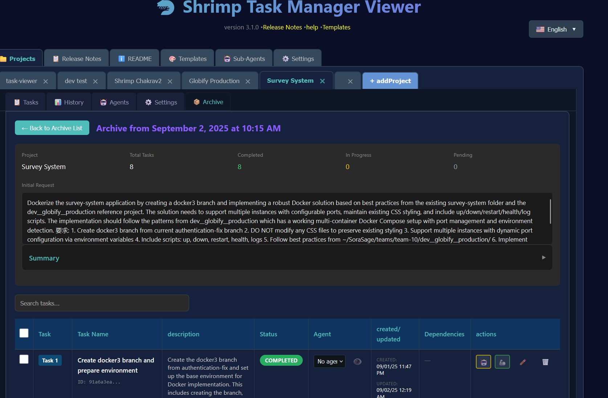

# 🦐 Note di Rilascio Shrimp Task Manager v4.0.0

*Rilasciato: 3 settembre 2025*

## 📋 Indice dei Contenuti

- [Principali Nuove Funzionalità](#principali-nuove-funzionalità)
  - [Visualizzazione Richiesta Iniziale e Generazione Riepiloghi](#visualizzazione-richiesta-iniziale-e-generazione-riepiloghi)
  - [Esperienza Note di Rilascio Migliorata](#esperienza-note-di-rilascio-migliorata)
  - [Sistema Gestione Archivi](#sistema-gestione-archivi)
  - [Gestione Agenti Migliorata](#gestione-agenti-migliorata)
  - [Vista Cronologia Riprogettata](#vista-cronologia-riprogettata)
- [Miglioramenti Tecnici](#miglioramenti-tecnici)
  - [Prestazioni e Infrastruttura](#prestazioni-e-infrastruttura)
  - [Copertura Testing](#copertura-testing)
- [Correzioni Bug Critici](#correzioni-bug-critici)
  - [Problemi di Scorrimento Risolti](#problemi-di-scorrimento-risolti)
  - [Correzioni UI/UX](#correzioni-uiux)
- [Come Aggiornare](#come-aggiornare)
- [Prossimamente](#prossimamente)

## 🎉 Principali Nuove Funzionalità

### 💡 Visualizzazione Richiesta Iniziale e Generazione Riepiloghi

È ora disponibile la capacità di vedere e comprendere il contesto dietro alle vostre liste di attività. La Visualizzazione Richiesta Iniziale cattura e memorizza permanentemente la richiesta utente originale che ha avviato la pianificazione delle attività. Questo significa che settimane o mesi dopo, potete istantaneamente rinfrescare la memoria sul perché queste attività esistono e quale problema dovevano risolvere.

Inoltre, c'è ora una funzionalità intelligente di Riepilogo che sfrutta OpenAI per generare panoramiche concise di ciò che è stato realizzato. Basta cliccare il pulsante Riepilogo, e utilizzando la vostra chiave API OpenAI, il sistema analizzerà tutte le attività completate e vi fornirà una sinossi chiara del vostro progresso. Questo è prezioso per aggiornamenti di stato progetto, comunicazioni di team, o semplicemente per capire a che punto siete con implementazioni complesse.

### 📖 Esperienza Note di Rilascio Migliorata

Il sistema Note di Rilascio è stato completamente reimmaginato da zero. Invece di testo statico, ora avete un'esperienza interattiva e navigabile con un Indice dei Contenuti richiudibile nella barra laterale. Ogni versione può essere espansa per mostrare la sua struttura delle sezioni, permettendovi di saltare rapidamente alle informazioni di cui avete bisogno.

L'implementazione include styling sofisticato con intestazioni codificate a colori - rosa per sezioni principali, bianco per "Nuove Funzionalità", arancione per "Correzioni Bug", e azzurro per sezioni panoramica. Il testo è 25% più grande per migliore leggibilità, e tutti gli elementi markdown da h2 a h5 sono resi correttamente.

Le aree barra laterale e contenuto scorrono indipendentemente, assicurando che non perdiate mai la vostra posizione mentre navigate attraverso documentazione estesa. Barre di scorrimento personalizzate a tema teal forniscono coerenza visuale con il linguaggio di design dell'applicazione.

### 📚 Sistema Gestione Archivi

La funzionalità Archivio rivoluziona come gestite le vostre liste di attività. Vi è mai capitato di creare un set complesso di attività da una richiesta iniziale dettagliata, solo per rendervi conto che dovete lavorare prima su qualcos'altro? Il sistema Archivio risolve perfettamente questo problema.

Quando archiviate una lista di attività, l'intera collezione di attività - inclusa la richiesta iniziale che le ha generate - è memorizzata in modo sicuro per uso futuro. Questo vi permette di iniziare da zero con una nuova lista di attività senza perdere alcun lavoro di pianificazione precedente. Quando siete pronti a tornare a quelle attività archiviate, importatele semplicemente nel vostro flusso di lavoro corrente. Questo è particolarmente utile per sviluppatori che lavorano su funzionalità multiple simultaneamente o devono cambiare contesti frequentemente.

L'interfaccia Archivio condivide lo stesso design raffinato della pagina Cronologia, fornendo un'esperienza utente coerente e intuitiva attraverso l'applicazione. Potete visualizzare tutte le vostre liste di attività archiviate, vedere quando sono state create, e ripristinare rapidamente qualunque archivio quando necessario.

*Il dialogo Archivia Attività Correnti che appare quando premete il pulsante Archivio nella scheda Attività. Mostra un riepilogo di cosa verrà archiviato, incluso il nome progetto, conteggi attività, ripartizione stato, e la richiesta iniziale completa che ha creato queste attività*

La vista Lista Archivi visualizza tutte le vostre liste di attività archiviate con le loro richieste iniziali e statistiche attività:

*La scheda Archivio che mostra una lista di liste di attività archiviate. Notate che gli utenti possono cliccare "Visualizza" per esaminare tutte le attività all'interno della lista attività archiviata, "Elimina" per rimuovere permanentemente un archivio, o premere il pulsante "Importa" per ripristinare attività nel loro flusso di lavoro corrente*

Quando siete pronti a ripristinare un archivio, il dialogo Importa vi dà opzioni per aggiungere attività alla vostra lista corrente o sostituirle completamente:

*Il dialogo Importa Archivio che appare quando premete Importa. Offre opzioni flessibili per ripristinare attività archiviate - aggiungerle alla lista attività corrente o sostituire completamente attività esistenti con quelle archiviate*

Una volta importate, potete visualizzare tutti i dettagli delle attività archiviate, inclusa la richiesta iniziale completa e ripartizione attività:

*Pagina Dettagli Archivio che mostra la lista attività completa con richiesta iniziale e riepilogo*

### Nuovi Strumenti MCP Aggiunti

Dato che ora abbiamo Archiviazione e Cronologia nel Task Viewer, abbiamo pensato che fosse meglio assicurarsi che lo strumento MCP fosse aggiornato anche così che il vostro agente Claude possa controllare completamente archivi e cronologia.

Un set completo di strumenti MCP (Model Context Protocol) è stato implementato per fornire accesso programmatico alle funzionalità archivio e cronologia. Questi strumenti abilitano agenti AI e sistemi esterni a interagire con flussi di lavoro di gestione attività attraverso API strutturate.

**Sette Nuovi Strumenti MCP:**

- **create_archive**: Crea backup delle liste attività correnti con descrizioni opzionali per organizzazione
- **list_archives**: Sfoglia tutte le liste attività archiviate con metadati inclusi date creazione e conteggi attività
- **restore_from_archive**: Importa attività archiviate nel flusso di lavoro corrente con opzioni unione o sostituzione
- **get_task_history**: Recupera tracce audit comprehensive di tutti i cambiamenti attività, aggiornamenti, e transizioni stato
- **get_deleted_tasks**: Accedi informazioni su attività eliminate per recupero o scopi audit
- **recover_task**: Ripristina attività precedentemente eliminate tramite i loro identificatori unici
- **sync_task_state**: Sincronizza coerenza dati attività attraverso diverse posizioni di storage e risolvi conflitti

Ogni strumento include validazione schema Zod robusta, gestione errori comprehensive, e supporto template bilingue (Inglese/Cinese). L'implementazione presenta integrazione TypeScript appropriata con il modello attività esistente e mantiene compatibilità completa con l'interfaccia web.

### 🤖 Gestione Agenti Migliorata

Le capacità agenti sono state significativamente espanse in questo rilascio. La nuova funzionalità assegnazione agenti bulk vi permette di assegnare attività multiple ad agenti AI simultaneamente attraverso un'interfaccia dropdown intuitiva. Assegnazioni attività individuali ora avvengono senza aggiornamenti pagina, rendendo il flusso di lavoro più fluido ed efficiente.

Il modal informazioni agenti è stato completamente rivisto per fornire descrizioni più chiare e migliore visibilità nelle capacità agenti. Problemi critici dove le descrizioni agenti apparivano vuote sono stati corretti, insieme agli errori 500 che si verificavano quando si lavorava con liste attività di produzione.

### 📊 Vista Cronologia Riprogettata

La Vista Cronologia è stata trasformata per corrispondere all'interfaccia raffinata del sistema Archivio. Più importante, ora visualizza la Richiesta Iniziale invece delle note nella vista principale, dandovi contesto immediato su ogni lista attività storica. Il layout è stato ottimizzato con migliore spaziatura colonne e capacità filtraggio più efficienti.

## 🔧 Miglioramenti Tecnici

### Prestazioni e Infrastruttura

Miglioramenti significativi sono stati fatti alle prestazioni dell'applicazione e all'esperienza di sviluppo. Il nuovo sistema build include un comando semplificato `npm run build` che automaticamente costruisce e avvia il server. Playwright è stato integrato per testing end-to-end, assicurando affidabilità UI attraverso aggiornamenti.

Il server è stato migliorato con nuovi endpoint archivio caratterizzati da gestione errori e validazione migliorate. I tempi di risposta sono stati ottimizzati attraverso migliori strategie di recupero dati.

**Architettura Server MCP:**

L'implementazione server MCP utilizza una classe Server a basso livello con StdioServerTransport per comunicazione affidabile con Claude. L'architettura include:

- Registrazione strumenti appropriata tramite `setRequestHandler` per `ListToolsRequestSchema` e `CallToolRequestSchema`
- Dichiarazione capacità server con definizioni strumenti comprehensive
- Gestione errori robusta con logging dettagliato e messaggi errore user-friendly
- Storage attività basato su memoria con persistenza JSON e backup automatici
- Supporto template bilingue con generazione contenuto dinamica

### Copertura Testing

Questo rilascio include copertura test comprehensive per tutte le nuove funzionalità:
- Test funzionalità archivio
- Test scorrimento Note di Rilascio
- Test integrazione Vista Cronologia
- Test assegnazione agenti
- Test generazione riepiloghi
- **Test validazione strumenti MCP**: Testing completo workflow archivio/ripristino con scenari reali di creazione attività, archiviazione, e ripristino
- **Test elaborazione template**: Verifica di rendering template Handlebars e sostituzione variabili
- **Test gestione errori**: Testing comprehensive di casi limite e scenari fallimento attraverso tutti gli strumenti MCP

## 🐛 Correzioni Bug Critici

### Problemi di Scorrimento Risolti

I problemi critici di visibilità barra scorrimento che interessavano le Note di Rilascio e altre schede sono stati corretti. L'applicazione ora visualizza correttamente barre scorrimento con styling personalizzato, assicurando che il contenuto sia sempre accessibile. Lo scorrimento indipendente tra aree barra laterale e contenuto funziona perfettamente.

### Correzioni UI/UX

- Il posizionamento frecce in sezioni richiudibili è stato corretto
- Il contrasto colore è stato migliorato attraverso l'interfaccia
- Gli stati caricamento sono ora più informativi
- I messaggi errore forniscono guida più chiara

### Correzioni Post-Rilascio (Settembre 2025)

Diversi problemi critici sono stati identificati e risolti dopo il rilascio iniziale:

#### Correzioni Scroll Spy e Indice dei Contenuti

- **Corretta evidenziazione duplicata scroll spy**: Sezioni con nomi identici (come "Come Utilizzare") causavano evidenziazione simultanea di voci TOC multiple. Implementata generazione ID unici utilizzando contesto parent per assicurare che solo la sezione corretta sia evidenziata mentre scorrete.
- **Corretta evidenziazione scroll spy interrotta**: La funzionalità scroll spy smetteva di funzionare completamente dopo implementazione ID unici. Aggiunte funzioni generazione ID centralizzate per assicurare coerenza tra parsing indice contenuti e rendering contenuto.
- **Corretto pulsante Richiudi Tutto su Note di Rilascio**: Il pulsante non funzionava a causa di gestione scope versione incorretta. Aggiornate le funzioni espandi/richiudi per accettare parametri versione e passare versione rilascio corretta.

#### Correzioni Terminologia e Date

- **Aggiornata terminologia modal**: Cambiato modal "Aggiungi Nuovo Profilo" per utilizzare terminologia "progetto" coerentemente attraverso l'interfaccia. Aggiornate traduzioni inglesi per mostrare "Nome Progetto" invece di "Nome Profilo".
- **Corretta data rilascio v4.0.0**: Corretta la data rilascio da 2025-01-02 alla data rilascio effettiva di 2025-09-03.

#### Correzioni Server MCP e Elaborazione Template

- **Corretti conflitti nomi funzione**: Risolti crash server causati da nomi funzione duplicati tra strumenti MCP e funzioni modello. Aggiornati `getDeletedTasksTool` → `getDeletedTasks` e `recoverTaskTool` → `recoverTask` con aliasing import appropriato.
- **Corretti problemi elaborazione template**: Risolti sintassi Handlebars grezza apparente in risposte strumenti creando file template mancanti (`empty.md`, `noResults.md`, `success.md`) e correggendo mappature nomi variabili tra generatori e template.
- **Corretta registrazione strumenti MCP**: Corretti naming export strumenti e registrazione per assicurare che tutti i 7 nuovi strumenti siano correttamente accessibili attraverso l'interfaccia MCP.
- **Corretti errori compilazione TypeScript**: Risolti problemi async/await in funzioni filtro e aggiunte asserzioni tipo appropriate per parametri opzionali.

Queste correzioni assicurano un'esperienza utente fluida con navigazione appropriata, terminologia coerente, informazioni rilascio accurate, e integrazione strumenti MCP completamente funzionale.

## 📝 Come Aggiornare

L'aggiornamento a v4.0.0 è semplice:

1. Estraete i cambiamenti più recenti dal repository
2. Eseguite `npm install` per aggiornare dipendenze
3. Eseguite `npm run build` per costruire e avviare l'applicazione
4. Pulite la cache browser per assicurare che tutti i nuovi stili siano caricati

Ecco tutto! Nessuna migrazione database necessaria - basta costruire ed eseguire.

## 🚀 Prossimamente

La versione 4.0.0 stabilisce un nuovo standard per lo Shrimp Task Manager. La combinazione di gestione Archivi, tracciamento Richiesta Iniziale, generazione Riepiloghi, sistema Note di Rilascio migliorato, e integrazione API MCP comprehensive crea un toolkit potente per gestire flussi di lavoro sviluppo complessi.

Il nuovo sistema Strumenti MCP Archivi e Cronologia apre possibilità per:
- Integrazione con strumenti sviluppo esterni e pipeline CI/CD
- Flussi di lavoro gestione attività automatizzati guidati da agenti AI
- Collaborazione migliorata attraverso accesso programmatico ai dati attività
- Analitiche avanzate e reporting sul progresso sviluppo
- Script automazione personalizzati per operazioni gestione attività ripetitive

Questa fondazione posiziona lo Shrimp Task Manager non solo come strumento standalone, ma come componente centrale di ecosistemi sviluppo più grandi.