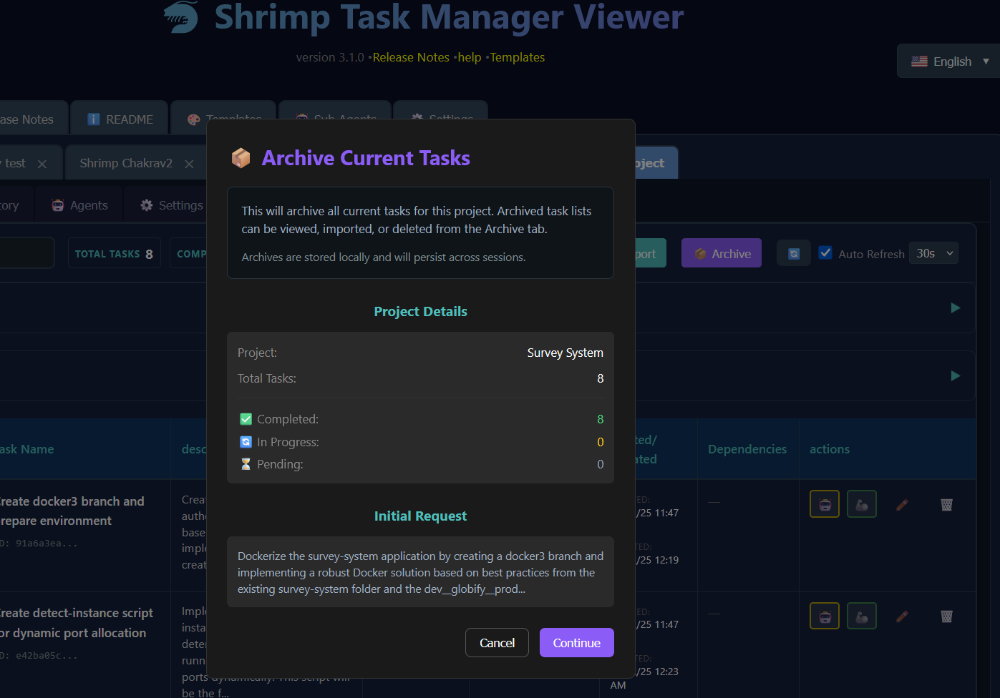
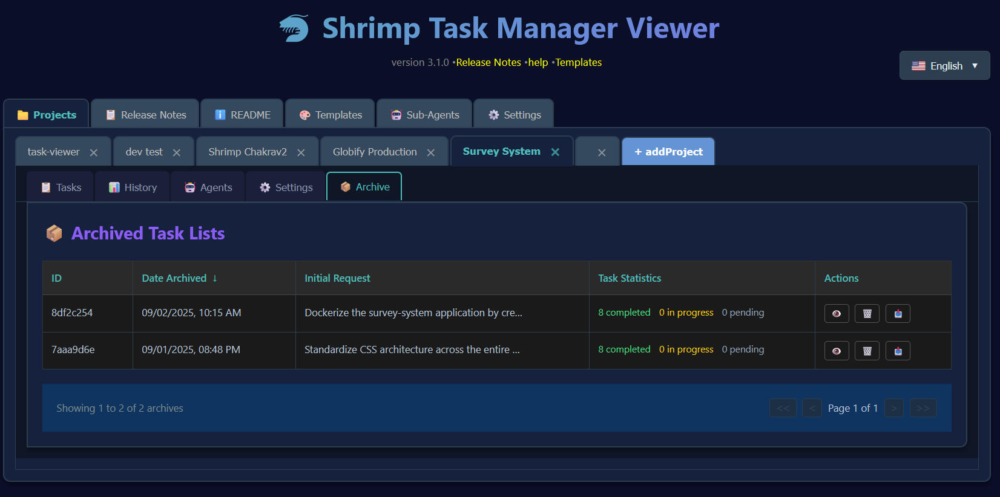
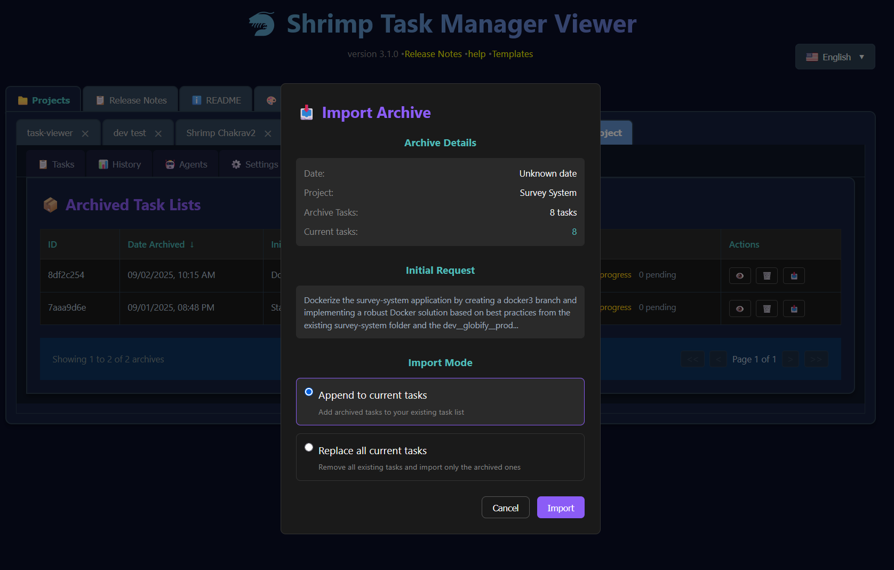
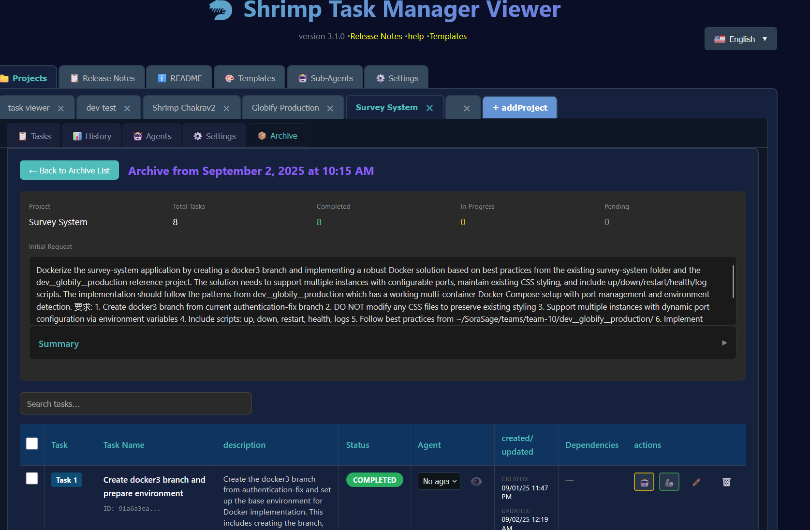

# 🦐 Shrimp Task Manager v4.0.0 Release Notes

*Released: 2025-09-03*

## 📋 Table of Contents

- [Major New Features](#major-new-features)
  - [Initial Request Display & Summary Generation](#initial-request-display--summary-generation)
  - [Enhanced Release Notes Experience](#enhanced-release-notes-experience)
  - [Archive Management System](#archive-management-system)
  - [Enhanced Agent Management](#enhanced-agent-management)
  - [Redesigned History View](#redesigned-history-view)
- [Technical Improvements](#technical-improvements)
  - [Performance & Infrastructure](#performance--infrastructure)
  - [Testing Coverage](#testing-coverage)
- [Critical Bug Fixes](#critical-bug-fixes)
  - [Scrolling Issues Resolved](#scrolling-issues-resolved)
  - [UI/UX Fixes](#uiux-fixes)
- [How to Upgrade](#how-to-upgrade)
- [What's Next](#whats-next)

## 🎉 Major New Features

### 💡 Initial Request Display & Summary Generation

The ability to see and understand the context behind your task lists is now available. The Initial Request Display captures and permanently stores the original user request that initiated task planning. This means weeks or months later, you can instantly refresh your memory about why these tasks exist and what problem they were meant to solve.

Additionally, there's now an intelligent Summary feature that leverages OpenAI to generate concise overviews of what has been accomplished. Simply click the Summary button, and using your OpenAI API key, the system will analyze all completed tasks and provide you with a clear synopsis of your progress. This is invaluable for project status updates, team communications, or simply understanding where you stand with complex implementations.

### 📖 Enhanced Release Notes Experience

The Release Notes system has been completely reimagined from the ground up. Instead of static text, you now have an interactive, navigable experience with a collapsible Table of Contents in the sidebar. Each version can be expanded to show its section outline, allowing you to quickly jump to the information you need.

The implementation includes sophisticated styling with color-coded headings - pink for main sections, white for "New Features", orange for "Bug Fixes", and light blue for overview sections. The text is 25% larger for better readability, and all markdown elements from h2 to h5 are properly rendered.

The sidebar and content areas scroll independently, ensuring you never lose your place while navigating through extensive documentation. Custom teal-themed scrollbars provide visual consistency with the application's design language.

### 📚 Archive Management System

The Archive feature revolutionizes how you manage your task lists. Have you ever created a complex set of tasks from a detailed initial request, only to realize you need to work on something else first? The Archive system solves this problem perfectly.

When you archive a task list, the entire collection of tasks - including the initial request that spawned them - is safely stored for later use. This allows you to start fresh with a new task list without losing any of your previous planning work. When you're ready to return to those archived tasks, simply import them back into your current workflow. This is particularly useful for developers who work on multiple features simultaneously or need to switch contexts frequently.

The Archive interface shares the same polished design as the History page, providing a consistent and intuitive user experience across the application. You can view all your archived task lists, see when they were created, and quickly restore any archive when needed.

### 🔧 MCP Archive and History Tools System

A comprehensive set of MCP (Model Context Protocol) tools has been implemented to provide programmatic access to the archive and history functionality. These tools enable AI agents and external systems to interact with task management workflows through structured APIs.

**Seven New MCP Tools:**

- **create_archive**: Create backups of current task lists with optional descriptions for organization
- **list_archives**: Browse all archived task lists with metadata including creation dates and task counts  
- **restore_from_archive**: Import archived tasks back into the current workflow with merge or replace options
- **get_task_history**: Retrieve comprehensive audit trails of all task changes, updates, and state transitions
- **get_deleted_tasks**: Access information about deleted tasks for recovery or audit purposes
- **recover_task**: Restore previously deleted tasks by their unique identifiers
- **sync_task_state**: Synchronize task data consistency across different storage locations and resolve conflicts

Each tool includes robust Zod schema validation, comprehensive error handling, and bilingual template support (English/Chinese). The implementation features proper TypeScript integration with the existing task model and maintains full compatibility with the web interface.

**Template Processing System:**

The MCP tools utilize a sophisticated template processing system that converts raw data into formatted, human-readable responses. Templates support conditional logic, loops, and variable substitution using Handlebars syntax, ensuring consistent and professional output across all tools.

*The Archive Current Tasks dialog that appears when you press the Archive button in the Tasks tab. It shows a summary of what will be archived, including the project name, task counts, status breakdown, and the complete initial request that created these tasks*

The Archive List view displays all your archived task lists with their initial requests and task statistics:

*The Archive tab showing a list of archived task lists. Note that users can click "View" to examine all tasks within the archived task list, "Delete" to permanently remove an archive, or press the "Import" button to restore tasks to their current workflow*

When you're ready to restore an archive, the Import dialog gives you options to either append tasks to your current list or replace them entirely:

*The Import Archive dialog that appears when you press Import. It offers flexible options for restoring archived tasks - either append them to the current task list or completely replace existing tasks with the archived ones*

Once imported, you can view all the details of the archived tasks, including the complete initial request and task breakdown:

*Archive Details page showing the complete task list with initial request and summary*

### 🤖 Enhanced Agent Management

The agent capabilities have been significantly expanded in this release. The new bulk agent assignment feature allows you to assign multiple tasks to AI agents simultaneously through an intuitive dropdown interface. Individual task assignments now happen without page refreshes, making the workflow smoother and more efficient.

The agent information modal has been completely overhauled to provide clearer descriptions and better visibility into agent capabilities. Critical issues where agent descriptions would appear blank have been fixed, along with the 500 errors that occurred when working with production task lists.

### 📊 Redesigned History View

The History View has been transformed to match the polished interface of the Archive system. Most importantly, it now displays the Initial Request instead of notes in the main view, giving you immediate context about each historical task list. The layout has been optimized with better column spacing and more efficient filtering capabilities.

## 🔧 Technical Improvements

### Performance & Infrastructure

Significant improvements have been made to the application's performance and development experience. The new build system includes a simplified `npm run build` command that automatically builds and starts the server. Playwright has been integrated for end-to-end testing, ensuring UI reliability across updates.

The server has been enhanced with new archive endpoints featuring improved error handling and validation. Response times have been optimized through better data fetching strategies.

**MCP Server Architecture:**

The MCP server implementation uses a low-level Server class with StdioServerTransport for reliable communication with Claude. The architecture includes:

- Proper tool registration via `setRequestHandler` for `ListToolsRequestSchema` and `CallToolRequestSchema`
- Server capabilities declaration with comprehensive tool definitions
- Robust error handling with detailed logging and user-friendly error messages
- Memory-based task storage with JSON persistence and automatic backups
- Bilingual template support with dynamic content generation

### Testing Coverage

This release includes comprehensive test coverage for all new features:
- Archive functionality tests
- Release Notes scrolling tests
- History View integration tests
- Agent assignment tests
- Summary generation tests
- **MCP tools validation tests**: Complete archive/restore workflow testing with real task creation, archiving, and restoration scenarios
- **Template processing tests**: Verification of Handlebars template rendering and variable substitution
- **Error handling tests**: Comprehensive testing of edge cases and failure scenarios across all MCP tools

## 🐛 Critical Bug Fixes

### Scrolling Issues Resolved

The critical scrollbar visibility issues that affected the Release Notes and other tabs have been fixed. The application now properly displays scrollbars with custom styling, ensuring content is always accessible. Independent scrolling between sidebar and content areas works flawlessly.

### UI/UX Fixes

- Arrow positioning in collapsible sections has been corrected
- Color contrast has been improved throughout the interface
- Loading states are now more informative
- Error messages provide clearer guidance

### Post-Release Fixes (September 2025)

Several critical issues were identified and resolved after the initial release:

#### Scroll Spy and Table of Contents Fixes

- **Fixed scroll spy duplicate highlighting**: Sections with identical names (like "How to Use") were causing multiple TOC entries to be highlighted simultaneously. Implemented unique ID generation using parent context to ensure only the correct section is highlighted as you scroll.
- **Fixed broken scroll spy highlighting**: The scroll spy functionality stopped working entirely after implementing unique IDs. Added centralized ID generation functions to ensure consistency between table of contents parsing and content rendering.
- **Fixed Collapse All button on Release Notes**: The button was not functioning due to incorrect version scope handling. Updated the expand/collapse functions to accept version parameters and pass the correct release version.

#### Terminology and Date Corrections

- **Updated modal terminology**: Changed "Add New Profile" modal to use "project" terminology consistently throughout the interface. Updated English translations to show "Project Name" instead of "Profile Name".
- **Corrected v4.0.0 release date**: Fixed the release date from 2025-01-02 to the actual release date of 2025-09-03.

#### MCP Server and Template Processing Fixes

- **Fixed function naming conflicts**: Resolved server crashes caused by duplicate function names between MCP tools and model functions. Updated `getDeletedTasksTool` → `getDeletedTasks` and `recoverTaskTool` → `recoverTask` with proper import aliasing.
- **Fixed template processing issues**: Resolved raw Handlebars syntax appearing in tool responses by creating missing template files (`empty.md`, `noResults.md`, `success.md`) and correcting variable name mappings between generators and templates.
- **Fixed MCP tool registration**: Corrected tool export naming and registration to ensure all 7 new tools are properly accessible through the MCP interface.
- **Fixed TypeScript compilation errors**: Resolved async/await issues in filter functions and added proper type assertions for optional parameters.

These fixes ensure a smooth user experience with proper navigation, consistent terminology, accurate release information, and fully functional MCP tool integration.

## 📝 How to Upgrade

Upgrading to v4.0.0 is straightforward:

1. Pull the latest changes from the repository
2. Run `npm install` to update dependencies
3. Execute `npm run build` to build and start the application
4. Clear your browser cache to ensure all new styles are loaded

That's it! No database migrations needed - just build and run.

## 🚀 What's Next

Version 4.0.0 sets a new standard for the Shrimp Task Manager. The combination of Archive management, Initial Request tracking, Summary generation, enhanced Release Notes system, and comprehensive MCP API integration creates a powerful toolkit for managing complex development workflows.

The new MCP Archive and History Tools system opens up possibilities for:
- Integration with external development tools and CI/CD pipelines
- Automated task management workflows driven by AI agents
- Enhanced collaboration through programmatic access to task data
- Advanced analytics and reporting on development progress
- Custom automation scripts for repetitive task management operations

This foundation positions the Shrimp Task Manager as not just a standalone tool, but as a core component of larger development ecosystems.